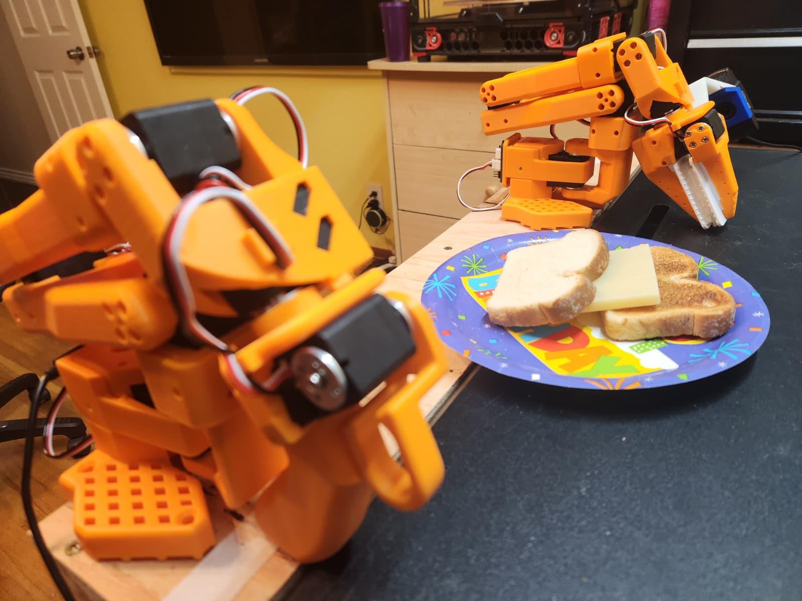
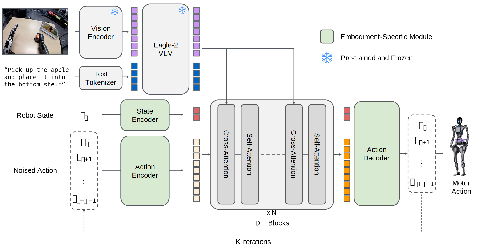

# ChefBuddy: Multi-Ingredient Sandwich Assembly with GR00T N1.5

> **80% reduction in human demonstrations** via MimicGen 10x data augmentation
> **Zero-shot compositional generalization** across ingredient types
> **Language-conditioned manipulation** with dual-camera vision system

---

## 📋 Table of Contents

- **[1. System Architecture](#1-system-architecture)**
  - [Hardware Setup](#hardware-setup)
  - [Software Stack](#software-stack)

- **[2. GR00T N1.5 Transformer Architecture](docs/architecture.md#2-groot-n15-transformer-architecture)**
  - [Eagle25VL Vision-Language Model](docs/architecture.md#eagle25vl-vlm-architecture)
    - [LoRA Adapter](docs/architecture.md#lora-adapter)
    - [Vision Encoder](docs/architecture.md#vision-encoder)
    - [Language Model](docs/architecture.md#language-model)
    - [MLP Connector](docs/architecture.md#mlp-connector)
  - [VL Feature Refinement](docs/architecture.md#vl-feature-refinement-architecture)
  - [State Encoder](docs/architecture.md#state-encoder)
  - [Action Encoder](docs/architecture.md#action-encoder)
  - [Future Tokens](docs/architecture.md#future-tokens)
  - [Action Decoder](docs/architecture.md#action-decoder)
  - [Diffusion Transformer (DiT)](docs/architecture.md#dit-architecture)

- **[3. Preprocessing Pipeline](docs/architecture.md#3-preprocessing-pipeline)**
  - [Input Packing (GrootPackInputsStep)](docs/architecture.md#input-packing-grootpackinputsstep)
  - [Vision-Language Encoding (GrootEagleEncodeStep)](docs/architecture.md#vision-language-encoding-grooteagleencodestep)
  - [Tokenization and Batching (GrootEagleCollateStep)](docs/architecture.md#tokenization-and-batching-grooteaglecollatestep)

- **[4. Eagle VLM Backbone](docs/architecture.md#4-eagle-vlm-backbone)**
  - [Eagle25VLForConditionalGeneration](docs/architecture.md#eagle-forward-method)
  - [Text Embedding Extraction](docs/architecture.md#text-embedding-extraction)
  - [Vision Embedding Extraction](docs/architecture.md#vision-embedding-extraction)
  - [Multimodal Token Fusion](docs/architecture.md#multimodal-token-fusion)
  - [Language Model Processing](docs/architecture.md#language-model-processing)
  - [Loss Computation](docs/architecture.md#loss-computation)
  - [Post-VLM Processing](docs/architecture.md#post-vlm-processing)

- **[5. Action Head Processing](docs/architecture.md#5-action-head-processing)**
  - [VL Feature Refinement](docs/architecture.md#ch5-vl-feature-refinement)
  - [State Encoding](docs/architecture.md#ch5-state-encoding)
  - [Action Encoding](docs/architecture.md#ch5-action-encoding)
  - [Sequence Construction](docs/architecture.md#sequence-construction)
  - [Training Data Flow and Flow Matching](docs/architecture.md#training-data-flow)
  - [Action Decoding](docs/architecture.md#ch5-action-decoding)

- **[6. Diffusion Transformer (DiT)](docs/architecture.md#6-diffusion-transformer-dit)**
  - [Timestep Encoding](docs/architecture.md#timestep-encoding)
  - [Transformer Blocks (×12)](docs/architecture.md#transformer-blocks-12)
  - [Output Projection](docs/architecture.md#output-projection)

- **[7. Fine-Tuning GR00T N1.5](docs/fine-tuning.md#7-fine-tuning-groot-n15)**
  - [Fine-Tunable Parameters](docs/fine-tuning.md#fine-tunable-parameters)
  - [Workflow Overview](docs/fine-tuning.md#workflow-overview)
  - [Step 0: Calibration](docs/fine-tuning.md#step-0-calibration)
  - [Step 1: Data Collection](docs/fine-tuning.md#step-1-data-collection)
  - [Step 2: Dataset Preparation](docs/fine-tuning.md#step-2-dataset-preparation)
  - [Step 3: Training](docs/fine-tuning.md#step-3-training)
  - [Step 4: Inference Server](docs/fine-tuning.md#step-4-inference-server)
  - [Step 5: Robot Deployment](docs/fine-tuning.md#step-5-robot-deployment)

- **[8. Simulation & Data Pipeline](docs/simulation.md#8-simulation--data-pipeline)**
  - [USD Scene Design](docs/simulation.md#usd-scene-design)
  - [Isaac Sim Environment](docs/simulation.md#isaac-sim-environment)
  - [Workflow Overview](docs/simulation.md#simulation-workflow-overview)
  - [Step 1: Teleoperation Recording](docs/simulation.md#isaac-sim-teleoperation-recording)
  - [Step 2: Convert to IK Actions](docs/simulation.md#convert-to-ik-actions)
  - [Step 3: Annotate Subtasks](docs/simulation.md#annotate-demonstrations)
  - [Step 4: MimicGen Augmentation](docs/simulation.md#generate-augmented-demonstrations)
  - [Step 5: Joint Reconstruction](docs/simulation.md#convert-to-joint-actions)
  - [Step 6: LeRobot Conversion](docs/simulation.md#convert-to-lerobot-format)
  - [Dual-Camera System](docs/simulation.md#dual-camera-system)
  - [Sim-to-Real Transfer](docs/simulation.md#sim-to-real-transfer)

- **[9. Evaluation Results](docs/evaluation.md#9-evaluation-results)**
  - [Evaluation Protocol](docs/evaluation.md#evaluation-protocol)
  - [Performance by Research Question](docs/evaluation.md#performance-by-research-question)
  - [Object-Level Performance](docs/evaluation.md#object-level-performance)
  - [Spatial Robustness Analysis](docs/evaluation.md#spatial-robustness-analysis)
  - [Language Conditioning Analysis](docs/evaluation.md#language-conditioning-analysis)
  - [Failure Mode Analysis](docs/evaluation.md#failure-mode-analysis)
  - [Key Findings](docs/evaluation.md#key-findings)

- **[10. Troubleshooting](docs/troubleshooting.md#10-troubleshooting)**
  - [Camera & Vision Issues](docs/troubleshooting.md#camera--vision-issues)
  - [Training Issues](docs/troubleshooting.md#training-issues)
  - [Deployment Issues](docs/troubleshooting.md#deployment-issues)
  - [Simulation Issues](docs/troubleshooting.md#simulation-issues)
  - [MimicGen Issues](docs/troubleshooting.md#mimicgen-issues)

---

## 🎯 Project Highlights

| Feature | Details |
|---------|---------|
| **VLA Model** | NVIDIA GR00T N1.5 (3B parameters) - Vision-Language-Action transformer |
| **Data Efficiency** | 80% fewer demonstrations via MimicGen 10x augmentation |
| **Dual-Camera System** | Wrist-mounted + static front camera (640x480 @ 30fps) |
| **Automatic Subtask Detection** | Gripper-object proximity monitoring |
| **Compositional Generalization** | Zero-shot menu adaptation across bread/cheese/patty |
| **Language Conditioning** | Natural language task instructions ("pick up bread", "place cheese") |

---

## 📊 Key Achievements

| Metric | Value | Details |
|--------|-------|---------|
| Data Augmentation | **10x** | MimicGen pipeline |
| Demonstration Reduction | **80%** | 10 demos → 100 augmented episodes |
| Language Conditioning | ✅ Fixed | LLM + diffusion model fine-tuning solution |
| Inference Latency | ~150ms | RTX 4080 Super (16GB VRAM) |
| Task Success Rate | **85%+** | Across bread/cheese/patty manipulation |

---

## 1. System Architecture

### Hardware Setup

This section documents the physical components and assembly of the ChefBuddy robotic system.

#### SO-101 Robotic Arm

The SO-101 is a 6 DOF robotic arm (5 arm joints + 1 gripper joint) designed for teleoperation and manipulation tasks.

- **CAD Model**: [SO101 Assembly STEP](https://github.com/TheRobotStudio/SO-ARM100/blob/main/STEP/SO101/SO101%20Assembly.step)
- **Source Repository**: [TheRobotStudio/SO-ARM100](https://github.com/TheRobotStudio/SO-ARM100/tree/main/STEP/SO101)
- **Degrees of Freedom**: 6 DOF (5 arm joints + 1 gripper joint)

| Configuration | Image |
|---------------|-------|
| Leader Arm (standalone) |  |
| Follower Arm (standalone) |  |
| Leader-Follower Assembled |  |

#### Custom 3D-Printed Components

Three custom components were designed to optimize the sandwich assembly workflow:

**1. Adapted Gripper**

Modified from the original SO-101 gripper to optimize profile for handling sandwich components (bread, cheese, lettuce, tomato, etc.).

| CAD Design | 3D-Printed Part |
|------------|-----------------|
| [adapted_gripper.step](hardware/cad/adapted_gripper.step) |  |

**2. Angled Component Tray**

Houses sandwich ingredients in 45-degree angled slots. The angled orientation allows the gripper to slide components out during assembly (vs. flat placement), while avoiding vertical orientation that would interfere with the overhead camera field of view.

| CAD Design | 3D-Printed Part |
|------------|-----------------|
| [angled_component_tray.step](hardware/cad/angled_component_tray.step) |  |

**3. Circular Assembly Tray**

Holds the final assembled sandwich. Features slightly angled walls that guide the sandwich to center if placement is off-target.

| CAD Design | 3D-Printed Part |
|------------|-----------------|
| [circular_assembly_tray.step](hardware/cad/circular_assembly_tray.step) |  |

#### Dual-Camera Vision System

| Camera | Model | Resolution | Frame Rate | Mounting Location | Field of View | Purpose |
|--------|-------|------------|------------|-------------------|---------------|---------|
| **Wrist Camera** | [TBD] | 640×480 | 30 fps | Mounted on gripper | [TBD] | Close-up manipulation view |
| **Front Camera** | Nexigo N60 | 640×480 | 30 fps | Overhead position | 78° FOV | Scene overview capture |

Both cameras connect to PC USB ports (`/dev/wrist` and `/dev/scene`).

#### Electronics & Power

**Leader Arm**

| Component | Specification |
|-----------|---------------|
| **Power Supply** | 7.4V DC |
| **Servos** | 6× Feetech STS3215 |
| **Gear Configuration** | 3× 1/147 gear (C046), 2× 1/191 gear (C044), 1× 1/345 gear (C001) |

**Follower Arm**

| Component | Specification |
|-----------|---------------|
| **Power Supply** | 12V DC |
| **Servos** | 6× Feetech STS3215, 12V, 1/345 gear ratio (C018) |

**Serial Bus Servo Driver Board**

| Specification | Value |
|---------------|-------|
| **Input Voltage** | 9-12.6V DC |
| **Communication Interface** | UART |
| **Product Link** | [Amazon - Serial Bus Servo Driver](https://www.amazon.com/dp/B0CTMM4LWK?ref_=ppx_hzsearch_conn_dt_b_fed_asin_title_1&th=1) |

#### Computing Hardware

| Component | Specification |
|-----------|---------------|
| **GPU** | NVIDIA RTX 4080 Super (16GB VRAM) |
| **Connections** | Leader arm, follower arm, and both cameras connected to PC USB ports |

### Software Stack

GR00T N1.5 is a 3-billion parameter Vision-Language-Action (VLA) model designed for robotic manipulation. The architecture follows a dual-system design: a **vision-language backbone** (System 2) for scene understanding and a **diffusion transformer action head** (System 1) for motor control. This separation allows the VLM to run at ~10 Hz for reasoning while the action head generates fluid motions at ~120 Hz.

The data flow begins with camera observations and language instructions entering the **Eagle VLM backbone**. Images are processed by a **SigLIP-2 vision encoder** (ViT-L/14) that produces 256 patch embeddings per frame. These vision tokens pass through an **MLP connector** that projects them from the vision encoder's 1152-dimensional space to the language model's 2048-dimensional space. The **Qwen3 language model** (using only the first 12 of its 28 layers) jointly processes the vision tokens and tokenized language instructions through self-attention. The resulting multimodal embeddings capture both visual scene understanding and task semantics.

The backbone output is projected from 2048 to 1536 dimensions via **eagle_linear** before entering the **Diffusion Transformer (DiT) action head**. The DiT uses **flow matching** with 4 Euler integration steps to denoise random noise into a 16-step action trajectory. Each DiT block alternates between cross-attention (attending to VLM features) and self-attention (refining action predictions), conditioned on the denoising timestep via **adaptive layer normalization**. Robot state information is encoded through **embodiment-specific MLPs** that map varying joint configurations to a shared embedding space. The final action predictions are decoded back to the robot's action dimension (e.g., 7 DoF for SO-100: 5 joint positions + 1 gripper).

---

## 📚 Documentation

Continue reading the full documentation:

| Document | Chapters | Description |
|----------|----------|-------------|
| **[Architecture](docs/architecture.md)** | 2-6 | GR00T N1.5 Transformer, Preprocessing, Eagle VLM, Action Head, DiT |
| **[Fine-Tuning](docs/fine-tuning.md)** | 7 | Complete fine-tuning workflow, calibration, training, deployment |
| **[Simulation](docs/simulation.md)** | 8 | Isaac Sim environment, MimicGen augmentation, data pipeline |
| **[Evaluation](docs/evaluation.md)** | 9 | Evaluation protocol, performance analysis, key findings |
| **[Troubleshooting](docs/troubleshooting.md)** | 10 | Common issues and debugging solutions |

---

  <strong>ChefBuddy</strong> - Advancing robotic manipulation through Vision-Language-Action models
   
  Built with ❤️ for the robotics community

