# GR00T N1.5 Architecture Documentation

> **Navigation**: [← Main README](../README.md) | [Fine-Tuning →](fine-tuning.md)

This document covers Chapters 2-6 of the ChefMate documentation:
- [2. GR00T N1.5 Transformer Architecture](#2-groot-n15-transformer-architecture)
- [3. Preprocessing Pipeline](#3-preprocessing-pipeline)
- [4. Eagle VLM Backbone](#4-eagle-vlm-backbone)
- [5. Action Head Processing](#5-action-head-processing)
- [6. Diffusion Transformer (DiT)](#6-diffusion-transformer-dit)

---

<a id="2-groot-n15-transformer-architecture"></a>
## 2. GR00T N1.5 Transformer Architecture

<a id="eagle25vl-vlm-architecture"></a>
### Eagle25VL Vision-Language Model

The Eagle VLM backbone is implemented as `Eagle25VLForConditionalGeneration`, a HuggingFace-compatible Vision-Language Model combining a SigLIP-2 vision encoder with a Qwen3 language model. This section documents the model architecture as instantiated in the `__init__` method.

#### Major Components

| Component | Class | Variable Name | Purpose |
|-----------|-------|---------------|---------|
| **Vision Encoder** | `SiglipVisionModel` | `self.vision_model` | Encodes input images into visual feature embeddings via Vision Transformer |
| **Language Model** | `Qwen3ForCausalLM` | `self.language_model` | Processes multimodal tokens (text + vision) autoregressively |
| **MLP Connector** | `nn.Sequential` | `self.mlp1` | Projects vision features (1152-dim) to match LLM embedding dimension (2048-dim) |
| **LoRA Adapters** | PEFT wrappers | via `wrap_backbone_lora`, `wrap_llm_lora` | Optional parameter-efficient fine-tuning |

#### Architecture Block Diagram

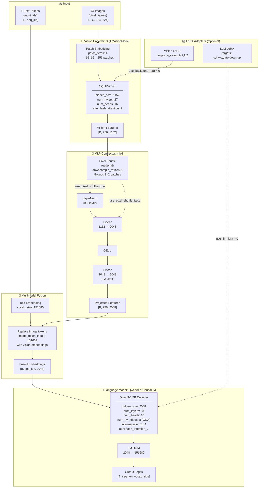
```mermaid
flowchart TB
    subgraph Input ["📥 Input"]
        IMG["🖼️ Images<br/>(pixel_values)<br/>[B, C, 224, 224]"]
        TXT["📝 Text Tokens<br/>(input_ids)<br/>[B, seq_len]"]
    end

    subgraph VisionEncoder ["🔭 Vision Encoder: SiglipVisionModel"]
        direction TB
        PATCH["Patch Embedding<br/>patch_size=14<br/>→ 16×16 = 256 patches"]
        VIT["SigLIP-2 ViT<br/>───────────────<br/>hidden_size: 1152<br/>num_layers: 27<br/>num_heads: 16<br/>attn: flash_attention_2"]
        VOUT["Vision Features<br/>[B, 256, 1152]"]

        PATCH --> VIT --> VOUT
    end

    subgraph Connector ["🔗 MLP Connector: mlp1"]
        direction TB
        PS["Pixel Shuffle<br/>(optional)<br/>downsample_ratio=0.5<br/>Groups 2×2 patches"]
        LN["LayerNorm<br/>(if 2-layer)"]
        L1["Linear<br/>1152 → 2048"]
        GELU["GELU"]
        L2["Linear<br/>2048 → 2048<br/>(if 2-layer)"]
        COUT["Projected Features<br/>[B, 256, 2048]"]

        PS -.->|"use_pixel_shuffle=true"| LN
        LN --> L1 --> GELU --> L2 --> COUT
        PS -.->|"use_pixel_shuffle=false"| L1
    end

    subgraph Fusion ["🔀 Multimodal Fusion"]
        direction TB
        EMBED["Text Embedding<br/>vocab_size: 151680"]
        REPLACE["Replace image tokens<br/>image_token_index: 151669<br/>with vision embeddings"]
        FUSED["Fused Embeddings<br/>[B, seq_len, 2048]"]

        EMBED --> REPLACE --> FUSED
    end

    subgraph LLM ["🧠 Language Model: Qwen3ForCausalLM"]
        direction TB
        QWEN["Qwen3-1.7B Decoder<br/>─────────────────<br/>hidden_size: 2048<br/>num_layers: 28<br/>num_heads: 16<br/>num_kv_heads: 8 (GQA)<br/>intermediate: 6144<br/>attn: flash_attention_2"]
        HEAD["LM Head<br/>2048 → 151680"]
        LOGITS["Output Logits<br/>[B, seq_len, vocab_size]"]

        QWEN --> HEAD --> LOGITS
    end

    subgraph LoRA ["🎛️ LoRA Adapters (Optional)"]
        VLORA["Vision LoRA<br/>targets: q,k,v,out,fc1,fc2"]
        LLORA["LLM LoRA<br/>targets: q,k,v,o,gate,down,up"]
    end

    IMG --> PATCH
    VOUT --> PS
    TXT --> EMBED
    COUT --> REPLACE
    FUSED --> QWEN

    VLORA -.->|"use_backbone_lora > 0"| VIT
    LLORA -.->|"use_llm_lora > 0"| QWEN
```

#### Component Instantiation Summary

| Line | Code | Component | Config Source |
|------|------|-----------|---------------|
| 106-110 | `SiglipVisionModel(config.vision_config)` | Vision Encoder | `Eagle25VLConfig.vision_config` |
| 120-127 | `Qwen3ForCausalLM(config.text_config)` | Language Model | `Eagle25VLConfig.text_config` |
| 133-149 | `nn.Sequential(LayerNorm, Linear, GELU, Linear)` | MLP Connector | `mlp_connector_layers`, `downsample_ratio` |
| 154-155 | `get_peft_model(vision_model, lora_config)` | Vision LoRA | `use_backbone_lora` |
| 158-159 | `get_peft_model(language_model, lora_config)` | LLM LoRA | `use_llm_lora` |

#### Derived Values

```python
# From config values
image_size = 224          # force_image_size or vision_config.image_size
patch_size = 14           # vision_config.patch_size
num_patches = (224/14)² = 256

# With pixel_shuffle=true, downsample_ratio=0.5:
#   Groups 2×2 patches → 64 tokens with 4× channel dim (4608)
# With pixel_shuffle=false (as in HF config):
#   256 tokens with 1152 channels → project directly to 2048
```

**Code Reference**: `lerobot/src/lerobot/policies/groot/eagle2_hg_model/modeling_eagle2_5_vl.py`

<a id="lora-adapter"></a>
#### LoRA Adapter

Low-Rank Adaptation (LoRA) enables parameter-efficient fine-tuning by injecting trainable low-rank matrices into frozen pretrained layers. This section documents the general LoRA mechanism and configuration parameters. Component-specific LoRA details (target modules, dimensions, diagrams) are documented in the [Vision Encoder](#vision-encoder) and [Language Model](#language-model) subsections above.

> **Note**: The fine-tuning script (`gr00t_finetune.py`) also wraps the action head with LoRA adapters when LoRA is enabled. This applies low-rank adaptation to the DiT action head in addition to the vision encoder and language model.

##### LoRA Low-Rank Decomposition

For a linear layer `W ∈ ℝ^(out_dim × in_dim)`, LoRA computes:

```
output = W·x + (B @ A)·x · scaling
       = W·x + ΔW·x · scaling

Where:
  A ∈ ℝ^(r × in_dim)       # Down-projection (initialized gaussian)
  B ∈ ℝ^(out_dim × r)      # Up-projection (initialized zero)
  scaling = lora_alpha / r  # Scaling factor
```

##### How PEFT Wraps Modules

The `get_peft_model()` function from HuggingFace PEFT:

1. **Traverses** the model's module tree searching for modules matching `target_modules`
2. **Replaces** each matched `nn.Linear` with a `LoraLayer` wrapper
3. **Freezes** the original pretrained weights (`weight.requires_grad = False`)
4. **Adds** trainable low-rank matrices A and B

##### Configuration Parameters

| Parameter | Default | Effect |
|-----------|---------|--------|
| `r` (rank) | 128 | Bottleneck dimension for A,B matrices |
| `lora_alpha` | 2×r = 256 | Scaling numerator (scaling = α/r = 2.0) |
| `lora_dropout` | 0.05 | Dropout on LoRA path during training |
| `task_type` | `"CAUSAL_LM"` (LLM only) | Enables causal LM-specific optimizations |
| `use_backbone_lora` | `0` | LoRA rank for vision (0 = disabled) |
| `use_llm_lora` | `0` | LoRA rank for LLM (0 = disabled) |

The code uses `lora_alpha = 2 * r`, resulting in a fixed scaling factor of 2.0 regardless of rank:

```python
# From __init__ (lines 154-159)
if config.use_backbone_lora:
    self.wrap_backbone_lora(r=config.use_backbone_lora, lora_alpha=2 * config.use_backbone_lora)

if config.use_llm_lora:
    self.wrap_llm_lora(r=config.use_llm_lora, lora_alpha=2 * config.use_llm_lora)
```

##### LoRA Forward Pass

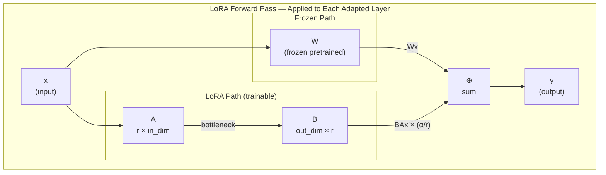
```mermaid
flowchart LR
    subgraph ForwardFlow["LoRA Forward Pass — Applied to Each Adapted Layer"]
        direction LR
        INPUT["x<br/>(input)"]

        subgraph Pretrained["Frozen Path"]
            ORIG["W<br/>(frozen pretrained)"]
        end

        subgraph LoRAPath["LoRA Path (trainable)"]
            LORA_A["A<br/>r × in_dim"]
            LORA_B["B<br/>out_dim × r"]
        end

        SUM["⊕<br/>sum"]
        OUTPUT["y<br/>(output)"]

        INPUT --> ORIG
        INPUT --> LORA_A
        LORA_A -->|"bottleneck"| LORA_B
        ORIG -->|"Wx"| SUM
        LORA_B -->|"BAx × (α/r)"| SUM
        SUM --> OUTPUT
    end
```

**Formula**: `y = Wx + BAx · (α/r) = Wx + ΔWx · scaling`

##### Implementation Details

1. **Conditional Attachment**: LoRA is only applied when `config.use_backbone_lora > 0` or `config.use_llm_lora > 0`. The config value specifies the LoRA rank `r`.

2. **Default Configuration**: In the default GR00T-N1.5-3B config, both `use_backbone_lora` and `use_llm_lora` are set to `0` (disabled).

3. **LLM-specific Setup**: `wrap_llm_lora()` additionally:
   - Calls `enable_input_require_grads()` — Enables gradient computation for inputs (required for PEFT)
   - Sets `task_type="CAUSAL_LM"` — Optimizes for autoregressive generation

4. **Module Naming Conventions**:
   - Vision (SigLIP): Uses `out_proj` for attention output projection
   - LLM (Qwen): Uses `o_proj` for attention output projection

5. **Trainable Parameter Logging**: Both wrapper functions call `print_trainable_parameters()` to log the percentage of trainable params after LoRA attachment.

**Code Reference**: `lerobot/src/lerobot/policies/groot/eagle2_hg_model/modeling_eagle2_5_vl.py` (lines 154-206)


#### Vision Encoder

<a id="vision-encoder-siglip"></a>
##### SiglipVisionModel

The SigLIP-2 Vision Transformer encodes images into patch embeddings:

- **Input**: `pixel_values` tensor of shape `[B, C, H, W]`
- **Output**: Sequence of patch embeddings `[B, num_patches, hidden_size]`
- **Architecture**: Vision Transformer (ViT) splitting images into 14×14 patches

```python
# From modeling_eagle2_5_vl.py
if config.vision_config.model_type == "siglip_vision_model":
    config.vision_config._attn_implementation = "flash_attention_2"
    self.vision_model = SiglipVisionModel(config.vision_config)
```

##### Vision Encoder Configuration Parameters

| Config Parameter | Value | Controls |
|------------------|-------|----------|
| `vision_config.model_type` | `"siglip_vision_model"` | Which vision encoder class |
| `vision_config.image_size` | `224` | Input image resolution |
| `vision_config.patch_size` | `14` | ViT patch size → 16×16 = 256 patches |
| `vision_config.hidden_size` | `1152` | Vision embedding dimension |
| `vision_config.num_hidden_layers` | `27` | ViT depth |
| `vision_config.num_attention_heads` | `16` | ViT attention heads |

##### Vision Encoder LoRA: `wrap_backbone_lora()`

The `wrap_backbone_lora()` method attaches LoRA adapters to the SiglipVisionModel:

```python
def wrap_backbone_lora(self, r=128, lora_alpha=256, lora_dropout=0.05):
    lora_config = LoraConfig(
        r=r,
        target_modules=[
            "self_attn.q_proj", "self_attn.k_proj", "self_attn.v_proj",
            "self_attn.out_proj", "mlp.fc1", "mlp.fc2",
        ],
        lora_alpha=lora_alpha,
        lora_dropout=lora_dropout,
    )
    self.vision_model = get_peft_model(self.vision_model, lora_config)
```

**Target Modules (SiglipVisionModel)**:

| Module | Purpose | Original Layer |
|--------|---------|----------------|
| `self_attn.q_proj` | Query projection | `nn.Linear(1152, 1152)` |
| `self_attn.k_proj` | Key projection | `nn.Linear(1152, 1152)` |
| `self_attn.v_proj` | Value projection | `nn.Linear(1152, 1152)` |
| `self_attn.out_proj` | Output projection | `nn.Linear(1152, 1152)` |
| `mlp.fc1` | MLP up-projection | `nn.Linear(1152, 4304)` |
| `mlp.fc2` | MLP down-projection | `nn.Linear(4304, 1152)` |

##### Vision Encoder LoRA Dimensions

With `hidden_size=1152`, `intermediate_size=4304`, `r=128`, `lora_alpha=256`:

| Target Module | in_dim | out_dim | A shape | B shape | LoRA params | Scaling |
|---------------|--------|---------|---------|---------|-------------|---------|
| `q_proj` | 1152 | 1152 | (128, 1152) | (1152, 128) | 294,912 | 2.0 |
| `k_proj` | 1152 | 1152 | (128, 1152) | (1152, 128) | 294,912 | 2.0 |
| `v_proj` | 1152 | 1152 | (128, 1152) | (1152, 128) | 294,912 | 2.0 |
| `out_proj` | 1152 | 1152 | (128, 1152) | (1152, 128) | 294,912 | 2.0 |
| `fc1` | 1152 | 4304 | (128, 1152) | (4304, 128) | 698,624 | 2.0 |
| `fc2` | 4304 | 1152 | (128, 4304) | (1152, 128) | 698,624 | 2.0 |

**Per-layer LoRA params**: 2,576,896
**Total Vision LoRA (27 layers)**: ~69.6M parameters

##### Vision Encoder LoRA Block Diagram

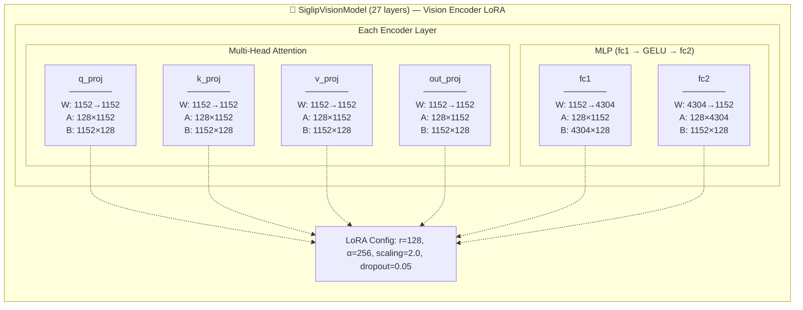
```mermaid
flowchart TB
    subgraph VisionEncoder["🔭 SiglipVisionModel (27 layers) — Vision Encoder LoRA"]
        direction TB

        subgraph VLayer["Each Encoder Layer"]
            direction TB

            subgraph VMHA["Multi-Head Attention"]
                direction LR
                VQ["q_proj<br/>───────<br/>W: 1152→1152<br/>A: 128×1152<br/>B: 1152×128"]
                VK["k_proj<br/>───────<br/>W: 1152→1152<br/>A: 128×1152<br/>B: 1152×128"]
                VV["v_proj<br/>───────<br/>W: 1152→1152<br/>A: 128×1152<br/>B: 1152×128"]
                VOUT["out_proj<br/>───────<br/>W: 1152→1152<br/>A: 128×1152<br/>B: 1152×128"]
            end

            subgraph VMLP["MLP (fc1 → GELU → fc2)"]
                direction LR
                VFC1["fc1<br/>───────<br/>W: 1152→4304<br/>A: 128×1152<br/>B: 4304×128"]
                VFC2["fc2<br/>───────<br/>W: 4304→1152<br/>A: 128×4304<br/>B: 1152×128"]
            end
        end

        VCFG["LoRA Config: r=128, α=256, scaling=2.0, dropout=0.05"]
        VQ & VK & VV & VOUT -.-> VCFG
        VFC1 & VFC2 -.-> VCFG
    end
```

#### Language Model

<a id="language-model-qwen3"></a>
##### Qwen3ForCausalLM

The Qwen3 decoder-only transformer processes the fused vision-language embeddings:

```python
# From modeling_eagle2_5_vl.py
if config.text_config.architectures[0] == "Qwen3ForCausalLM":
    self.language_model = Qwen3ForCausalLM(config.text_config)
```

The model replaces `<image>` placeholder tokens with projected vision embeddings before LLM processing.

##### Language Model Configuration Parameters

| Config Parameter | Value | Controls |
|------------------|-------|----------|
| `text_config.architectures[0]` | `"Qwen3ForCausalLM"` | Which LLM class |
| `text_config.hidden_size` | `2048` | LLM embedding dimension |
| `text_config.num_hidden_layers` | `28` | LLM depth |
| `text_config.num_attention_heads` | `16` | LLM attention heads |
| `text_config.num_key_value_heads` | `8` | Grouped Query Attention heads |
| `text_config.intermediate_size` | `6144` | FFN dimension |
| `text_config.vocab_size` | `151680` | Vocabulary size |

##### Language Model LoRA: `wrap_llm_lora()`

The `wrap_llm_lora()` method attaches LoRA adapters to the Qwen3ForCausalLM:

```python
def wrap_llm_lora(self, r=128, lora_alpha=256, lora_dropout=0.05):
    lora_config = LoraConfig(
        r=r,
        target_modules=[
            "self_attn.q_proj", "self_attn.k_proj", "self_attn.v_proj",
            "self_attn.o_proj", "mlp.gate_proj", "mlp.down_proj", "mlp.up_proj",
        ],
        lora_alpha=lora_alpha,
        lora_dropout=lora_dropout,
        task_type="CAUSAL_LM",
    )
    self.language_model = get_peft_model(self.language_model, lora_config)
    self.language_model.enable_input_require_grads()
```

**Target Modules (Qwen3ForCausalLM)**:

| Module | Purpose | Original Layer |
|--------|---------|----------------|
| `self_attn.q_proj` | Query projection | `nn.Linear(2048, 2048)` |
| `self_attn.k_proj` | Key projection (GQA) | `nn.Linear(2048, 512)` |
| `self_attn.v_proj` | Value projection (GQA) | `nn.Linear(2048, 512)` |
| `self_attn.o_proj` | Output projection | `nn.Linear(2048, 2048)` |
| `mlp.gate_proj` | SwiGLU gate | `nn.Linear(2048, 6144)` |
| `mlp.up_proj` | SwiGLU up | `nn.Linear(2048, 6144)` |
| `mlp.down_proj` | SwiGLU down | `nn.Linear(6144, 2048)` |

##### Language Model LoRA Dimensions

With `hidden_size=2048`, `intermediate_size=6144`, `num_key_value_heads=8`, `r=128`, `lora_alpha=256`:

| Target Module | in_dim | out_dim | A shape | B shape | LoRA params | Scaling |
|---------------|--------|---------|---------|---------|-------------|---------|
| `q_proj` | 2048 | 2048 | (128, 2048) | (2048, 128) | 524,288 | 2.0 |
| `k_proj` | 2048 | 512 | (128, 2048) | (512, 128) | 327,680 | 2.0 |
| `v_proj` | 2048 | 512 | (128, 2048) | (512, 128) | 327,680 | 2.0 |
| `o_proj` | 2048 | 2048 | (128, 2048) | (2048, 128) | 524,288 | 2.0 |
| `gate_proj` | 2048 | 6144 | (128, 2048) | (6144, 128) | 1,048,576 | 2.0 |
| `up_proj` | 2048 | 6144 | (128, 2048) | (6144, 128) | 1,048,576 | 2.0 |
| `down_proj` | 6144 | 2048 | (128, 6144) | (2048, 128) | 1,048,576 | 2.0 |

**Per-layer LoRA params**: 4,849,664
**Total LLM LoRA (28 layers)**: ~135.8M parameters

##### Language Model LoRA Block Diagram

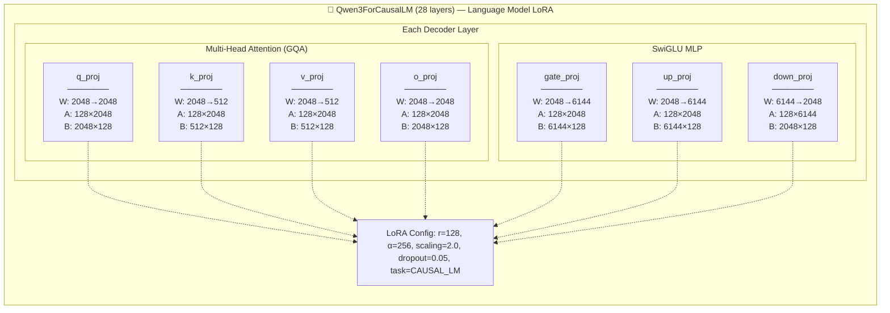
```mermaid
flowchart TB
    subgraph LLM["🧠 Qwen3ForCausalLM (28 layers) — Language Model LoRA"]
        direction TB

        subgraph LLayer["Each Decoder Layer"]
            direction TB

            subgraph LMHA["Multi-Head Attention (GQA)"]
                direction LR
                LQ["q_proj<br/>───────<br/>W: 2048→2048<br/>A: 128×2048<br/>B: 2048×128"]
                LK["k_proj<br/>───────<br/>W: 2048→512<br/>A: 128×2048<br/>B: 512×128"]
                LV["v_proj<br/>───────<br/>W: 2048→512<br/>A: 128×2048<br/>B: 512×128"]
                LO["o_proj<br/>───────<br/>W: 2048→2048<br/>A: 128×2048<br/>B: 2048×128"]
            end

            subgraph LMLP["SwiGLU MLP"]
                direction LR
                LGATE["gate_proj<br/>───────<br/>W: 2048→6144<br/>A: 128×2048<br/>B: 6144×128"]
                LUP["up_proj<br/>───────<br/>W: 2048→6144<br/>A: 128×2048<br/>B: 6144×128"]
                LDOWN["down_proj<br/>───────<br/>W: 6144→2048<br/>A: 128×6144<br/>B: 2048×128"]
            end
        end

        LCFG["LoRA Config: r=128, α=256, scaling=2.0, dropout=0.05, task=CAUSAL_LM"]
        LQ & LK & LV & LO -.-> LCFG
        LGATE & LUP & LDOWN -.-> LCFG
    end
```

#### MLP Connector

<a id="mlp-connector"></a>
##### mlp1

The connector projects vision features to match the LLM embedding dimension. Two variants exist:

**2-layer connector** (when `mlp_connector_layers=2` and `use_pixel_shuffle=True`):
```python
self.mlp1 = nn.Sequential(
    nn.LayerNorm(vit_hidden_size * int(1/downsample_ratio)**2),  # 1152 * 4 = 4608
    nn.Linear(4608, 2048),   # Project to LLM dim
    nn.GELU(),
    nn.Linear(2048, 2048),   # Refine
)
```

**1-layer connector** (when `mlp_connector_layers=1`):
```python
self.mlp1 = nn.Sequential(
    nn.Linear(vit_hidden_size, llm_hidden_size),  # 1152 → 2048
)
```

##### MLP Connector Configuration Parameters

| Config Parameter | Value | Controls |
|------------------|-------|----------|
| `force_image_size` | `224` | Override vision image size |
| `downsample_ratio` | `0.5` | Pixel shuffle downsampling factor |
| `use_pixel_shuffle` | `false` | Enable spatial downsampling |
| `mlp_connector_layers` | `1` | MLP connector depth (1 or 2) |
| `select_layer` | `-1` | Which ViT layer to extract (-1 = last) |
| `image_token_index` | `151669` | Token ID for `<image>` placeholder |
| `dynamic_image_size` | `true` | Variable resolution tiling |
| `max_dynamic_tiles` | `12` | Max tiles for high-res images |

<a id="vl-feature-refinement-architecture"></a>
### VL Feature Refinement

The **VL Feature Refinement** layers (`vlln` and `vl_self_attention`) are components within `FlowMatchingActionHead` that bridge the Eagle VLM backbone output to the DiT cross-attention conditioning. These layers refine the vision-language features before they are used as context for action prediction.

#### Architectural Role

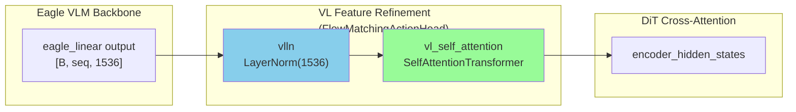
```mermaid
flowchart LR
    subgraph BACKBONE["Eagle VLM Backbone"]
        A["eagle_linear output<br/>[B, seq, 1536]"]
    end

    subgraph VL_REFINE["VL Feature Refinement<br/>(FlowMatchingActionHead)"]
        B["vlln<br/>LayerNorm(1536)"]
        C["vl_self_attention<br/>SelfAttentionTransformer"]
    end

    subgraph DIT["DiT Cross-Attention"]
        D["encoder_hidden_states"]
    end

    A --> B --> C --> D

    style B fill:#87CEEB
    style C fill:#98FB98
```

#### Component Overview

| Component | Class | Purpose |
|-----------|-------|---------|
| `vlln` | `nn.LayerNorm(1536)` | Normalizes backbone features before self-attention |
| `vl_self_attention` | `SelfAttentionTransformer` | Refines features through self-attention while preserving sequence length |

**Initialization** (`flow_matching_action_head.py`, lines 199-202):

```python
# File: flow_matching_action_head.py
self.vlln = nn.LayerNorm(config.backbone_embedding_dim) if config.use_vlln else nn.Identity()
self.vl_self_attention = (
    SelfAttentionTransformer(**config.vl_self_attention_cfg) if config.use_vlln else nn.Identity()
)
```

#### vl_self_attention Architecture

The `vl_self_attention` layer is a `SelfAttentionTransformer` with the following configuration:

| Parameter | Value | Description |
|-----------|-------|-------------|
| `num_attention_heads` | 8 | Number of attention heads |
| `attention_head_dim` | 64 | Dimension per head (inner_dim = 8 × 64 = 512) |
| `num_layers` | 12 | Number of transformer blocks |
| `dropout` | 0.1 | Dropout rate |
| `activation_fn` | `gelu-approximate` | Activation function |
| `positional_embeddings` | `sinusoidal` | Position encoding type |

**Key Property**: The `vl_self_attention` layer does **NOT** reduce sequence length—it refines features through self-attention while preserving all tokens:

| Stage | Shape | Notes |
|-------|-------|-------|
| Input | `[B, seq_len, 1536]` | From `vlln` output |
| Output | `[B, seq_len, 1536]` | Sequence length preserved |

#### Training Behavior

The VL refinement layers are controlled by the `use_vlln` configuration flag:

| `use_vlln` | `vlln` | `vl_self_attention` |
|------------|--------|---------------------|
| `True` (default) | `LayerNorm(1536)` | `SelfAttentionTransformer` |
| `False` | `Identity()` | `Identity()` |

> **Cross-Reference**: For detailed forward pass implementation including tensor transformations and configuration parameters, see [Section 5: VL Feature Refinement](#ch5-vl-feature-refinement).

---

<a id="state-encoder"></a>
### State Encoder

The **State Encoder** projects the robot's current proprioceptive state (joint positions, velocities, etc.) into the same embedding space used by the DiT (Diffusion Transformer). This component is critical for bridging robot-specific state representations to the unified action prediction pipeline.

#### Purpose and Role

1. **Dimension Bridging**: Raw state vectors have variable dimensions depending on the robot embodiment (e.g., 6 joints for SO-101, 7 joints for Franka), while the DiT operates on a fixed 1536-dimensional embedding space.

2. **Conditioning Signal**: The encoded state serves as the **first token** in the DiT's input sequence (`sa_embs`), providing the model with current proprioceptive context for action prediction.

3. **Multi-Embodiment Support**: Different robots have fundamentally different state representations. The State Encoder uses **embodiment-specific MLP weights** to handle this heterogeneity within a single model.

#### Integration in Action Head Pipeline

The State Encoder is the **first** encoding step in the Action Head:

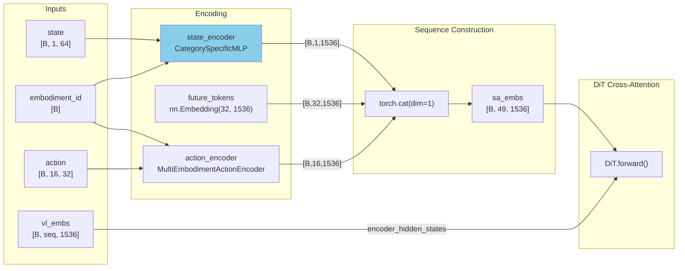
```mermaid
flowchart LR
    subgraph INPUT["Inputs"]
        S["state<br/>[B, 1, 64]"]
        E["embodiment_id<br/>[B]"]
        A["action<br/>[B, 16, 32]"]
        VL["vl_embs<br/>[B, seq, 1536]"]
    end

    subgraph ENCODE["Encoding"]
        SE["state_encoder<br/>CategorySpecificMLP"]
        AE["action_encoder<br/>MultiEmbodimentActionEncoder"]
        FT["future_tokens<br/>nn.Embedding(32, 1536)"]
    end

    subgraph SEQ["Sequence Construction"]
        CAT["torch.cat(dim=1)"]
        SA["sa_embs<br/>[B, 49, 1536]"]
    end

    subgraph DIT["DiT Cross-Attention"]
        D["DiT.forward()"]
    end

    S --> SE
    E --> SE & AE
    SE -->|"[B,1,1536]"| CAT
    FT -->|"[B,32,1536]"| CAT
    A --> AE -->|"[B,16,1536]"| CAT
    CAT --> SA --> D
    VL -->|"encoder_hidden_states"| D

    style SE fill:#87CEEB
```

**Sequence Construction** (`flow_matching_action_head.py`, lines 320-322):

```python
future_tokens = self.future_tokens.weight.unsqueeze(0).expand(vl_embs.shape[0], -1, -1)
sa_embs = torch.cat((state_features, future_tokens, action_features), dim=1)
# sa_embs shape: [B, 1 + 32 + 16, 1536] = [B, 49, 1536]
```

The `state_features` (1 token) is **prepended** to the sequence, giving the DiT:

| Position | Content | Shape per batch |
|----------|---------|-----------------|
| 0 | Current robot state | `[1, 1536]` |
| 1-32 | Future tokens (learnable) | `[32, 1536]` |
| 33-48 | Action tokens (noisy trajectory) | `[16, 1536]` |

#### Architecture: CategorySpecificMLP

The State Encoder is implemented as a `CategorySpecificMLP`, a two-layer MLP with **per-embodiment weights**. Each `CategorySpecificLinear` layer maintains a weight bank storing separate parameters for all 32 embodiments, with `cat_ids` selecting the appropriate weights at runtime.

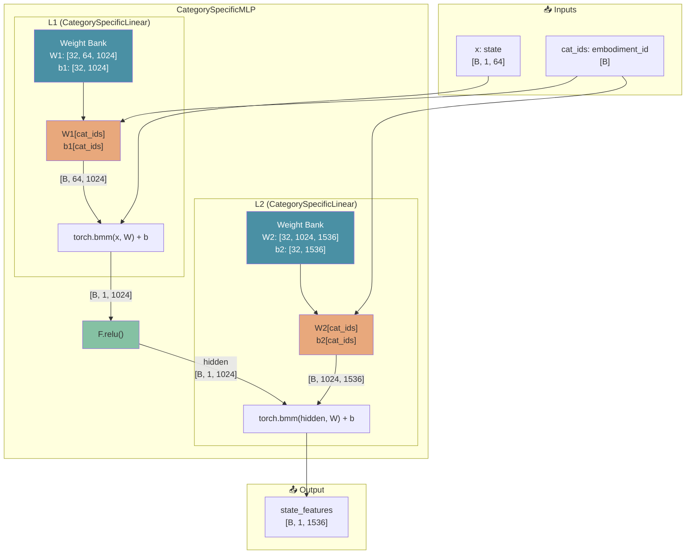
```mermaid
flowchart TB
    subgraph INPUTS["📥 Inputs"]
        X["x: state<br/>[B, 1, 64]"]
        CAT["cat_ids: embodiment_id<br/>[B]"]
    end

    subgraph MLP["CategorySpecificMLP"]
        subgraph L1["L1 (CategorySpecificLinear)"]
            WB1["Weight Bank<br/>W1: [32, 64, 1024]<br/>b1: [32, 1024]"]
            IDX1["W1[cat_ids]<br/>b1[cat_ids]"]
            BMM1["torch.bmm(x, W) + b"]
        end

        RELU["F.relu()"]

        subgraph L2["L2 (CategorySpecificLinear)"]
            WB2["Weight Bank<br/>W2: [32, 1024, 1536]<br/>b2: [32, 1536]"]
            IDX2["W2[cat_ids]<br/>b2[cat_ids]"]
            BMM2["torch.bmm(hidden, W) + b"]
        end
    end

    subgraph OUTPUT["📤 Output"]
        OUT["state_features<br/>[B, 1, 1536]"]
    end

    X --> BMM1
    CAT --> IDX1 & IDX2
    WB1 --> IDX1 -->|"[B, 64, 1024]"| BMM1
    BMM1 -->|"[B, 1, 1024]"| RELU
    RELU -->|"hidden<br/>[B, 1, 1024]"| BMM2
    WB2 --> IDX2 -->|"[B, 1024, 1536]"| BMM2
    BMM2 --> OUT

    style WB1 fill:#4a90a4,color:#fff
    style WB2 fill:#4a90a4,color:#fff
    style IDX1 fill:#e8a87c
    style IDX2 fill:#e8a87c
    style RELU fill:#85c1a3
```

**Code Implementation** (`flow_matching_action_head.py`):

```python
# CategorySpecificMLP (lines 56-65)
class CategorySpecificMLP(nn.Module):
    def __init__(self, num_categories, input_dim, hidden_dim, output_dim):
        super().__init__()
        self.num_categories = num_categories
        self.layer1 = CategorySpecificLinear(num_categories, input_dim, hidden_dim)
        self.layer2 = CategorySpecificLinear(num_categories, hidden_dim, output_dim)

# CategorySpecificLinear (lines 42-53)
class CategorySpecificLinear(nn.Module):
    def __init__(self, num_categories, input_dim, hidden_dim):
        super().__init__()
        self.num_categories = num_categories
        self.W = nn.Parameter(0.02 * torch.randn(num_categories, input_dim, hidden_dim))
        self.b = nn.Parameter(torch.zeros(num_categories, hidden_dim))
```

#### Embodiment-Specific Design: Weight Bank Architecture

The key design pattern is the **weight bank** that stores separate parameters for each robot embodiment:

| Layer | Weight Tensor Shape | Description |
|-------|---------------------|-------------|
| `layer1.W` | `[32, 64, 1024]` | `[num_embodiments, max_state_dim, hidden_size]` |
| `layer1.b` | `[32, 1024]` | `[num_embodiments, hidden_size]` |
| `layer2.W` | `[32, 1024, 1536]` | `[num_embodiments, hidden_size, output_dim]` |
| `layer2.b` | `[32, 1536]` | `[num_embodiments, output_dim]` |

**How `embodiment_id` Indexing Works**:

```python
# During forward pass:
embodiment_id = action_input.embodiment_id  # e.g., tensor([31]) for SO-101

# In CategorySpecificLinear.forward():
selected_w = self.W[cat_ids]  # Shape: [B, input_dim, hidden_dim]
# This selects the weight matrix for embodiment 31 from the bank of 32
```

This design enables:
- **Single Model, Multiple Robots**: One pretrained checkpoint works for all supported embodiments
- **Zero-Shot Transfer**: New embodiment configurations can be assigned an ID and leverage shared DiT knowledge
- **Memory Efficiency**: Only the relevant weights are used during forward pass (via batched indexing)

#### Input/Output Specifications

**Configuration Parameters** (`FlowmatchingActionHeadConfig`):

| Parameter | Default Value | Description |
|-----------|---------------|-------------|
| `max_num_embodiments` | 32 | Maximum number of robot embodiments supported |
| `max_state_dim` | 64 | Maximum state vector dimension (padded if smaller) |
| `hidden_size` | 1024 | Hidden layer dimension |
| `input_embedding_dim` | 1536 | Output dimension (matches DiT input) |

#### Code Implementation

**Instantiation** (`flow_matching_action_head.py`, lines 179-184):

```python
self.state_encoder = CategorySpecificMLP(
    num_categories=config.max_num_embodiments,  # 32
    input_dim=config.max_state_dim,             # 64
    hidden_dim=self.hidden_size,                 # 1024
    output_dim=self.input_embedding_dim,         # 1536
)
```

**Usage in Training Forward Pass** (line 299):

```python
# In FlowmatchingActionHead.forward()
embodiment_id = action_input.embodiment_id
state_features = self.state_encoder(action_input.state, embodiment_id)
```

**Usage in Inference** (line 354):

```python
# In FlowmatchingActionHead.get_action()
state_features = self.state_encoder(action_input.state, embodiment_id)
```

#### Training Behavior: `--tune-projector` Flag

The `state_encoder` is controlled by the `tune_projector` configuration flag:

**Configuration** (`FlowmatchingActionHeadConfig`, line 140):

```python
tune_projector: bool = field(default=True, metadata={"help": "Whether to tune the projector."})
```

**Effect in `set_trainable_parameters()`** (lines 213-227):

```python
def set_trainable_parameters(self, tune_projector: bool, tune_diffusion_model: bool):
    for p in self.parameters():
        p.requires_grad = True  # Start with all trainable
    if not tune_projector:
        self.state_encoder.requires_grad_(False)   # ← Freeze state_encoder
        self.action_encoder.requires_grad_(False)
        self.action_decoder.requires_grad_(False)
        if self.config.add_pos_embed:
            self.position_embedding.requires_grad_(False)
```

**Components Affected by `tune_projector=False`**:

| Component | Frozen when `tune_projector=False`? |
|-----------|-------------------------------------|
| `state_encoder` | ✅ Yes |
| `action_encoder` | ✅ Yes |
| `action_decoder` | ✅ Yes |
| `position_embedding` | ✅ Yes (if `add_pos_embed=True`) |
| `future_tokens` | ❌ No (always trainable) |
| `vlln` | ❌ No |
| `vl_self_attention` | ❌ No |
| `model` (DiT) | Controlled by `tune_diffusion_model` |

**Typical Fine-Tuning Configurations**:

| Scenario | `tune_projector` | `tune_diffusion_model` | Notes |
|----------|------------------|------------------------|-------|
| Full fine-tuning | `True` | `True` | All action head parameters trainable |
| DiT-only | `False` | `True` | Freeze encoders, tune DiT only |
| Encoders-only | `True` | `False` | Tune projectors, freeze DiT |

---

<a id="action-encoder"></a>
### Action Encoder

The **Action Encoder** (`MultiEmbodimentActionEncoder`) projects noisy action trajectories into the DiT embedding space while conditioning on the denoising timestep. Unlike the simpler State Encoder, it requires timestep conditioning to inform the model about the current noise level during flow matching.

#### Integration in Action Head Pipeline

The Action Encoder encodes noisy action trajectories with timestep conditioning in the Action Head:

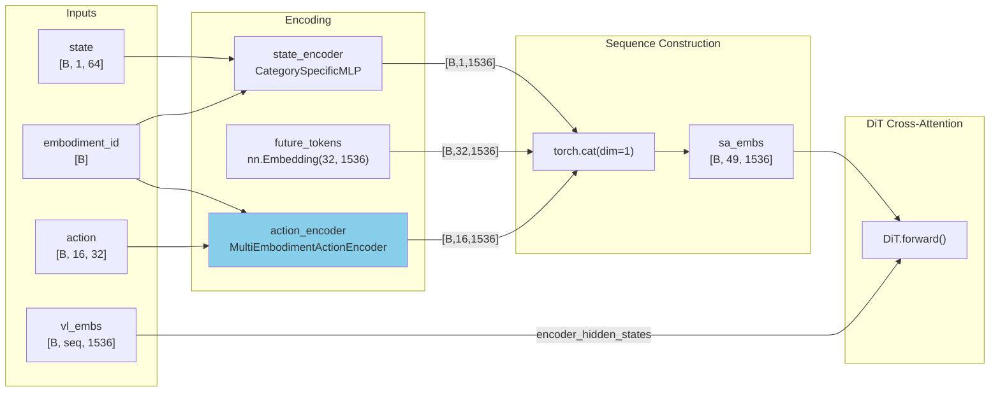
```mermaid
flowchart LR
    subgraph INPUT["Inputs"]
        S["state<br/>[B, 1, 64]"]
        E["embodiment_id<br/>[B]"]
        A["action<br/>[B, 16, 32]"]
        VL["vl_embs<br/>[B, seq, 1536]"]
    end

    subgraph ENCODE["Encoding"]
        SE["state_encoder<br/>CategorySpecificMLP"]
        AE["action_encoder<br/>MultiEmbodimentActionEncoder"]
        FT["future_tokens<br/>nn.Embedding(32, 1536)"]
    end

    subgraph SEQ["Sequence Construction"]
        CAT["torch.cat(dim=1)"]
        SA["sa_embs<br/>[B, 49, 1536]"]
    end

    subgraph DIT["DiT Cross-Attention"]
        D["DiT.forward()"]
    end

    S --> SE
    E --> SE & AE
    SE -->|"[B,1,1536]"| CAT
    FT -->|"[B,32,1536]"| CAT
    A --> AE -->|"[B,16,1536]"| CAT
    CAT --> SA --> D
    VL -->|"encoder_hidden_states"| D

    style AE fill:#87CEEB
```

**Action Encoding with Timestep** (`flow_matching_action_head.py`):

```python
# During training: encode noisy actions with timestep conditioning
action_features = self.action_encoder(noisy_actions, t, embodiment_id)
# action_features shape: [B, 16, 1536]
```

The Action Encoder contributes 16 tokens to the sequence:

| Position | Content | Shape per batch |
|----------|---------|-----------------|
| 0 | Current robot state | `[1, 1536]` |
| 1-32 | Future tokens (learnable) | `[32, 1536]` |
| 33-48 | **Action tokens (noisy trajectory)** | `[16, 1536]` |

#### Architecture Comparison: Action Encoder vs State Encoder

| Aspect | State Encoder | Action Encoder |
|--------|---------------|----------------|
| **Class** | `CategorySpecificMLP` | `MultiEmbodimentActionEncoder` |
| **Layers** | 2 (`layer1`, `layer2`) | 3 (`W1`, `W2`, `W3`) |
| **Timestep Conditioning** | ❌ None | ✅ Sinusoidal positional encoding |
| **Activation** | ReLU | Swish (SiLU) |
| **Feature Concatenation** | ❌ None | ✅ Action + Timestep embeddings |
| **Input Dimension** | `max_state_dim=64` | `action_dim=32` |

The Action Encoder must encode **both** the noisy action trajectory **and** the denoising timestep, requiring the additional layer and timestep conditioning mechanism.

#### Architecture: MultiEmbodimentActionEncoder

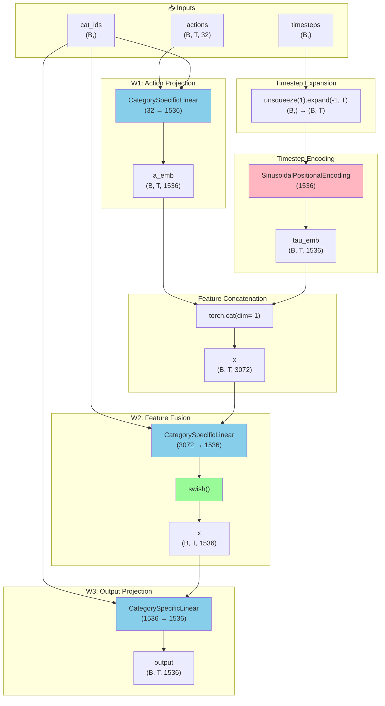
```mermaid
flowchart TB
    subgraph INPUT["📥 Inputs"]
        A["actions<br/>(B, T, 32)"]
        TS["timesteps<br/>(B,)"]
        CAT["cat_ids<br/>(B,)"]
    end

    subgraph EXPAND["Timestep Expansion"]
        EXP["unsqueeze(1).expand(-1, T)<br/>(B,) → (B, T)"]
    end

    subgraph W1_BLOCK["W1: Action Projection"]
        W1["CategorySpecificLinear<br/>(32 → 1536)"]
        A_EMB["a_emb<br/>(B, T, 1536)"]
    end

    subgraph POS["Timestep Encoding"]
        SIN["SinusoidalPositionalEncoding<br/>(1536)"]
        TAU["tau_emb<br/>(B, T, 1536)"]
    end

    subgraph CONCAT["Feature Concatenation"]
        CATOP["torch.cat(dim=-1)"]
        X1["x<br/>(B, T, 3072)"]
    end

    subgraph W2_BLOCK["W2: Feature Fusion"]
        W2["CategorySpecificLinear<br/>(3072 → 1536)"]
        SWISH["swish()"]
        X2["x<br/>(B, T, 1536)"]
    end

    subgraph W3_BLOCK["W3: Output Projection"]
        W3["CategorySpecificLinear<br/>(1536 → 1536)"]
        OUT["output<br/>(B, T, 1536)"]
    end

    A --> W1
    CAT --> W1 & W2 & W3
    W1 --> A_EMB --> CATOP

    TS --> EXP --> SIN --> TAU --> CATOP
    CATOP --> X1 --> W2 --> SWISH --> X2 --> W3 --> OUT

    style W1 fill:#87CEEB
    style W2 fill:#87CEEB
    style W3 fill:#87CEEB
    style SIN fill:#FFB6C1
    style SWISH fill:#98FB98
```

**Code Implementation** (`flow_matching_action_head.py`, lines 68-110):

```python
class MultiEmbodimentActionEncoder(nn.Module):
    def __init__(self, action_dim, hidden_size, num_embodiments):
        super().__init__()
        self.W1 = CategorySpecificLinear(num_embodiments, action_dim, hidden_size)      # (d → w)
        self.W2 = CategorySpecificLinear(num_embodiments, 2 * hidden_size, hidden_size) # (2w → w)
        self.W3 = CategorySpecificLinear(num_embodiments, hidden_size, hidden_size)     # (w → w)
        self.pos_encoding = SinusoidalPositionalEncoding(hidden_size)
```

#### Timestep Conditioning: SinusoidalPositionalEncoding

The `SinusoidalPositionalEncoding` converts discrete timesteps into continuous embeddings using the same technique as transformer positional encodings.

```python
class SinusoidalPositionalEncoding(nn.Module):
    def __init__(self, embedding_dim):
        super().__init__()
        self.embedding_dim = embedding_dim  # 1536
```

**Mathematical Formulation**:

For timestep `t` and dimension index `i`:
```
PE(t, 2i)   = sin(t / 10000^(2i/d))
PE(t, 2i+1) = cos(t / 10000^(2i/d))
```

Where `d = 1536` (embedding dimension) and `i ∈ [0, 768)`.

**Why Sinusoidal Encoding for Timesteps?**

| Property | Benefit |
|----------|---------|
| **Continuous Representation** | Converts discrete integers (0-999) to smooth, differentiable embeddings |
| **Unique Signatures** | Each timestep gets a unique embedding pattern |
| **Interpolation** | Model can generalize to timesteps not seen during training |
| **No Learned Parameters** | Deterministic encoding, no additional training needed |

#### Activation Function: Swish vs ReLU

The Action Encoder uses **swish** (also known as SiLU) instead of ReLU:

```python
def swish(x):
    return x * torch.sigmoid(x)
```

| Activation | Formula | Used In | Properties |
|------------|---------|---------|------------|
| **ReLU** | `max(0, x)` | State Encoder | Hard zero for negatives, sparse gradients |
| **Swish** | `x * sigmoid(x)` | Action Encoder | Smooth, non-monotonic, self-gated |

**Why Swish for Action Encoding?**

1. **Smooth Gradients**: Swish is smooth everywhere, avoiding the "dying ReLU" problem
2. **Self-Gating**: The sigmoid component allows the network to learn feature selection
3. **Non-Monotonic**: Can have small negative outputs for negative inputs, preserving information
4. **Diffusion Convention**: Swish is commonly used in diffusion model architectures (DDPM, DiT)

**Application Point**: Swish is applied only after W2, not after W3:
```python
x = swish(self.W2(x, cat_ids))  # ← swish here
x = self.W3(x, cat_ids)          # ← no activation (linear output)
```

#### Embodiment-Specific Design: Weight Bank Shapes

Each `CategorySpecificLinear` layer maintains separate weights for all 32 embodiments:

| Layer | Weight `W` Shape | Bias `b` Shape | Parameters per Layer |
|-------|------------------|----------------|----------------------|
| `W1` | `[32, 32, 1536]` | `[32, 1536]` | 32 × (32×1536 + 1536) = 1.62M |
| `W2` | `[32, 3072, 1536]` | `[32, 1536]` | 32 × (3072×1536 + 1536) = 151.0M |
| `W3` | `[32, 1536, 1536]` | `[32, 1536]` | 32 × (1536×1536 + 1536) = 75.5M |

**Total Action Encoder Parameters**: ~228.2M

**Instantiation** (`flow_matching_action_head.py`, lines 185-189):

```python
self.action_encoder = MultiEmbodimentActionEncoder(
    action_dim=config.action_dim,              # 32
    hidden_size=self.input_embedding_dim,      # 1536
    num_embodiments=config.max_num_embodiments # 32
)
```

#### Data Flow: Complete Tensor Shape Transformation

**Concrete Example (Bread Dataset with SO-101)**:

```
Input:
  - actions: (1, 16, 32)     # 16 timesteps, 32-dim action (6 joints padded)
  - timesteps: (1,) = [700]  # Discretized from t=0.7
  - cat_ids: (1,) = [31]     # SO-101 embodiment ID

Step 1: Expand timesteps
  - (1,) → (1, 16)           # Replicate across action horizon

Step 2: W1 - Action projection
  - (1, 16, 32) × W1[31, 32, 1536] → (1, 16, 1536)
  - a_emb: (1, 16, 1536)

Step 3: Sinusoidal positional encoding
  - (1, 16) → (1, 16, 1536)
  - tau_emb: (1, 16, 1536)

Step 4: Concatenation
  - cat([a_emb, tau_emb], dim=-1)
  - x: (1, 16, 3072)

Step 5: W2 + Swish
  - (1, 16, 3072) × W2[31, 3072, 1536] → (1, 16, 1536)
  - swish() applied
  - x: (1, 16, 1536)

Step 6: W3 - Final projection
  - (1, 16, 1536) × W3[31, 1536, 1536] → (1, 16, 1536)
  - x: (1, 16, 1536)

Output:
  - action_features: (1, 16, 1536)
```

**Tensor Shape Summary Table**:

| Stage | Tensor | Shape | Description |
|-------|--------|-------|-------------|
| Input | `actions` | `[B, 16, 32]` | Noisy action trajectory |
| Input | `timesteps` | `[B]` | Discrete timestep (0-999) |
| Expand | `timesteps` | `[B, 16]` | Replicated across horizon |
| W1 | `a_emb` | `[B, 16, 1536]` | Action embeddings |
| SinPosEnc | `tau_emb` | `[B, 16, 1536]` | Timestep embeddings |
| Concat | `x` | `[B, 16, 3072]` | Concatenated features |
| W2+Swish | `x` | `[B, 16, 1536]` | Fused features |
| W3 | `output` | `[B, 16, 1536]` | Final action features |

---

<a id="future-tokens"></a>
### Future Tokens

#### Integration in Action Head Pipeline

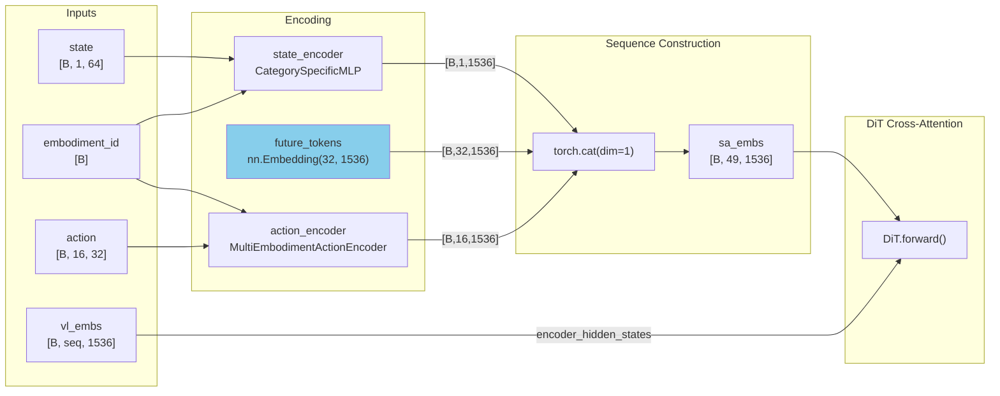
```mermaid
flowchart LR
    subgraph INPUT["Inputs"]
        S["state<br/>[B, 1, 64]"]
        E["embodiment_id<br/>[B]"]
        A["action<br/>[B, 16, 32]"]
        VL["vl_embs<br/>[B, seq, 1536]"]
    end

    subgraph ENCODE["Encoding"]
        SE["state_encoder<br/>CategorySpecificMLP"]
        AE["action_encoder<br/>MultiEmbodimentActionEncoder"]
        FT["future_tokens<br/>nn.Embedding(32, 1536)"]
    end

    subgraph SEQ["Sequence Construction"]
        CAT["torch.cat(dim=1)"]
        SA["sa_embs<br/>[B, 49, 1536]"]
    end

    subgraph DIT["DiT Cross-Attention"]
        D["DiT.forward()"]
    end

    S --> SE
    E --> SE & AE
    SE -->|"[B,1,1536]"| CAT
    FT -->|"[B,32,1536]"| CAT
    A --> AE -->|"[B,16,1536]"| CAT
    CAT --> SA --> D
    VL -->|"encoder_hidden_states"| D

    style FT fill:#87CEEB
```

#### Purpose of Future Tokens

**Future tokens** are learnable embeddings that provide additional context for action prediction:

| Purpose | Description |
|---------|-------------|
| **Intermediate Representations** | Allow the model to learn representations between state and action |
| **Temporal Bridge** | Fill the gap between current state (1 token) and action horizon (16 tokens) |
| **Learnable Context** | Provide trainable parameters that can encode task-relevant priors |
| **Attention Targets** | Give the DiT additional tokens to attend to during self-attention |

**Common Confusion Clarification**: The configuration parameter `num_target_vision_tokens: int = 32` controls the number of future tokens, **NOT** VL feature compression. VL features retain their original sequence length through the pipeline.

#### Future Tokens Implementation

**Initialization** (`flow_matching_action_head.py`, lines 196-197):

```python
# Create learnable embedding with 32 tokens, each 1536-dimensional
self.future_tokens = nn.Embedding(config.num_target_vision_tokens, self.input_embedding_dim)
#                                  ↑ 32 tokens                      ↑ 1536 dimensions
nn.init.normal_(self.future_tokens.weight, mean=0.0, std=0.02)
```

**Weight Shape**: `[32, 1536]` (32 learnable tokens × 1536 embedding dimension)

**Batch Expansion** (line 321 for training, line 383 for inference):

```python
# Expand from (32, 1536) to (B, 32, 1536)
future_tokens = self.future_tokens.weight.unsqueeze(0).expand(vl_embs.shape[0], -1, -1)
#               ↑ (32, 1536)      ↑ (1, 32, 1536)    ↑ (B, 32, 1536)
```

| Step | Operation | Shape | Description |
|------|-----------|-------|-------------|
| 1 | `self.future_tokens.weight` | `[32, 1536]` | Raw learnable weights |
| 2 | `.unsqueeze(0)` | `[1, 32, 1536]` | Add batch dimension |
| 3 | `.expand(B, -1, -1)` | `[B, 32, 1536]` | Replicate across batch |

**Note**: `.expand()` does not copy data—it creates a view with the same underlying tensor, making it memory-efficient.

---

<a id="action-decoder"></a>
### Action Decoder

The **Action Decoder** transforms DiT outputs back to the action space using embodiment-specific weights. Unlike the more complex Action Encoder, the Action Decoder is a straightforward 2-layer MLP that projects from the DiT's hidden dimension to the action dimension.

**Cross-Reference**: For processing flow and Euler integration during inference, see [Section 5: Action Decoding](#ch5-action-decoding). For the DiT that provides input to the Action Decoder, see [Section 6: Diffusion Transformer (DiT)](#6-diffusion-transformer-dit).

#### Architecture: CategorySpecificMLP

The Action Decoder uses the same `CategorySpecificMLP` class as the [State Encoder](#state-encoder), but with different dimensions for projecting from DiT hidden space back to action space.

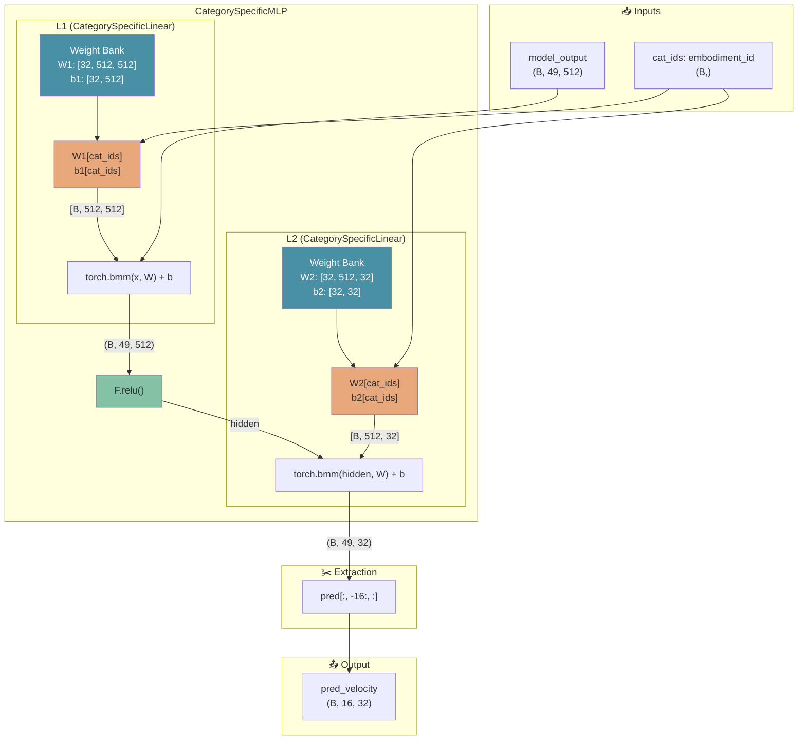
```mermaid
flowchart TB
    subgraph INPUT["📥 Inputs"]
        D1["model_output<br/>(B, 49, 512)"]
        E1["cat_ids: embodiment_id<br/>(B,)"]
    end

    subgraph MLP["CategorySpecificMLP"]
        subgraph L1["L1 (CategorySpecificLinear)"]
            WB1["Weight Bank<br/>W1: [32, 512, 512]<br/>b1: [32, 512]"]
            IDX1["W1[cat_ids]<br/>b1[cat_ids]"]
            BMM1["torch.bmm(x, W) + b"]
        end

        RELU["F.relu()"]

        subgraph L2["L2 (CategorySpecificLinear)"]
            WB2["Weight Bank<br/>W2: [32, 512, 32]<br/>b2: [32, 32]"]
            IDX2["W2[cat_ids]<br/>b2[cat_ids]"]
            BMM2["torch.bmm(hidden, W) + b"]
        end
    end

    subgraph SLICE["✂️ Extraction"]
        S1["pred[:, -16:, :]"]
    end

    subgraph OUTPUT["📤 Output"]
        OUT["pred_velocity<br/>(B, 16, 32)"]
    end

    D1 --> BMM1
    E1 --> IDX1 & IDX2
    WB1 --> IDX1 -->|"[B, 512, 512]"| BMM1
    BMM1 -->|"(B, 49, 512)"| RELU
    RELU -->|"hidden"| BMM2
    WB2 --> IDX2 -->|"[B, 512, 32]"| BMM2
    BMM2 -->|"(B, 49, 32)"| S1 --> OUT

    style WB1 fill:#4a90a4,color:#fff
    style WB2 fill:#4a90a4,color:#fff
    style IDX1 fill:#e8a87c
    style IDX2 fill:#e8a87c
    style RELU fill:#85c1a3
```

**Code Reference**: Uses `CategorySpecificMLP` and `CategorySpecificLinear` classes—see [State Encoder: Code Implementation](#architecture-categoryspecificmlp) for class definitions.

#### Instantiation

**Instantiation** (`flow_matching_action_head.py`, lines 190-195):

```python
self.action_decoder = CategorySpecificMLP(
    num_categories=config.max_num_embodiments,  # 32
    input_dim=self.hidden_size,                  # 512 (DiT inner_dim)
    hidden_dim=self.hidden_size,                 # 512
    output_dim=self.action_dim,                  # 32 (padded action dimension)
)
```

#### Weight Bank Structure

Each `CategorySpecificLinear` layer maintains separate weights for all 32 embodiments:

| Layer | Weight `W` Shape | Bias `b` Shape | Parameters per Layer |
|-------|------------------|----------------|----------------------|
| `layer1` | `[32, 512, 512]` | `[32, 512]` | 32 × (512×512 + 512) = 8.41M |
| `layer2` | `[32, 512, 32]` | `[32, 32]` | 32 × (512×32 + 32) = 0.53M |

**Total Action Decoder Parameters**: ~8.9M

#### Input/Output Shape Transformation

| Stage | Shape | Description |
|-------|-------|-------------|
| **DiT output** | `(B, 49, 512)` | Full sequence: state(1) + future(32) + action(16) |
| **After layer1 + ReLU** | `(B, 49, 512)` | Hidden representation |
| **After layer2** | `(B, 49, 32)` | Projected to action dimension |
| **Slice `[:, -16:]`** | `(B, 16, 32)` | Extract action tokens only |

**Why Slice the Last 16 Tokens?**

The DiT processes all 49 tokens in `sa_embs`, but only the last 16 positions correspond to action tokens:

| Position Range | Token Type | Purpose |
|----------------|------------|---------|
| 0 | State | Proprioceptive encoding (discarded in output) |
| 1-32 | Future | Target vision tokens (discarded in output) |
| 33-48 | Action | **Predicted velocities** (extracted for loss/integration) |

**Cross-Reference**: For detailed forward pass flow and Euler integration during inference, see [Section 5: Action Decoding](#ch5-action-decoding).

#### Comparison: Action Decoder vs. Action Encoder

| Aspect | Action Decoder | Action Encoder |
|--------|----------------|----------------|
| **Class** | `CategorySpecificMLP` | `MultiEmbodimentActionEncoder` |
| **File/Lines** | `flow_matching_action_head.py:190-195` | `flow_matching_action_head.py:185-189` |
| **Layers** | 2 (`layer1`, `layer2`) | 3 (`W1`, `W2`, `W3`) |
| **Timestep Input** | ❌ None | ✅ Sinusoidal positional encoding |
| **Activation** | ReLU (after layer1) | Swish (after W2 only) |
| **Input Dim** | `hidden_size=512` | `action_dim=32` |
| **Output Dim** | `action_dim=32` | `hidden_size=1536` |
| **Direction** | Embedding → Action space | Action space → Embedding |
| **Parameters** | ~8.9M | ~228.2M |
| **Purpose** | Decode DiT output to velocity predictions | Encode noisy actions + timestep to embeddings |

**Why the Asymmetry?**

- **Action Encoder is complex** because it must:
  1. Encode timestep information (noise level awareness)
  2. Project from low-dim (32) to high-dim (1536)
  3. Fuse action + timestep via concatenation

- **Action Decoder is simple** because:
  1. No timestep needed (DiT already incorporated it via AdaLayerNorm)
  2. Project from high-dim (512) to low-dim (32)
  3. Straightforward dimensionality reduction

---

<a id="dit-architecture"></a>
### Diffusion Transformer (DiT)

The **Diffusion Transformer (DiT)** is the core generative model in GR00T N1.5's Flow Matching Action Head. It processes a heterogeneous sequence of state, future, and action tokens while cross-attending to vision-language features, conditioned on the denoising timestep via Adaptive Layer Normalization.

This section provides a detailed explanation of the DiT architecture, including input construction, processing mechanics, output extraction, and a comparison with the original DiT paper (Peebles & Xie, 2023).

**Cross-Reference**: For how the DiT fits into the training loop, see [Section 5: Training Data Flow and Flow Matching](#training-data-flow). For runtime behavior, see [Section 6: Diffusion Transformer (DiT)](#6-diffusion-transformer-dit).

#### DiT Architecture Block Diagram

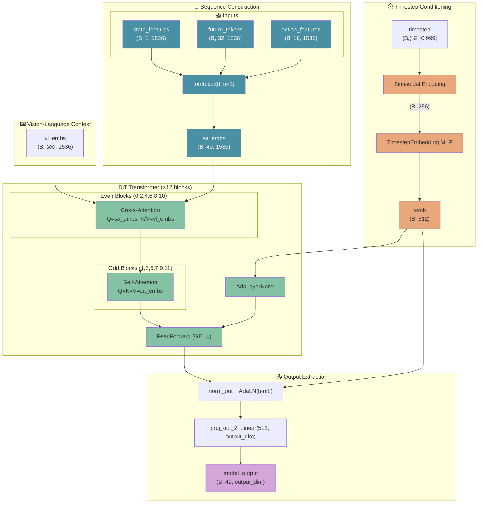
```mermaid
flowchart TB
    subgraph SEQ["🔗 Sequence Construction"]
        subgraph INPUTS["📥 Inputs"]
            STATE["state_features<br/>(B, 1, 1536)"]
            FUTURE["future_tokens<br/>(B, 32, 1536)"]
            ACTION["action_features<br/>(B, 16, 1536)"]
        end
        CAT["torch.cat(dim=1)"]
        SA["sa_embs<br/>(B, 49, 1536)"]
    end

    subgraph COND["⏱️ Timestep Conditioning"]
        T_IN["timestep<br/>(B,) ∈ [0,999]"]
        SINCOS["Sinusoidal Encoding"]
        MLP_T["TimestepEmbedding MLP"]
        TEMB["temb<br/>(B, 512)"]
    end

    subgraph VL["🖼️ Vision-Language Context"]
        VL_IN["vl_embs<br/>(B, seq, 1536)"]
    end

    subgraph TRANSFORMER["🔄 DiT Transformer (×12 blocks)"]
        subgraph EVEN["Even Blocks (0,2,4,6,8,10)"]
            CROSS["Cross-Attention<br/>Q=sa_embs, K/V=vl_embs"]
        end
        subgraph ODD["Odd Blocks (1,3,5,7,9,11)"]
            SELF["Self-Attention<br/>Q=K=V=sa_embs"]
        end
        ADALN["AdaLayerNorm"]
        FF["FeedForward (GELU)"]
    end

    subgraph OUTPUT["📤 Output Extraction"]
        NORM_OUT["norm_out + AdaLN(temb)"]
        PROJ["proj_out_2: Linear(512, output_dim)"]
        MODEL_OUT["model_output<br/>(B, 49, output_dim)"]
    end

    STATE --> CAT
    FUTURE --> CAT
    ACTION --> CAT
    CAT --> SA

    T_IN --> SINCOS -->|"(B, 256)"| MLP_T --> TEMB

    SA --> CROSS
    VL_IN --> CROSS
    CROSS --> SELF
    TEMB --> ADALN
    ADALN --> FF
    SELF --> FF

    FF --> NORM_OUT
    TEMB --> NORM_OUT
    NORM_OUT --> PROJ --> MODEL_OUT

    style STATE fill:#4a90a4,color:#fff
    style FUTURE fill:#4a90a4,color:#fff
    style ACTION fill:#4a90a4,color:#fff
    style CAT fill:#4a90a4,color:#fff
    style SA fill:#4a90a4,color:#fff
    style TEMB fill:#e8a87c
    style SINCOS fill:#e8a87c
    style MLP_T fill:#e8a87c
    style CROSS fill:#85c1a3
    style SELF fill:#85c1a3
    style ADALN fill:#85c1a3
    style FF fill:#85c1a3
    style MODEL_OUT fill:#d4a5d9
```

**Diagram Key**:
- **Blue (Sequence Construction)**: State, future tokens, and action features concatenated into `sa_embs`
- **Orange (Conditioning)**: Timestep encoded via sinusoidal + MLP, modulates all AdaLayerNorm
- **Purple (VL Context)**: Vision-language features from Eagle VLM, used as K/V in cross-attention
- **Green (Transformer)**: 12 blocks alternating cross-attention (even) and self-attention (odd)
- **Pink (Output)**: Final projection and slicing to extract 16-step action predictions

#### Sequence Construction: The `sa_embs` Sequence

The DiT receives a concatenated sequence `sa_embs` constructed as:

```python
# flow_matching_action_head.py, lines 320-322
future_tokens = self.future_tokens.weight.unsqueeze(0).expand(vl_embs.shape[0], -1, -1)
sa_embs = torch.cat((state_features, future_tokens, action_features), dim=1)
# sa_embs shape: [B, 1 + 32 + 16, 1536] = [B, 49, 1536]
```

**Component Breakdown**:

| Position | Component | Shape | Source | Role |
|----------|-----------|-------|--------|------|
| 0 | `state_features` | `[B, 1, 1536]` | `CategorySpecificMLP` | Current robot proprioceptive state (joint positions/velocities) |
| 1-32 | `future_tokens` | `[B, 32, 1536]` | `nn.Embedding(32, 1536)` | Learnable latent placeholders for future planning |
| 33-48 | `action_features` | `[B, 16, 1536]` | `MultiEmbodimentActionEncoder` | Noisy action trajectory with timestep conditioning |

**Why This Specific Ordering?**

1. **State First (Position 0)**: The current robot state provides the initial condition—the DiT needs to understand "where am I now?" before predicting "what should I do next?"

2. **Future Tokens (Positions 1-32)**: These 32 learnable tokens act as a **latent bridge** between state and action:
   - They allow the model to develop abstract internal representations for long-horizon planning
   - Cross-attention to VL features can project task-relevant information into these slots
   - **Important**: The config parameter `num_target_vision_tokens: int = 32` is misleadingly named—these are NOT vision token compressions, but learnable placeholders

3. **Action Tokens (Positions 33-48)**: The noisy action trajectory represents the 16-step action chunk (frames t to t+15) that the model is learning to denoise

**Sequence Length and Temporal Window**:

| Metric | Value | Description |
|--------|-------|-------------|
| Total sequence length | 49 tokens | 1 state + 32 future + 16 action |
| State temporal scope | Frame t | Current observation |
| Action temporal scope | Frames t to t+15 | 16-step action horizon |
| Future tokens | No explicit temporal assignment | Learned latent representations |

**Concrete Example (Bread Dataset, B=1)**:
```
Input Components:
  - state_features:  (1, 1, 1536)   [from CategorySpecificMLP, embodiment_id=31]
  - future_tokens:   (1, 32, 1536)  [learnable, expanded from nn.Embedding(32, 1536)]
  - action_features: (1, 16, 1536)  [from MultiEmbodimentActionEncoder, t_discretized=700]

Concatenation:
  sa_embs = torch.cat((state_features, future_tokens, action_features), dim=1)

Output:
  sa_embs: (1, 49, 1536)
  └── Position 0:     state embedding (current joint positions)
  └── Positions 1-32: future token embeddings (learnable)
  └── Positions 33-48: action embeddings (noisy trajectory at t=0.7)
```

#### DiT Processing: Architecture Details

The DiT is instantiated from configuration:

```python
# flow_matching_action_head.py, line 174
self.model = DiT(**config.diffusion_model_cfg)
```

**Architecture Parameters**:

| Parameter | Default Value | Description |
|-----------|---------------|-------------|
| `num_attention_heads` | 8 | Attention heads per layer |
| `attention_head_dim` | 64 | Dimension per attention head |
| `inner_dim` | 512 (8×64) | Total hidden dimension inside transformer |
| `num_layers` | 12 | Number of transformer blocks |
| `norm_type` | `"ada_norm"` | Adaptive Layer Normalization |
| `interleave_self_attention` | configurable | Whether to alternate cross/self attention |
| `cross_attention_dim` | 1536 | VL embedding dimension for K/V in cross-attention |
| `num_embeds_ada_norm` | 1000 | Number of timestep buckets |

**Code Reference**: `cross_attention_dit.py`, lines 191-211.

**Cross-Reference**: For detailed processing mechanics (timestep conditioning, attention patterns, output extraction), see [Section 6: Diffusion Transformer (DiT)](#6-diffusion-transformer-dit).

#### Comparison with Original DiT (Peebles & Xie, 2023)

The GR00T N1.5 DiT differs significantly from the original Diffusion Transformer designed for image generation. Here's a concise comparison:

**Architectural Comparison**:

| Aspect | Original DiT (Image Generation) | GR00T N1.5 DiT (Action Prediction) |
|--------|--------------------------------|-----------------------------------|
| **Attention** | Self-attention only on image patches | Interleaved: even blocks = cross-attention to VL features, odd blocks = self-attention |
| **Conditioning** | AdaLN-Zero: timestep + class label, with learnable α gating | AdaLayerNorm: timestep only (no gating), VL context via cross-attention |
| **Input Tokens** | Homogeneous patchified image latents | Heterogeneous: [state(1), future(32), action(16)] tokens |
| **Output** | Denoised image patches | Velocity predictions for action chunk |

**Key Differences**:

1. **Dual-Source Conditioning**: Original DiT conditions solely through AdaLN (timestep + class). GR00T uses **two conditioning pathways**: timestep via AdaLayerNorm, and visual-language context via explicit cross-attention blocks. This separates "when in denoising" from "what to do."

2. **Simplified Normalization**: Original DiT's AdaLN-Zero includes a learnable gate α that scales residual contributions (initialized to zero for stable training). GR00T's AdaLayerNorm omits this gating:

```python
# Original DiT AdaLN-Zero
x = x + α * attn(norm(x) * (1 + scale) + shift)

# GR00T AdaLayerNorm
x = attn(norm(x) * (1 + scale) + shift) + x  # No α gating
```

3. **Heterogeneous Sequence**: Image DiT processes uniform patches. GR00T's sequence contains semantically distinct regions—the model implicitly learns that position 0 is state, 1-32 are latent future slots, and 33-48 are actions to denoise.

4. **Cross-Attention for Grounding**: The interleaved pattern enables action tokens to directly query visual features ("where is the bread?") while self-attention maintains temporal coherence across the 16-step action chunk.

**Robotics-Specific Adaptations**:

| Adaptation | Purpose |
|------------|---------|
| `CategorySpecificMLP` encoders/decoders | Embodiment-agnostic multi-robot training |
| Future tokens (32 learnable) | Long-horizon planning abstractions |
| Velocity prediction | Outputs velocity field rather than denoised samples |
| Cross-attention to VL | Task grounding via vision-language features |

**Code References**:

| Component | File | Lines |
|-----------|------|-------|
| DiT class | `cross_attention_dit.py` | 187-301 |
| TimestepEncoder | `cross_attention_dit.py` | 30-40 |
| AdaLayerNorm | `cross_attention_dit.py` | 43-66 |
| Input construction | `flow_matching_action_head.py` | 320-322 |
| Output extraction | `flow_matching_action_head.py` | 333-334 |
| Training forward | `flow_matching_action_head.py` | 266-343 |
| Inference | `flow_matching_action_head.py` | 345-398 |

---

<a id="3-preprocessing-pipeline"></a>
## 3. Preprocessing Pipeline

The preprocessing pipeline transforms raw observations into the format expected by the Eagle VLM backbone. This stage uses callable `ProcessorStep` objects that implement `__call__()` methods.

#### Data Flow Diagram

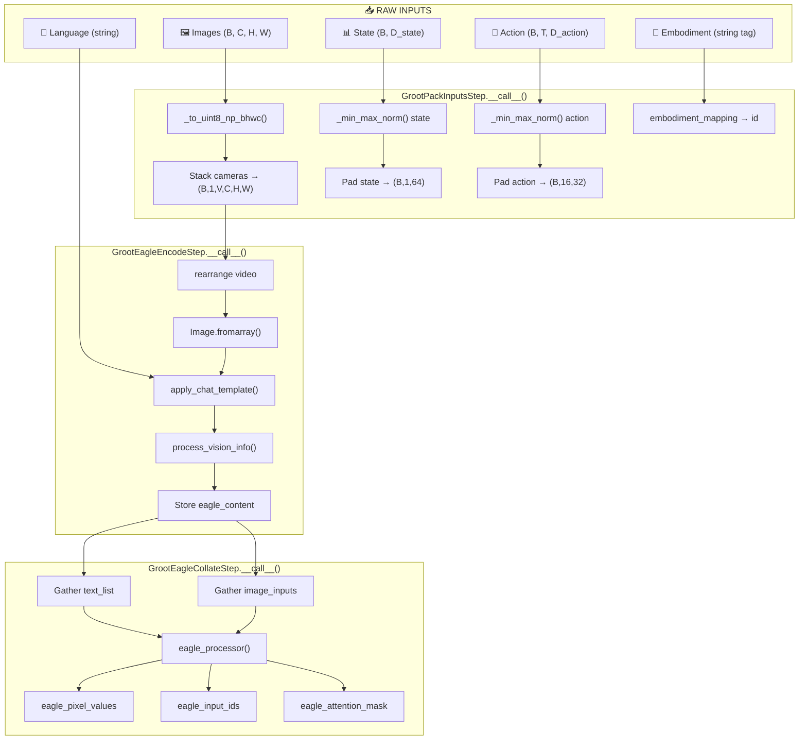
```mermaid
flowchart TB
    subgraph INPUTS["📥 RAW INPUTS"]
        I1["🖼️ Images (B, C, H, W)"]
        I2["📝 Language (string)"]
        I3["📊 State (B, D_state)"]
        I4["🎯 Action (B, T, D_action)"]
        I5["🤖 Embodiment (string tag)"]
    end

    subgraph PACK["GrootPackInputsStep.__call__()"]
        P1["_to_uint8_np_bhwc()"]
        P2["Stack cameras → (B,1,V,C,H,W)"]
        P3["_min_max_norm() state"]
        P4["Pad state → (B,1,64)"]
        P5["_min_max_norm() action"]
        P6["Pad action → (B,16,32)"]
        P7["embodiment_mapping → id"]
    end

    subgraph ENCODE["GrootEagleEncodeStep.__call__()"]
        E1["rearrange video"]
        E2["Image.fromarray()"]
        E3["apply_chat_template()"]
        E4["process_vision_info()"]
        E5["Store eagle_content"]
    end

    subgraph COLLATE["GrootEagleCollateStep.__call__()"]
        C1["Gather text_list"]
        C2["Gather image_inputs"]
        C3["eagle_processor()"]
        C4["eagle_pixel_values"]
        C5["eagle_input_ids"]
        C6["eagle_attention_mask"]
    end

    I1 --> P1 --> P2 --> E1
    I3 --> P3 --> P4
    I4 --> P5 --> P6
    I5 --> P7
    I2 --> E3
    E1 --> E2 --> E3
    E3 --> E4 --> E5
    E5 --> C1 --> C3
    E5 --> C2 --> C3
    C3 --> C4 & C5 & C6
```

#### Function Call Sequence

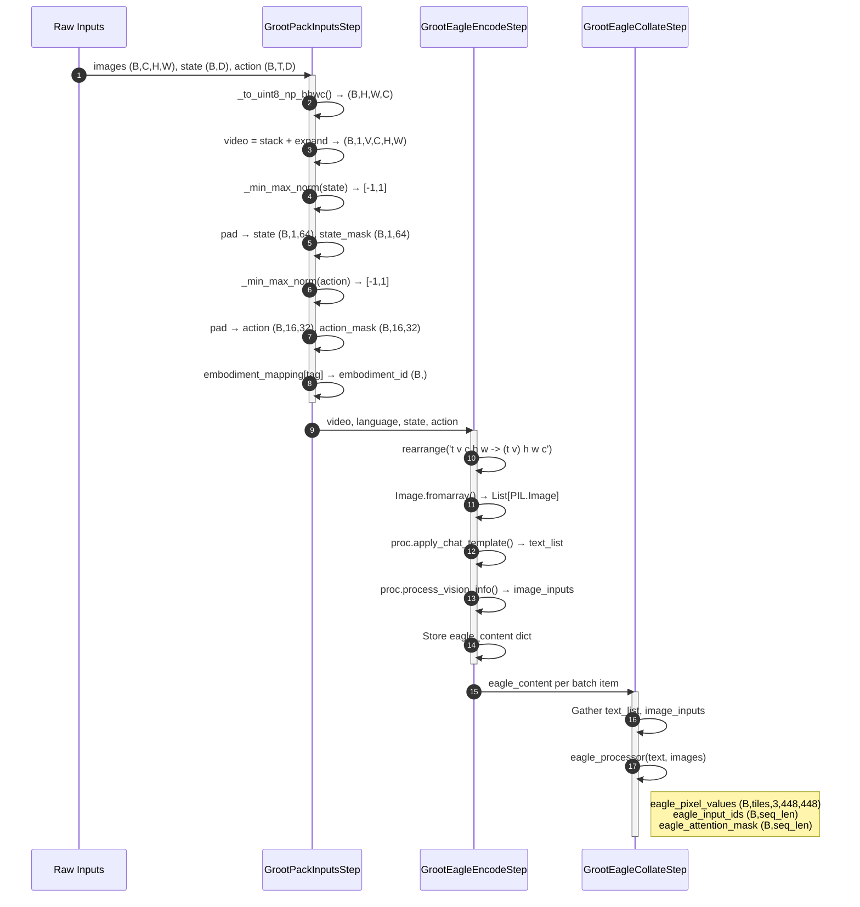
```mermaid
sequenceDiagram
    autonumber
    participant Input as Raw Inputs
    participant Pack as GrootPackInputsStep
    participant Encode as GrootEagleEncodeStep
    participant Collate as GrootEagleCollateStep

    Input->>Pack: images (B,C,H,W), state (B,D), action (B,T,D)
    activate Pack
    Pack->>Pack: _to_uint8_np_bhwc() → (B,H,W,C)
    Pack->>Pack: video = stack + expand → (B,1,V,C,H,W)
    Pack->>Pack: _min_max_norm(state) → [-1,1]
    Pack->>Pack: pad → state (B,1,64), state_mask (B,1,64)
    Pack->>Pack: _min_max_norm(action) → [-1,1]
    Pack->>Pack: pad → action (B,16,32), action_mask (B,16,32)
    Pack->>Pack: embodiment_mapping[tag] → embodiment_id (B,)
    deactivate Pack

    Pack->>Encode: video, language, state, action
    activate Encode
    Encode->>Encode: rearrange('t v c h w -> (t v) h w c')
    Encode->>Encode: Image.fromarray() → List[PIL.Image]
    Encode->>Encode: proc.apply_chat_template() → text_list
    Encode->>Encode: proc.process_vision_info() → image_inputs
    Encode->>Encode: Store eagle_content dict
    deactivate Encode

    Encode->>Collate: eagle_content per batch item
    activate Collate
    Collate->>Collate: Gather text_list, image_inputs
    Collate->>Collate: eagle_processor(text, images)
    Note right of Collate: eagle_pixel_values (B,tiles,3,448,448)<br/>eagle_input_ids (B,seq_len)<br/>eagle_attention_mask (B,seq_len)
    deactivate Collate
```

The preprocessing pipeline performs three critical transformations:

1. **Data Normalization**: State and action values are normalized to `[-1, 1]` using min-max normalization with dataset statistics. This ensures consistent input scales across different robot embodiments.

2. **Vision Tokenization**: Camera images are converted to PIL format, processed through the Eagle processor's chat template, and tokenized into `eagle_pixel_values` tensors suitable for the SigLIP vision encoder.

3. **Sequence Padding**: State vectors are padded to `max_state_dim=64` and action sequences to `max_action_dim=32` with `action_horizon=16` timesteps, enabling batch processing across different embodiments.

### Input Packing (GrootPackInputsStep)

**Function**: `GrootPackInputsStep.__call__()`

Converts raw observations into normalized, padded tensors suitable for batching across different embodiments.

| Input | Output |
|-------|--------|
| Images (B, C, H, W) | Video (B, 1, V, C, H, W) |
| State (B, D) | State (B, 1, 64) + state_mask |
| Action (B, T, D) | Action (B, 16, 32) + action_mask |
| embodiment_tag (string) | embodiment_id (B,) |

**Code Reference**: `processor_groot.py:GrootPackInputsStep.__call__()`

**Concrete Example (Bread Dataset)**:
```
Input:
  - observation.images.wrist: (1, 3, 480, 640) float32
  - observation.images.scene: (1, 3, 480, 640) float32
  - observation.state: (1, 6) float32 [joint positions]
  - action: (1, 6) float32 [target positions]
  - embodiment_tag: "new_embodiment"

Output:
  - video: (1, 1, 2, 3, 480, 640) uint8 [2 cameras stacked]
  - state: (1, 1, 64) float32 [padded, normalized to [-1,1]]
  - state_mask: (1, 1, 64) bool [True for first 6 dims]
  - action: (1, 16, 32) float32 [padded, normalized]
  - action_mask: (1, 16, 32) bool [True for first 6 dims]
  - embodiment_id: (1,) long [value: 31]
```

### Vision-Language Encoding (GrootEagleEncodeStep)

**Function**: `GrootEagleEncodeStep.__call__()`

Converts video frames to PIL images and applies the Eagle chat template to prepare vision-language inputs.

| Input | Output |
|-------|--------|
| Video (B, 1, V, C, H, W) | image_inputs (List[PIL.Image]) |
| Language (string) | text_list (List[str]) |

**Code Reference**: `processor_groot.py:GrootEagleEncodeStep.__call__()`

**Concrete Example (Bread Dataset)**:
```
Input:
  - video: (1, 1, 2, 3, 480, 640) [2 camera views]
  - task: "Pick up the bread slice"

Output:
  - eagle_content dict containing:
    - text_list: ["<image>...<image> Pick up the bread slice"]
    - image_inputs: [PIL.Image(480,640), PIL.Image(480,640)]
```

### Tokenization and Batching (GrootEagleCollateStep)

**Function**: `GrootEagleCollateStep.__call__()`

Tokenizes text and processes images into tensors ready for the Eagle VLM backbone.

| Input | Output |
|-------|--------|
| eagle_content dict | eagle_pixel_values (B, tiles, 3, 448, 448) |
| | eagle_input_ids (B, seq_len) |
| | eagle_attention_mask (B, seq_len) |

**Code Reference**: `processor_groot.py:GrootEagleCollateStep.__call__()`

**Concrete Example (Bread Dataset)**:
```
Input:
  - eagle_content from GrootEagleEncodeStep

Output:
  - eagle_pixel_values: (1, 2, 3, 448, 448) float32 [2 tiles]
  - eagle_input_ids: (1, 156) long [tokenized prompt + image tokens]
  - eagle_attention_mask: (1, 156) long
```

### Command-Line Interface Mapping

| CLI Argument | Code Location | Effect |
|--------------|---------------|--------|
| `--embodiment-tag` | `GrootPackInputsStep.embodiment_tag` | Sets `embodiment_id` for CategorySpecificMLP routing |
| `--data-config` | `GrootConfig.data_config` | Configures video keys and state/action dimensions |
| `--normalize-min-max` | `GrootPackInputsStep.normalize_min_max` | Enables/disables min-max normalization |

### Training vs. Inference Behavior

| Aspect | Training | Inference |
|--------|----------|-----------|
| Action Input | Ground truth actions from dataset | None (actions generated by model) |
| Normalization | Applied to both state and action | Applied to state only |
| Action Mask | Used for loss computation | Not used |
| Batch Size | Typically 16-128 | Typically 1 |

**Cross-Reference**: The preprocessed `eagle_*` tensors are consumed by the Eagle VLM Backbone (Chapter 4).

---

<a id="4-eagle-vlm-backbone"></a>
## 4. Eagle VLM Backbone

The Eagle VLM backbone (System 2) processes vision and language inputs to produce contextualized embeddings for the action head. It uses Eagle-2.5 VLM architecture combining SigLIP-2 vision encoder with Qwen2 LLM.

#### Function Call Sequence

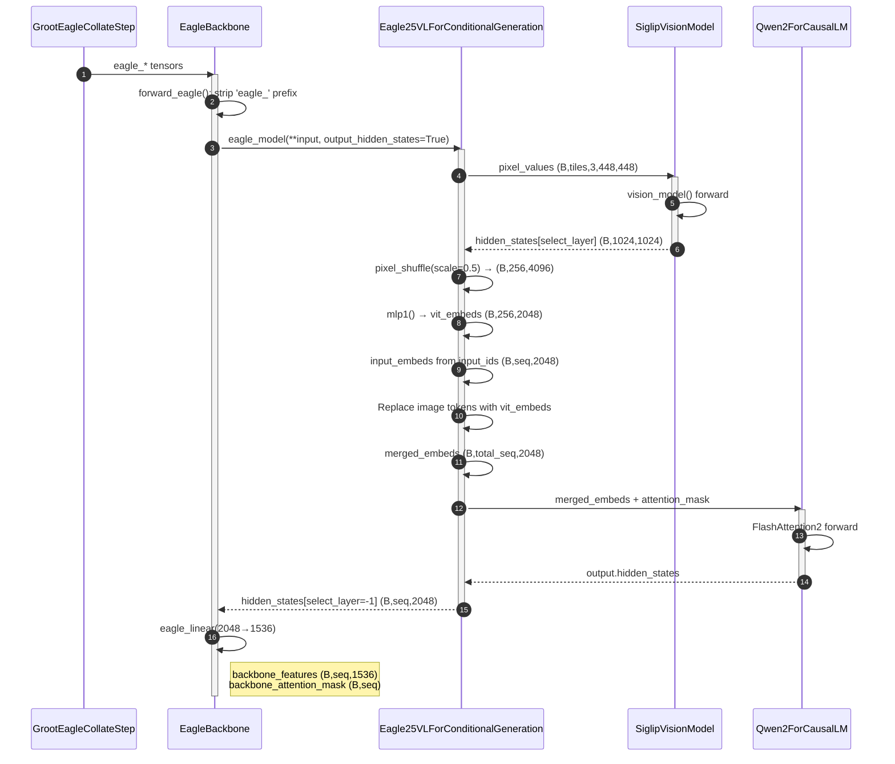
```mermaid
sequenceDiagram
    autonumber
    participant Collate as GrootEagleCollateStep
    participant Backbone as EagleBackbone
    participant Eagle as Eagle25VLForConditionalGeneration
    participant SigLIP as SiglipVisionModel
    participant Qwen as Qwen2ForCausalLM

    Collate->>Backbone: eagle_* tensors
    activate Backbone
    Backbone->>Backbone: forward_eagle(): strip 'eagle_' prefix
    Backbone->>Eagle: eagle_model(**input, output_hidden_states=True)
    activate Eagle

    Eagle->>SigLIP: pixel_values (B,tiles,3,448,448)
    activate SigLIP
    SigLIP->>SigLIP: vision_model() forward
    SigLIP-->>Eagle: hidden_states[select_layer] (B,1024,1024)
    deactivate SigLIP

    Eagle->>Eagle: pixel_shuffle(scale=0.5) → (B,256,4096)
    Eagle->>Eagle: mlp1() → vit_embeds (B,256,2048)
    Eagle->>Eagle: input_embeds from input_ids (B,seq,2048)
    Eagle->>Eagle: Replace image tokens with vit_embeds
    Eagle->>Eagle: merged_embeds (B,total_seq,2048)

    Eagle->>Qwen: merged_embeds + attention_mask
    activate Qwen
    Qwen->>Qwen: FlashAttention2 forward
    Qwen-->>Eagle: output.hidden_states
    deactivate Qwen

    Eagle-->>Backbone: hidden_states[select_layer=-1] (B,seq,2048)
    deactivate Eagle

    Backbone->>Backbone: eagle_linear(2048→1536)
    Note right of Backbone: backbone_features (B,seq,1536)<br/>backbone_attention_mask (B,seq)
    deactivate Backbone
```

The Eagle backbone implements a vision-language model with three key components:

1. **SigLIP Vision Encoder**: Processes images at 448×448 resolution using a Vision Transformer. The `select_layer` parameter (default: -1) extracts intermediate representations for better downstream performance.

2. **Pixel Shuffle**: Reduces spatial dimensions by factor of 2 (1024→256 tokens) while increasing channel dimension (1024→4096), followed by MLP projection to LLM hidden size (2048).

3. **Critical 2048→1536 Projection**: The `eagle_linear` layer bridges the Eagle VLM's 2048-dim output to the action head's 1536-dim input, enabling cross-attention in the DiT. See [Post-VLM Processing](#post-vlm-processing) for comprehensive details.

### Command-Line Interface Mapping

| CLI Argument | Code Location | Effect |
|--------------|---------------|--------|
| `--tune-llm` | `EagleBackbone.tune_llm` | Enables LLM fine-tuning |
| `--tune-visual` | `EagleBackbone.tune_visual` | Enables vision encoder fine-tuning |
| `--select-layer` | `EagleBackbone.select_layer` | Which LLM layer to extract features from |

### Training vs. Inference Behavior

| Aspect | Training | Inference |
|--------|----------|-----------|
| `tune_llm` | Configurable (default: False) | Always frozen |
| `tune_visual` | Configurable (default: False) | Always frozen |
| Gradient Flow | Through eagle_linear always | No gradients |
| Frozen Module Mode | `set_frozen_modules_to_eval_mode()` called | N/A |

**Cross-Reference**: The `backbone_features` output is consumed by the Action Head (Chapter 5).

<a id="eagle-forward-method"></a>
### Eagle25VLForConditionalGeneration

The `forward()` method in `Eagle25VLForConditionalGeneration` is the core of the Eagle VLM. It performs **multimodal fusion** by encoding text tokens, extracting visual features, replacing placeholder tokens with vision embeddings, and processing the fused sequence through the language model.

#### Method Signature and Parameters

```python
# File: modeling_eagle2_5_vl.py
def forward(
    self,
    pixel_values: torch.FloatTensor,
    input_ids: torch.LongTensor = None,
    attention_mask: torch.Tensor | None = None,
    ...
) -> tuple | CausalLMOutputWithPast:
```

| Parameter | Type | Shape | Description |
|-----------|------|-------|-------------|
| `pixel_values` | `torch.FloatTensor` | `[B*N_img, C, H, W]` | Preprocessed image tensors |
| `input_ids` | `torch.LongTensor` | `[B, seq_len]` | Tokenized text with `<image>` placeholder tokens |
| `attention_mask` | `torch.Tensor` | `[B, seq_len]` | Mask: valid tokens (1) vs. padding (0) |
| `image_flags` | `torch.LongTensor` | `[B, N_img]` | Valid images (1) vs. padded (0) |
| `labels` | `torch.LongTensor` | `[B, seq_len]` | Target token IDs for cross-entropy loss (**NOT used in robotic training**) |
| `output_hidden_states` | `bool` | - | Whether to return all layer hidden states (**True for GR00T**) |


#### Forward Pass Data Flow

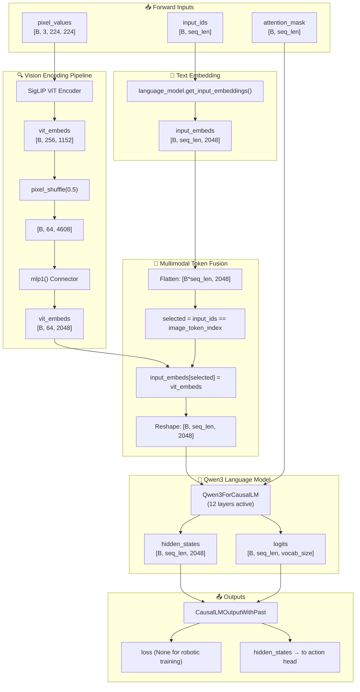
```mermaid
flowchart TB
    subgraph INPUTS["📥 Forward Inputs"]
        PV["pixel_values<br/>[B, 3, 224, 224]"]
        IDS["input_ids<br/>[B, seq_len]"]
        MASK["attention_mask<br/>[B, seq_len]"]
    end

    subgraph TEXT["📝 Text Embedding"]
        EMB["language_model.get_input_embeddings()"]
        IE["input_embeds<br/>[B, seq_len, 2048]"]
    end

    subgraph VISION["🔍 Vision Encoding Pipeline"]
        VIT["SigLIP ViT Encoder"]
        VE1["vit_embeds<br/>[B, 256, 1152]"]
        PS["pixel_shuffle(0.5)"]
        VE2["[B, 64, 4608]"]
        MLP["mlp1() Connector"]
        VE3["vit_embeds<br/>[B, 64, 2048]"]
    end

    subgraph FUSION["🔗 Multimodal Token Fusion"]
        FLAT["Flatten: [B*seq_len, 2048]"]
        SEL["selected = input_ids == image_token_index"]
        REPLACE["input_embeds[selected] = vit_embeds"]
        RESHAPE["Reshape: [B, seq_len, 2048]"]
    end

    subgraph LLM["🧠 Qwen3 Language Model"]
        Q3["Qwen3ForCausalLM<br/>(12 layers active)"]
        HS["hidden_states<br/>[B, seq_len, 2048]"]
        LOGITS["logits<br/>[B, seq_len, vocab_size]"]
    end

    subgraph OUTPUT["📤 Outputs"]
        OUT["CausalLMOutputWithPast"]
        LOSS["loss (None for robotic training)"]
        HIDDEN["hidden_states → to action head"]
    end

    PV --> VIT --> VE1 --> PS --> VE2 --> MLP --> VE3
    IDS --> EMB --> IE --> FLAT
    VE3 --> REPLACE
    FLAT --> SEL --> REPLACE --> RESHAPE
    RESHAPE --> Q3
    MASK --> Q3
    Q3 --> HS --> OUT
    Q3 --> LOGITS --> OUT
    OUT --> LOSS
    OUT --> HIDDEN
```


<a id="text-embedding-extraction"></a>
### Text Embedding Extraction

```python
# File: modeling_eagle2_5_vl.py
input_embeds = self.language_model.get_input_embeddings()(input_ids)
```

The token embedding layer converts `input_ids` to dense embeddings. At this stage, `<image>` placeholder tokens (ID `151655`) are also embedded—but will be **replaced** with vision features later.

**Tensor transformation**: `[B, seq_len]` → `[B, seq_len, 2048]`

<a id="vision-embedding-extraction"></a>
### Vision Embedding Extraction

```python
# File: modeling_eagle2_5_vl.py
vit_embeds = self.extract_feature(pixel_values)
```

The `extract_feature()` method performs the complete vision encoding pipeline:

1. **SigLIP ViT forward pass**: `[B, 3, 224, 224]` → `[B, 256, 1152]`
2. **Pixel shuffle** (spatial downsampling, optional): `[B, 256, 1152]` → `[B, 64, 4608]`
3. **MLP connector projection**: `[B, N, dim]` → `[B, N, 2048]`

```python
# File: modeling_eagle2_5_vl.py
def pixel_shuffle(self, x, scale_factor=0.5):
    n, w, h, c = x.size()
    x = x.view(n, w, int(h * scale_factor), int(c / scale_factor))
    x = x.permute(0, 2, 1, 3).contiguous()
    ...
```

#### Pixel Shuffle Operation

Pixel shuffle (also known as **space-to-depth** in this context) is a spatial reorganization operation that trades spatial resolution for channel depth. It reduces the number of vision tokens while preserving information by packing spatial neighbors into the channel dimension.

#### Pixel Shuffle: Dimensional Impact

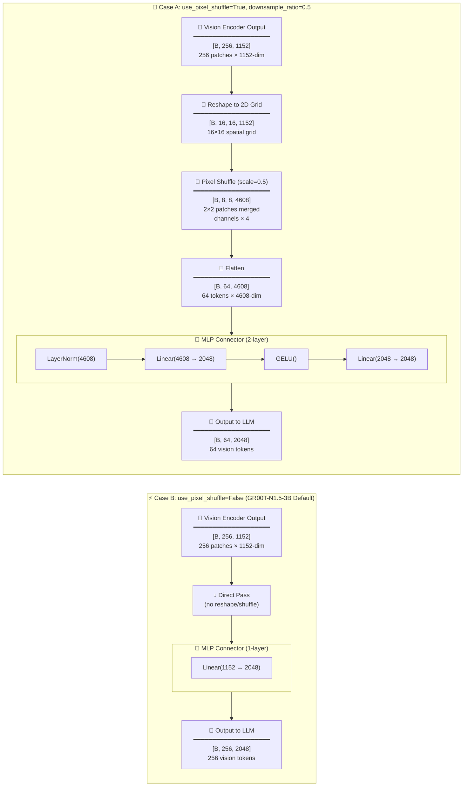
```mermaid
flowchart TB
    %% ═══════════════════════════════════════════════════════════════
    %% CASE A: Pixel Shuffle ENABLED
    %% ═══════════════════════════════════════════════════════════════
    subgraph CaseA["🔀 Case A: use_pixel_shuffle=True, downsample_ratio=0.5"]
        direction TB

        A_VIT["🔭 Vision Encoder Output<br/>━━━━━━━━━━━━━━━━━━━━<br/>[B, 256, 1152]<br/>256 patches × 1152-dim"]

        A_RESHAPE["📐 Reshape to 2D Grid<br/>━━━━━━━━━━━━━━━━━━━━<br/>[B, 16, 16, 1152]<br/>16×16 spatial grid"]

        A_SHUFFLE["🔀 Pixel Shuffle (scale=0.5)<br/>━━━━━━━━━━━━━━━━━━━━<br/>[B, 8, 8, 4608]<br/>2×2 patches merged<br/>channels × 4"]

        A_FLATTEN["📏 Flatten<br/>━━━━━━━━━━━━━━━━━━━━<br/>[B, 64, 4608]<br/>64 tokens × 4608-dim"]

        subgraph A_MLP["🔗 MLP Connector (2-layer)"]
            A_LN["LayerNorm(4608)"]
            A_L1["Linear(4608 → 2048)"]
            A_GELU["GELU()"]
            A_L2["Linear(2048 → 2048)"]
            A_LN --> A_L1 --> A_GELU --> A_L2
        end

        A_OUT["🧠 Output to LLM<br/>━━━━━━━━━━━━━━━━━━━━<br/>[B, 64, 2048]<br/>64 vision tokens"]

        A_VIT --> A_RESHAPE --> A_SHUFFLE --> A_FLATTEN --> A_MLP --> A_OUT
    end

    %% ═══════════════════════════════════════════════════════════════
    %% CASE B: Pixel Shuffle DISABLED (GR00T Default)
    %% ═══════════════════════════════════════════════════════════════
    subgraph CaseB["⚡ Case B: use_pixel_shuffle=False (GR00T-N1.5-3B Default)"]
        direction TB

        B_VIT["🔭 Vision Encoder Output<br/>━━━━━━━━━━━━━━━━━━━━<br/>[B, 256, 1152]<br/>256 patches × 1152-dim"]

        B_DIRECT["↓ Direct Pass<br/>(no reshape/shuffle)"]

        subgraph B_MLP["🔗 MLP Connector (1-layer)"]
            B_L1["Linear(1152 → 2048)"]
        end

        B_OUT["🧠 Output to LLM<br/>━━━━━━━━━━━━━━━━━━━━<br/>[B, 256, 2048]<br/>256 vision tokens"]

        B_VIT --> B_DIRECT --> B_MLP --> B_OUT
    end

    %% Vertical stacking
    CaseA ~~~ CaseB
```

##### Pixel Shuffle Comparison Table

| Metric | Pixel Shuffle ON | Pixel Shuffle OFF |
|--------|------------------|-------------------|
| **Token count** | 64 | 256 |
| **Channel dim (pre-MLP)** | 4608 | 1152 |
| **MLP connector layers** | 2 (typical) | 1 |
| **LLM context length impact** | 4× fewer vision tokens | Full resolution |
| **Information preservation** | All info packed in channels | All info in spatial layout |
| **Receptive field per token** | 2×2 = 4 patches | 1 patch |

##### MLP Connector Variants

The MLP connector configuration depends on `use_pixel_shuffle` and `mlp_connector_layers`:

| Configuration | Input Dim | MLP Architecture | Output Dim |
|---------------|-----------|------------------|------------|
| `mlp_connector_layers=2` (with pixel shuffle) | 4608 | LayerNorm(4608) → Linear(4608→2048) → GELU → Linear(2048→2048) | 2048 |
| `mlp_connector_layers=1`, `use_pixel_shuffle=True` | 4608 | Linear(4608→2048) | 2048 |
| `mlp_connector_layers=1`, `use_pixel_shuffle=False` | 1152 | Linear(1152→2048) | 2048 |

The input dimension formula when pixel shuffle is enabled:
```
input_dim = vit_hidden_size × (1 / downsample_ratio)²
          = 1152 × (1 / 0.5)²
          = 1152 × 4
          = 4608
```

#### Pixel Shuffle Trade-offs

| Aspect | Pixel Shuffle ON | Pixel Shuffle OFF |
|--------|------------------|-------------------|
| **Pros** | | |
| LLM inference speed | ✅ 4× fewer tokens = faster | ❌ More tokens = slower |
| Memory efficiency | ✅ Smaller KV cache | ❌ Larger KV cache |
| Multi-image handling | ✅ Better scaling with many images | ❌ Context fills quickly |
| **Cons** | | |
| Fine-grained spatial info | ❌ 2×2 patches merged | ✅ Full spatial resolution |
| MLP connector complexity | ❌ Larger input dim (4608) | ✅ Smaller input dim (1152) |
| Connector parameters | ❌ More params: Linear(4608→2048) | ✅ Fewer params: Linear(1152→2048) |

##### Why GR00T-N1.5-3B Uses `use_pixel_shuffle=False`

The default GR00T configuration disables pixel shuffle for several reasons:

1. **Robotics requires spatial precision**: Fine manipulation and visual servoing benefit from higher spatial resolution (256 tokens) rather than compressed representations (64 tokens).

2. **Single-image inference**: Robotics typically processes 1-2 camera views per timestep, so the LLM context length isn't a bottleneck.

3. **Simpler connector**: A single `Linear(1152 → 2048)` layer is more parameter-efficient and faster than the 2-layer variant needed for pixel shuffle.

4. **Action prediction focus**: Unlike VQA tasks where token efficiency matters for long conversations, robotics uses the VLM for action prediction with shorter sequences.

**Code Reference**: `lerobot/src/lerobot/policies/groot/eagle2_hg_model/modeling_eagle2_5_vl.py` (lines 287-327)

---

<a id="multimodal-token-fusion"></a>
### Multimodal Token Fusion

This is the **most critical section**—where vision and text are merged:

```python
# File: modeling_eagle2_5_vl.py
b, n, c = input_embeds.shape
input_embeds = input_embeds.reshape(b * n, c)
input_ids = input_ids.reshape(b * n)
selected = input_ids == self.image_token_index
input_embeds[selected] = input_embeds[selected] * 0.0 + vit_embeds.reshape(-1, c)
```

**The `* 0.0 +` trick**: This gradient-preserving technique zeros out placeholder embeddings while keeping the computation graph intact, then inserts actual vision features.

```
Before fusion: [<text> <text>   ...  <text>]
                             ↑   64 placeholder tokens   ↑
After fusion:  [<text> <text> <VIS> <VIS> ... <VIS> <text>]
                             ↑ 64 vision embeddings ↑
```


<a id="language-model-processing"></a>
### Language Model Processing

```python
# File: modeling_eagle2_5_vl.py
outputs = self.language_model(
    inputs_embeds=input_embeds,
    attention_mask=attention_mask,
    output_hidden_states=output_hidden_states,
)
logits = outputs.logits
```

The fused multimodal embeddings pass through Qwen3. For GR00T, `output_hidden_states=True` is critical—the action head needs `hidden_states` from a specific layer.

<a id="loss-computation"></a>
### Loss Computation

```python
# File: modeling_eagle2_5_vl.py
loss = None
if labels is not None:
    shift_logits = logits[..., :-1, :].contiguous()
    shift_labels = labels[..., 1:].contiguous()
    loss_fct = CrossEntropyLoss()
    loss = loss_fct(shift_logits.view(-1, vocab_size), shift_labels.view(-1))
```

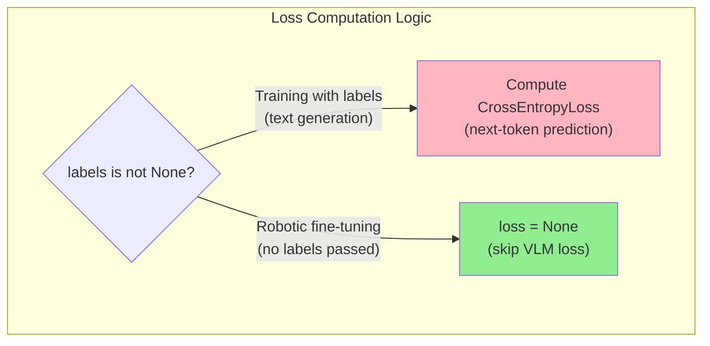
```mermaid
flowchart TD
    subgraph LOSS_DECISION["Loss Computation Logic"]
        CHECK{"labels is not None?"}
        YES["Compute CrossEntropyLoss<br/>(next-token prediction)"]
        NO["loss = None<br/>(skip VLM loss)"]
    end

    CHECK -->|"Training with labels<br/>(text generation)"| YES
    CHECK -->|"Robotic fine-tuning<br/>(no labels passed)"| NO

    style NO fill:#90EE90
    style YES fill:#FFB6C1
```

> **⚠️ Critical for Robotic Training**: During GR00T fine-tuning for manipulation tasks, `labels` is **NOT passed** to the Eagle VLM. The VLM acts purely as a **feature extractor**, and only the **flow matching loss from the DiT action head** is used for training.

#### VLM as Feature Extractor (No Labels During Robotic Training)

In GR00T's robotic fine-tuning pipeline, the Eagle VLM does **not** compute cross-entropy loss. The `forward_eagle()` method in `EagleBackbone` shows that no `labels` parameter is passed:

```python
# File: groot_n1.py
def forward_eagle(self, vl_input: BatchFeature) -> BatchFeature:
    eagle_input = {k.removeprefix("eagle_"): v for k, v in vl_input.items() ...}
    eagle_output = self.eagle_model(**eagle_input, output_hidden_states=True, return_dict=True)
    eagle_features = eagle_output.hidden_states[self.select_layer]
    eagle_features = self.eagle_linear(eagle_features)
    return eagle_features, eagle_input["attention_mask"]
```

Note that `eagle_input` contains only `pixel_values`, `input_ids`, `attention_mask`, and `image_flags`—**no `labels`**. The VLM's `loss` output is always `None` during robotic training.

#### Where the Actual Training Loss Comes From

The **only loss** used during GR00T fine-tuning is the **flow matching MSE loss** from the DiT action head:

```python
# File: flow_matching_action_head.py
velocity = actions - noise  # Target: direction from noise to action
pred_actions = pred[:, -actions.shape[1]:]
loss = F.mse_loss(pred_actions, velocity, reduction="none") * action_mask
loss = loss.sum() / action_mask.sum()
```

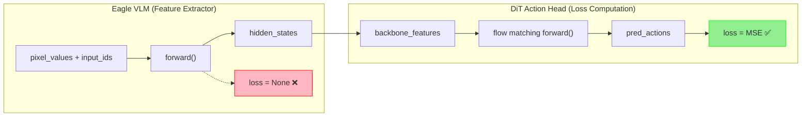
```mermaid
flowchart LR
    subgraph VLM["Eagle VLM (Feature Extractor)"]
        V1["pixel_values + input_ids"]
        V2["forward()"]
        V3["hidden_states"]
        V4["loss = None ❌"]
    end

    subgraph ACTION["DiT Action Head (Loss Computation)"]
        A1["backbone_features"]
        A2["flow matching forward()"]
        A3["pred_actions"]
        A4["loss = MSE ✅"]
    end

    V1 --> V2 --> V3 --> A1
    V2 -.-> V4
    A1 --> A2 --> A3 --> A4

    style V4 fill:#FFB6C1,stroke:#FF0000
    style A4 fill:#90EE90,stroke:#00FF00
```

#### Training Data Flow Summary

| Stage | Component | Loss Used | Purpose |
|-------|-----------|-----------|---------|
| 1. Vision-Language | Eagle VLM `forward()` | ❌ None | Feature extraction only |
| 2. Feature Projection | `eagle_linear` | ❌ None | Dimension adaptation (2048→1536) |
| 3. Action Prediction | DiT `forward()` | ✅ Flow Matching MSE | Denoise actions from noise to target |

This design allows the pretrained VLM knowledge to be preserved while adapting only the action prediction pathway for robotic manipulation.

<a id="post-vlm-processing"></a>
### Post-VLM Processing: Dimension Projection

After the Eagle VLM extracts hidden states, the `eagle_linear` layer projects the features from VLM dimension to the action head's expected dimension. This layer is the **architectural bridge** between the Eagle VLM and the DiT action head.

> **Cross-Reference**: After `eagle_linear` projection, the features are further processed by `vlln` and `vl_self_attention` layers in the Action Head. See [Section 5: VL Feature Refinement](#ch5-vl-feature-refinement) for comprehensive documentation of those layers.

#### Data Flow Overview

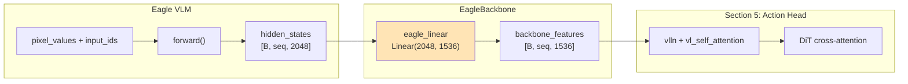
```mermaid
flowchart LR
    subgraph EAGLE["Eagle VLM"]
        A["pixel_values + input_ids"]
        B["forward()"]
        C["hidden_states<br/>[B, seq, 2048]"]
    end

    subgraph PROJ["EagleBackbone"]
        D["eagle_linear<br/>Linear(2048, 1536)"]
        E["backbone_features<br/>[B, seq, 1536]"]
    end

    subgraph SECTION5["Section 5: Action Head"]
        F["vlln + vl_self_attention"]
        G["DiT cross-attention"]
    end

    A --> B --> C --> D --> E --> F --> G

    style D fill:#FFE4B5
```

#### eagle_linear: Dimension Projection Layer

**Purpose**: The `eagle_linear` layer is the **architectural bridge** between two components with different hidden dimensions:

| Component | Hidden Dimension | Source |
|-----------|------------------|--------|
| Eagle VLM (Qwen3 LLM) | **2048** | Fixed by pretrained VLM architecture |
| DiT Action Head | **1536** | Fixed by pretrained action head (`backbone_embedding_dim`) |

**Position in Forward Pass**: `eagle_linear` is **NOT** part of the Eagle VLM's `forward()` method—it is defined and applied **separately** in `EagleBackbone` after VLM processing completes.

**Initialization** (`groot_n1.py`, lines 87-90):

```python
# File: groot_n1.py
if project_to_dim is not None:
    self.eagle_linear = torch.nn.Linear(2048, project_to_dim)  # project_to_dim = 1536
else:
    self.eagle_linear = torch.nn.Identity()
```

**Application** (`groot_n1.py`, lines 134-145):

```python
# File: groot_n1.py
def forward_eagle(self, vl_input: BatchFeature) -> BatchFeature:
    eagle_prefix = "eagle_"
    eagle_input = {
        k.removeprefix(eagle_prefix): v for k, v in vl_input.items() if k.startswith(eagle_prefix)
    }
    del eagle_input["image_sizes"]

    eagle_output = self.eagle_model(**eagle_input, output_hidden_states=True, return_dict=True)
    eagle_features = eagle_output.hidden_states[self.select_layer]

    eagle_features = self.eagle_linear(eagle_features)  # <-- Projection applied HERE
    return eagle_features, eagle_input["attention_mask"]
```

**Input/Output Tensor Shapes**:

| Direction | Shape | Description |
|-----------|-------|-------------|
| **Input** | `[B, seq_len, 2048]` | Hidden states from Qwen3 LLM (extracted at `select_layer`) |
| **Output** | `[B, seq_len, 1536]` | Projected features matching DiT action head's expected dimension |

**Concrete Example (Bread Dataset)**:
```
Input:  [1, 668, 2048]  (668 = 156 text tokens + 512 vision tokens)
Output: [1, 668, 1536]  (sequence length preserved, dimension reduced)
```

#### Section 4 Pipeline Summary

| Stage | Layer | Input Shape | Output Shape | Location |
|-------|-------|-------------|--------------|----------|
| 1 | Eagle VLM `forward()` | pixel_values, input_ids | `[B, seq, 2048]` | `modeling_eagle2_5_vl.py` |
| 2 | `eagle_linear` | `[B, seq, 2048]` | `[B, seq, 1536]` | `groot_n1.py:144` |

The `backbone_features` output is then passed to the Action Head (Section 5), where `vlln` and `vl_self_attention` layers further refine the features before DiT cross-attention.

---

<a id="5-action-head-processing"></a>
## 5. Action Head Processing

The Action Head (System 1) encodes state and action information, constructs the input sequence for the DiT, and manages the flow matching training objective.

#### Data Flow Diagram

```mermaid
flowchart TB
    subgraph INPUT["📥 Inputs"]
        B1["backbone_features<br/>(B, seq, 1536)"]
        S1["state<br/>(B, 1, 64)"]
        A1["action<br/>(B, 16, 32)"]
        E1["embodiment_id<br/>(B,)"]
    end

    subgraph VL_PROC["VL Processing"]
        VL1["vl_layernorm()"]
        VL2["vl_self_attention()"]
        VL3["vl_embs<br/>(B, seq, 1536)"]
    end

    subgraph STATE["State Encoding"]
        SE1["state_encoder()<br/>CategorySpecificMLP"]
        SE2["state_features<br/>(B, 1, 1536)"]
    end

    subgraph ACTION["Action Encoding"]
        AE1["Sample noise ~ N(0,1)"]
        AE2["Sample t ~ Beta(1.5, 1.0)"]
        AE3["noisy = (1-t)*noise + t*action"]
        AE4["action_encoder()<br/>MultiEmbodimentActionEncoder"]
        AE5["action_features<br/>(B, 16, 1536)"]
    end

    subgraph SEQ["Sequence Construction"]
        F1["future_tokens.weight<br/>(32, 1536)"]
        F2["Expand → (B, 32, 1536)"]
        C1["torch.cat(dim=1)"]
        C2["sa_embs<br/>(B, 49, 1536)"]
    end

    B1 --> VL1 --> VL2 --> VL3
    S1 --> SE1 --> SE2
    A1 --> AE1 --> AE3
    AE2 --> AE3 --> AE4 --> AE5
    E1 --> SE1 & AE4
    SE2 --> C1
    F1 --> F2 --> C1
    AE5 --> C1 --> C2
```

#### Function Call Sequence

```mermaid
sequenceDiagram
    autonumber
    participant Backbone as EagleBackbone
    participant ActionHead as FlowmatchingActionHead
    participant DiT as DiT

    Backbone->>ActionHead: backbone_features (B,seq,1536)
    activate ActionHead
    ActionHead->>ActionHead: vl_layernorm()
    ActionHead->>ActionHead: vl_self_attention() → vl_embs (B,seq,1536)

    ActionHead->>ActionHead: state_encoder(state, emb_id)
    Note right of ActionHead: CategorySpecificMLP<br/>(B,1,64) → (B,1,1536)

    ActionHead->>ActionHead: noise = randn(B,16,32)
    ActionHead->>ActionHead: t ~ Beta(1.5, 1.0)
    ActionHead->>ActionHead: noisy = (1-t)*noise + t*action
    ActionHead->>ActionHead: velocity = action - noise (TARGET)
    ActionHead->>ActionHead: t_discretized = (t * 1000).long()

    ActionHead->>ActionHead: action_encoder(noisy, t_disc, emb_id)
    Note right of ActionHead: MultiEmbodimentActionEncoder<br/>(B,16,32) → (B,16,1536)

    ActionHead->>ActionHead: future_tokens.expand(B,32,1536)
    ActionHead->>ActionHead: sa_embs = cat([state,future,action],dim=1)
    Note right of ActionHead: sa_embs (B, 1+32+16, 1536) = (B,49,1536)

    ActionHead->>DiT: hidden_states=sa_embs, encoder_hidden_states=vl_embs, timestep=t_disc
    deactivate ActionHead
```

The action head implements flow matching for action generation:

1. **State Encoder**: A `CategorySpecificMLP` projects state vectors to the embedding dimension. Each embodiment has its own MLP weights (indexed by `embodiment_id`).

2. **Action Encoder**: The `MultiEmbodimentActionEncoder` combines action embeddings with sinusoidal timestep encoding, enabling the model to learn the denoising process.

3. **Future Tokens**: Learnable embeddings (32 tokens) provide additional capacity for the model to reason about future actions.

4. **Sequence Construction**: State (1 token) + future tokens (32) + action (16 tokens) = 49 total tokens in `sa_embs`.

<a id="ch5-vl-feature-refinement"></a>
### VL Feature Refinement

> **Cross-Reference**: For architectural overview and component configuration, see [Section 2: VL Feature Refinement](#vl-feature-refinement-architecture).

After receiving `backbone_features` from the Eagle VLM backbone (via `eagle_linear` projection), the Action Head applies two layers to refine the vision-language features before they are used as cross-attention conditioning in the DiT.

#### Forward Pass Implementation

**Usage in `process_backbone_output()`** (`flow_matching_action_head.py`, lines 259-264):

```python
# File: flow_matching_action_head.py
def process_backbone_output(self, backbone_output: BatchFeature) -> BatchFeature:
    backbone_features = backbone_output["backbone_features"]  # [B, seq, 1536]
    backbone_features = self.vlln(backbone_features)          # LayerNorm
    backbone_features = self.vl_self_attention(backbone_features)  # Self-attention refinement
    backbone_output["backbone_features"] = backbone_features
    return backbone_output
```

#### Purpose of vl_self_attention

1. **Cross-Token Reasoning**: Allows vision tokens to attend to language tokens and vice versa, enabling:
   - Understanding spatial relationships ("the bread is **on** the table")
   - Correlating objects across different image regions

2. **Feature Refinement**: The VLM's hidden states are optimized for language generation, not action prediction. Self-attention adapts these representations for robotic control.

3. **Temporal Coherence**: Sinusoidal positional embeddings help the model understand token ordering, critical for sequential action prediction.

4. **Conditioning Preparation**: Refines `vl_embs` before they serve as **cross-attention conditioning** in the DiT:

```python
# File: flow_matching_action_head.py (lines 326-332)
model_output = self.model(
    hidden_states=sa_embs,                     # State + Future + Action tokens
    encoder_hidden_states=vl_embs,             # ← vl_self_attention output used here
    encoder_attention_mask=vl_attn_mask,
    timestep=t_discretized,
)
```

#### Complete VL Processing Pipeline Summary

| Stage | Layer | Input Shape | Output Shape | Location |
|-------|-------|-------------|--------------|----------|
| 1 | Eagle VLM `forward()` | pixel_values, input_ids | `[B, seq, 2048]` | `modeling_eagle2_5_vl.py` |
| 2 | `eagle_linear` | `[B, seq, 2048]` | `[B, seq, 1536]` | `groot_n1.py:144` (Section 4) |
| 3 | `vlln` (LayerNorm) | `[B, seq, 1536]` | `[B, seq, 1536]` | `flow_matching_action_head.py:261` |
| 4 | `vl_self_attention` | `[B, seq, 1536]` | `[B, seq, 1536]` | `flow_matching_action_head.py:262` |
| 5 | DiT cross-attention | `vl_embs` as KV | action predictions | `flow_matching_action_head.py:326` |

**Note on `num_target_vision_tokens`**: The config parameter `num_target_vision_tokens: int = 32` is used for `future_tokens` (learnable tokens added to the DiT's input sequence), NOT for compressing VL features. These appear in the DiT input:

```python
future_tokens = self.future_tokens.weight.unsqueeze(0).expand(vl_embs.shape[0], -1, -1)
sa_embs = torch.cat((state_features, future_tokens, action_features), dim=1)
```

<a id="ch5-state-encoding"></a>
### State Encoding

The State Encoder converts robot proprioceptive state (joint positions, velocities) into the DiT embedding space. This section details the forward pass mechanics.

> **Cross-Reference**: For architecture details of the `CategorySpecificMLP` class, weight bank shapes, and training behavior, see [Section 2: State Encoder](#state-encoder).

#### Step-by-Step Forward Pass

| Step | Operation | Input Shape | Output Shape | Description |
|------|-----------|-------------|--------------|-------------|
| 1 | `layer1(x, cat_ids)` | `(B, 1, 64)` | `(B, 1, 1024)` | Project state to hidden dimension |
| 2 | `F.relu()` | `(B, 1, 1024)` | `(B, 1, 1024)` | Non-linearity |
| 3 | `layer2(hidden, cat_ids)` | `(B, 1, 1024)` | `(B, 1, 1536)` | Project to DiT embedding dimension |

#### Concrete Example (Bread Dataset with SO-101)

```
Input:
  - state: (1, 1, 64)      [6 joints padded to 64]
  - cat_ids: (1,) = [31]   [SO-101 embodiment ID]

Step 1: layer1 (W1 projection)
  - Select weights: W1[31, 64, 1024], b1[31, 1024]
  - Compute: (1, 1, 64) × (1, 64, 1024) + (1, 1, 1024)
  - hidden: (1, 1, 1024)

Step 2: ReLU activation
  - F.relu(hidden)
  - hidden: (1, 1, 1024)

Step 3: layer2 (W2 projection)
  - Select weights: W2[31, 1024, 1536], b2[31, 1536]
  - Compute: (1, 1, 1024) × (1, 1024, 1536) + (1, 1, 1536)
  - output: (1, 1, 1536)

Output:
  - state_features: (1, 1, 1536)
```

#### Tensor Shape Transformation Summary

| Stage | Tensor | Shape | Notes |
|-------|--------|-------|-------|
| Input | `state` | `[B, 1, 64]` | 6 real joints + 58 zeros padding |
| Input | `cat_ids` | `[B]` | Embodiment ID (e.g., 31 for SO-101) |
| After layer1 | `hidden` | `[B, 1, 1024]` | Linear projection |
| After ReLU | `hidden` | `[B, 1, 1024]` | Non-linearity applied |
| After layer2 | `output` | `[B, 1, 1536]` | Final state features |

#### Code Reference: Where State Encoding is Called

**Training** (`forward()`, line 299):
```python
# Get embodiment ID.
embodiment_id = action_input.embodiment_id

# Embed state.
state_features = self.state_encoder(action_input.state, embodiment_id)
```

**Inference** (`get_action()`, line 354):
```python
embodiment_id = action_input.embodiment_id

# Embed state.
state_features = self.state_encoder(action_input.state, embodiment_id)
```

**Note**: State encoding is identical in training and inference - unlike Action Encoding, there is no timestep conditioning or noise injection.

<a id="ch5-action-encoding"></a>
### Action Encoding

The Action Encoder (`MultiEmbodimentActionEncoder`) is used differently during training and inference. This section explains the key differences and clarifies the relationship between timesteps, action tokens, and batch dimensions.

> **Cross-Reference**: For architecture details of the `MultiEmbodimentActionEncoder` class, see [Section 2: Action Encoder](#action-encoder).

#### What is `t_discretized`?

The `t_discretized` variable is the **flow matching timestep converted to a discrete bucket index**.

**Training** (`forward()`, line 304-311):
```python
# Sample continuous t from transformed Beta distribution
t = self.sample_time(batch_size, ...)  # t ∈ [0, noise_s] ≈ [0, 0.999]
t = t[:, None, None]                   # Shape: (B, 1, 1) for broadcast

# Convert continuous → discrete
t_discretized = (t[:, 0, 0] * self.num_timestep_buckets).long()
# Example: if t = 0.7 and num_timestep_buckets = 1000
#          t_discretized = int(0.7 * 1000) = 700
```

**Inference** (`get_action()`, line 369-371):
```python
for t in range(num_steps):  # num_steps = 4
    t_cont = t / float(num_steps)              # 0, 0.25, 0.5, 0.75
    t_discretized = int(t_cont * self.num_timestep_buckets)  # 0, 250, 500, 750
```

**Range of `t_discretized`**: 0 (pure noise) to 999 (nearly clean)

**Configuration**: `num_timestep_buckets: int = 1000` (default)

#### Timestep Sampling Distribution

```python
# Initialization (line 208)
self.beta_dist = Beta(config.noise_beta_alpha, config.noise_beta_beta)  # Beta(1.5, 1.0)

# Sampling (line 252-254)
def sample_time(self, batch_size, device, dtype):
    sample = self.beta_dist.sample([batch_size])  # sample ∈ [0, 1]
    return (self.config.noise_s - sample) / self.config.noise_s  # (0.999 - sample) / 0.999
```

The `Beta(1.5, 1.0)` distribution is **right-skewed**, sampling higher values more often. Combined with the transformation, this means training **favors lower `t` values** (more noise) to better learn the denoising direction.

#### All Action Tokens Share the Same Timestep

A key design choice: **all 16 action tokens in a trajectory share the same noise level/timestep**.

```python
# In MultiEmbodimentActionEncoder.forward() (lines 89-96):
def forward(self, actions, timesteps, cat_ids):
    """
    actions:   shape (B, T, action_dim)  # T = 16 action tokens
    timesteps: shape (B,)                 # 1 scalar per batch
    """
    b, t, _ = actions.shape

    # Expand single timestep across all T action tokens
    timesteps = timesteps.unsqueeze(1).expand(-1, t)  # (B,) → (B, T)
```

**Why Share Timesteps Across Action Tokens?**

1. **Coherent Noise Level**: The entire trajectory is interpolated between noise and ground truth using the same `t`:
   ```python
   noisy_trajectory = (1 - t) * noise + t * actions  # t broadcasted across T
   ```

2. **Single Denoising Step**: During inference, each step moves the **entire trajectory** together:
   ```python
   actions = actions + dt * pred_velocity  # Update all 16 tokens together
   ```

3. **Temporal Consistency**: The DiT learns to denoise trajectories as a coherent whole, not individual tokens independently.

**However, position embeddings differentiate tokens**:
```python
if self.config.add_pos_embed:
    pos_ids = torch.arange(action_features.shape[1], ...)  # [0, 1, 2, ..., 15]
    pos_embs = self.position_embedding(pos_ids)            # Different for each token
    action_features = action_features + pos_embs           # Adds temporal order
```

#### Training Mode: Flow Matching with Random Noise

During training, the action encoder processes **noisy ground-truth trajectories**:

```python
# FlowmatchingActionHead.forward() (lines 301-312)

# 1. Sample noise and timestep
actions = action_input.action                              # Ground truth (B, 16, 32)
noise = torch.randn(actions.shape, device=device)          # (B, 16, 32)
t = self.sample_time(batch_size, device)                   # (B,) ~ Beta(1.5, 1.0)
t = t[:, None, None]                                       # (B, 1, 1) for broadcast

# 2. Create noisy trajectory via flow matching interpolation
noisy_trajectory = (1 - t) * noise + t * actions           # Linear interpolation
velocity = actions - noise                                  # Target velocity

# 3. Discretize timestep and encode
t_discretized = (t[:, 0, 0] * 1000).long()                 # (B,) in [0, 999]
action_features = self.action_encoder(noisy_trajectory, t_discretized, embodiment_id)
```

**Training Loss** (line 337-339):
```python
action_mask = action_input.action_mask
loss = F.mse_loss(pred_actions, velocity, reduction="none") * action_mask
loss = loss.sum() / action_mask.sum()
```

#### Inference Mode: Iterative Denoising

During inference, the action encoder processes **progressively denoised trajectories**:

```python
# FlowmatchingActionHead.get_action() (lines 356-398)

# 1. Start with pure noise
actions = torch.randn(size=(batch_size, action_horizon, action_dim), ...)

# 2. Iterate through denoising steps
num_steps = 4  # Default
dt = 1.0 / num_steps  # = 0.25

for t in range(num_steps):
    t_cont = t / float(num_steps)          # 0, 0.25, 0.5, 0.75
    t_discretized = int(t_cont * 1000)     # 0, 250, 500, 750

    timesteps_tensor = torch.full((batch_size,), t_discretized, device=device)
    action_features = self.action_encoder(actions, timesteps_tensor, embodiment_id)

    # ... DiT forward pass to get predicted velocity ...

    # 3. Euler integration step
    actions = actions + dt * pred_velocity
```

#### Training vs Inference Comparison

| Aspect | Training | Inference |
|--------|----------|-----------|
| **Action Input** | Ground truth + noise | Pure noise → iteratively refined |
| **Timestep Source** | Random ~ Beta(1.5, 1.0) | Deterministic: 0, 1/K, 2/K, ... |
| **Timestep Range** | Continuous [0, 0.999] → [0, 999] | Discrete: 0, 250, 500, 750 |
| **Forward Passes** | 1 per training step | K=4 per inference call |
| **Target** | velocity = action - noise | None (no loss) |
| **Update Rule** | Backprop through MSE loss | Euler: `x = x + dt * v` |
| **Timestep Sharing** | Same `t` for all 16 tokens | Same `t` for all 16 tokens |

#### Batch Size Dimension Explained

The batch dimension `B` represents **independent trajectory samples processed in parallel**:

- **Training**: Mini-batch size (e.g., 32 training examples)
- **Inference**: Typically 1 for real-time robot control

```
┌─────────────────────────────────────────────────────────────────────────────┐
│                        ACTION TENSOR: (B, T, D)                             │
│                        Example: (4, 16, 32)                                 │
├─────────────────────────────────────────────────────────────────────────────┤
│                                                                             │
│  B = 4 (Batch)          T = 16 (Horizon)           D = 32 (Action Dim)      │
│  ──────────────         ─────────────────          ───────────────────      │
│  Independent            Temporal sequence          Joint positions +        │
│  trajectories           of future actions          gripper + padding        │
│  in parallel            to predict                                          │
│                                                                             │
│  ┌───────────────────────────────────────────────────────────────────────┐  │
│  │ Batch 0: Trajectory for observation #0                                │  │
│  │ ┌─────┬─────┬─────┬─────┬─────┬─────┬─────┬ ─ ─ ┬─────┐              │  │
│  │ │ t=0 │ t=1 │ t=2 │ t=3 │ t=4 │ t=5 │ ... │     │t=15 │              │  │
│  │ └──┬──┴─────┴─────┴─────┴─────┴─────┴─────┴─────┴─────┘              │  │
│  │    │                                                                  │  │
│  │    └─► Each cell is a 32-dim vector:                                  │  │
│  │        [θ1, θ2, θ3, θ4, θ5, θ6, grip, 0, 0, ..., 0]                  │  │
│  │         └───────real (6-7 DOF)──────┘ └──padding──┘                   │  │
│  └───────────────────────────────────────────────────────────────────────┘  │
│  ┌───────────────────────────────────────────────────────────────────────┐  │
│  │ Batch 1: Trajectory for observation #1 (independent)                  │  │
│  └───────────────────────────────────────────────────────────────────────┘  │
│  ... (Batch 2, Batch 3)                                                     │
│                                                                             │
├─────────────────────────────────────────────────────────────────────────────┤
│ DIMENSION ROLES:                                                            │
│                                                                             │
│  B (Batch)   : Parallel samples (training: many, inference: typically 1)   │
│  T (Horizon) : Future timesteps to predict (default: 16)                   │
│  D (Action)  : DOF of action space (padded to max_action_dim=32)           │
└─────────────────────────────────────────────────────────────────────────────┘
```

**Inference Output**: The model returns all `B` trajectories. For real-time control (B=1), the single trajectory is used directly.

<a id="sequence-construction"></a>
### Sequence Construction

This subsection explains how the DiT input sequence (`sa_embs`) is constructed from state features, learnable future tokens, and action features.

**Cross-Reference**: For Future Tokens architecture and purpose, see [Section 2: Future Tokens](#future-tokens).

#### Complete Sequence Construction

The final `sa_embs` tensor is constructed by concatenating three components:

```mermaid
flowchart LR
    subgraph COMPONENTS["📦 Input Components"]
        S["state_features<br/>(B, 1, 1536)"]
        F["future_tokens<br/>(B, 32, 1536)"]
        A["action_features<br/>(B, 16, 1536)"]
    end

    subgraph CAT["🔗 Concatenation"]
        OP["torch.cat(dim=1)"]
    end

    subgraph OUTPUT["📤 Output"]
        SA["sa_embs<br/>(B, 49, 1536)"]
    end

    subgraph DIT["🔄 Destination"]
        DIT_IN["DiT.forward()<br/>hidden_states"]
    end

    S --> OP
    F --> OP
    A --> OP
    OP --> SA --> DIT_IN

    style S fill:#87CEEB
    style F fill:#FFD700
    style A fill:#98FB98
    style SA fill:#DDA0DD
```

**Code Implementation** (`flow_matching_action_head.py`, line 322):

```python
# Concatenate along sequence dimension (dim=1)
sa_embs = torch.cat((state_features, future_tokens, action_features), dim=1)
#                    ↑ (B, 1, 1536)  ↑ (B, 32, 1536) ↑ (B, 16, 1536)
# Result: sa_embs shape = (B, 49, 1536) where 49 = 1 + 32 + 16
```

| Component | Shape | Source | Description |
|-----------|-------|--------|-------------|
| `state_features` | `(B, 1, 1536)` | [State Encoder](#ch5-state-encoding) | Current robot state embedding |
| `future_tokens` | `(B, 32, 1536)` | `nn.Embedding` | Learnable context tokens |
| `action_features` | `(B, 16, 1536)` | [Action Encoder](#ch5-action-encoding) | Noisy/denoised action embeddings |
| **`sa_embs`** | `(B, 49, 1536)` | `torch.cat()` | Complete DiT input sequence |

#### Sequence Position Mapping

Each position in the 49-token `sa_embs` sequence has a specific meaning:

| Position(s) | Token Type | Count | Description |
|-------------|------------|-------|-------------|
| 0 | State | 1 | Current robot proprioceptive state |
| 1-32 | Future | 32 | Learnable intermediate representations |
| 33-48 | Action | 16 | Future action predictions (action horizon) |
| **Total** | — | **49** | Complete DiT input sequence |

```
┌─────────────────────────────────────────────────────────────────────────────┐
│                    sa_embs: (B, 49, 1536)                                   │
├─────┬─────────────────────────────────────────┬─────────────────────────────┤
│ [0] │                [1 ... 32]               │          [33 ... 48]        │
├─────┼─────────────────────────────────────────┼─────────────────────────────┤
│State│            Future Tokens                │        Action Tokens        │
│  1  │               32 tokens                 │          16 tokens          │
├─────┼─────────────────────────────────────────┼─────────────────────────────┤
│Curr.│         Learnable Context               │      t=0  t=1  ...  t=15    │
│robot│         (trained params)                │      (future actions)       │
│state│                                         │                             │
└─────┴─────────────────────────────────────────┴─────────────────────────────┘
```

#### Concrete Example (Bread Dataset with SO-101)

```
Input Components:
  - state_features: (1, 1, 1536)   [from State Encoder, cat_ids=31]
  - future_tokens:  (1, 32, 1536)  [learnable, expanded from (32, 1536)]
  - action_features: (1, 16, 1536) [from Action Encoder, with t_discretized]

Concatenation:
  torch.cat((
      state_features,   # (1, 1, 1536)
      future_tokens,    # (1, 32, 1536)
      action_features   # (1, 16, 1536)
  ), dim=1)

Output:
  - sa_embs: (1, 49, 1536)
  - Position 0: state embedding
  - Positions 1-32: future token embeddings
  - Positions 33-48: action embeddings for t=0,1,...,15

Passed to DiT:
  model_output = self.model(
      hidden_states=sa_embs,           # (1, 49, 1536)
      encoder_hidden_states=vl_embs,   # (1, seq, 1536)
      timestep=t_discretized           # (1,)
  )
```

#### Training vs Inference Behavior

| Component | Training | Inference | Notes |
|-----------|----------|-----------|-------|
| `state_features` | Same | Same | No difference |
| `future_tokens` | Same | Same | Learned parameters, always identical |
| `action_features` | Noisy GT trajectory | Iteratively denoised | Key difference |
| `sa_embs` | Contains noisy actions | Contains progressively cleaner actions | Affects DiT input |

**Key Insight**: `future_tokens` are the **same** in training and inference—they're learned parameters that don't change between modes. Only `action_features` differ based on whether we're training (single noisy forward pass) or inferring (K=4 denoising steps).

#### Code References

| Location | Line | Purpose |
|----------|------|---------|
| `FlowmatchingActionHeadConfig` | 154 | `num_target_vision_tokens: int = 32` |
| `FlowmatchingActionHead.__init__()` | 196-197 | `self.future_tokens = nn.Embedding(...)` |
| `forward()` (training) | 321-322 | Expand and concatenate |
| `get_action()` (inference) | 383-384 | Expand and concatenate (inside loop) |

**Cross-References**:
- State features from [State Encoding](#ch5-state-encoding)
- Action features from [Action Encoding](#ch5-action-encoding)
- Architectures from [Section 2: State Encoder](#state-encoder) and [Section 2: Action Encoder](#action-encoder)
- `sa_embs` passed to [Section 6: DiT](#6-diffusion-transformer-dit)

<a id="training-data-flow"></a>
### Training Data Flow and Flow Matching

This subsection explains how recorded demonstration data is transformed into training samples and how the flow matching loss is computed. Understanding this data flow is essential for debugging training issues and interpreting loss curves.

#### Overview

**Single Training Sample Construction**: For each sampled frame at time `t`, the dataset extracts: (1) **state** = joint values at time `t`, (2) **action** = joint values at times `t, t+1, ..., t+15` (16-step action horizon), and (3) **VL features** = camera images + language prompt at time `t`. The state and action are the same type of data (joint positions) but serve different temporal roles—the state is the current proprioceptive reading, while the action is a chunk of future joint positions the robot should execute.

**Ground Truth Target During Training**: The training target is **NOT the clean action trajectory directly**. Instead, GR00T uses flow matching where the target is the **velocity** = `actions - noise`. The model learns to predict the direction and magnitude needed to transform noise into the clean action trajectory at any interpolation point `t`.

**Flow Matching Loss Computation**: During training, noise is sampled from N(0,1), a timestep `t` is sampled from a Beta(1.5, 1.0) distribution, and the noisy trajectory is computed as `noisy = (1-t)*noise + t*actions`. The model predicts the velocity from this noisy input, and the loss is `MSE(predicted_velocity, velocity)` where `velocity = actions - noise`.

**Batch Sampling**: Frames are sampled randomly from across all episodes using `EpisodeAwareSampler`. Each batch contains independent (frame, state, action_chunk, VL_features) tuples. The sampler can optionally drop frames near episode boundaries to ensure valid action horizons.

#### State vs Action: Frame Indexing

The key insight is that **state** and **action** both represent joint positions, but at different temporal offsets:

| Concept | Frame Indices | Description | Tensor Shape |
|---------|---------------|-------------|--------------|
| **State** | Frame `t` (current) | Current joint configuration | `(B, 1, 64)` after padding |
| **Action** | Frames `t, t+1, ..., t+15` | Current + future joint trajectory | `(B, 16, 32)` after padding |

**From the whitepaper implementation** (`gr00t/experiment/data_config.py`):

```python
# Action chunking: H=16 timesteps (current + 15 future)
action_indices = list(range(16))  # [0, 1, 2, ..., 15] - starts at current frame

# State: current frame only
state_indices = [0]               # Current state only

# Video observation indices (history for temporal context)
video_indices = [-1, 0]           # Previous and current frame
```

**Note**: The action chunk starts at the **current** frame `t=0`, not `t+1`. This means the first action in the chunk is the action to execute *now*, followed by 15 future actions.

**Delta Timestamps Example** (for 30 fps dataset):

```python
delta_timestamps = {
    "observation.image": [-0.033, 0.0],          # -1 frame, current frame
    "observation.state": [0.0],                   # Current state only
    "action": [0.0, 0.033, 0.066, ..., 0.5],     # 16 steps at 30fps = 0 to ~0.5 sec
}
```

#### VL Embeddings Derivation

Vision-Language (VL) embeddings are computed from camera images and language prompt at time `t`:

```python
# From processor_groot.py (lines 270-294)

# 1. Camera images: collect all observation.images.* keys
img_keys = sorted([k for k in obs if k.startswith("observation.images.")])
cams = [_to_uint8_np_bhwc(obs[k]) for k in img_keys]
video = np.stack(cams, axis=1)  # (B, V, H, W, C) - V cameras (e.g., wrist + scene)
video = np.expand_dims(video, axis=1)  # (B, 1, V, H, W, C) - T=1 temporal dim

# 2. Language prompt: task instruction
lang = comp.get(self.language_key)  # e.g., "Pick up the bread"
if not lang:
    lang = "Perform the task."  # Default fallback
```

| Component | Source | Shape | Description |
|-----------|--------|-------|-------------|
| **Video** | `observation.images.*` | `(B, T, V, C, H, W)` | T=1 or 2 frames, V cameras |
| **Language** | `language` field | String | Task instruction |
| **VL Embeddings** | Eagle VLM output | `(B, seq, 1536)` | Combined vision-language features |

**Temporal Context for Images**: GR00T can use video history (typically current + 1 previous frame) for visual temporal context, but this is configurable via `video_indices = [-1, 0]`.

#### Flow Matching Training Process

The flow matching training process uses a **single forward pass** per sample (unlike inference which uses K=4 iterative denoising steps).

**Step-by-Step Training Forward Pass** (`flow_matching_action_head.py`, lines 290-343):

```python
def forward(self, backbone_output, action_input):
    # Get vision-language embeddings from Eagle VLM
    vl_embs = backbone_output.backbone_features  # (B, seq, 1536)

    # Get embodiment ID for weight bank selection
    embodiment_id = action_input.embodiment_id   # (B,) e.g., [31, 31, ...] for SO-101

    # 1. Encode current state (joint positions at time t)
    state_features = self.state_encoder(action_input.state, embodiment_id)
    # Shape: (B, 1, 64) → (B, 1, 1536)

    # 2. Get ground truth action trajectory from recorded data
    actions = action_input.action  # (B, 16, 32) - recorded joint positions t to t+15

    # 3. Sample random noise (same shape as actions)
    noise = torch.randn(actions.shape, device=actions.device, dtype=actions.dtype)
    # Shape: (B, 16, 32)

    # 4. Sample timestep from Beta(1.5, 1.0) distribution
    t = self.sample_time(actions.shape[0], device=actions.device)
    # t ∈ [0, 0.999], right-skewed favoring higher noise levels
    t = t[:, None, None]  # (B,) → (B, 1, 1) for broadcasting

    # 5. Create noisy trajectory via linear interpolation
    noisy_trajectory = (1 - t) * noise + t * actions
    # When t≈0: noisy_trajectory ≈ pure noise
    # When t≈1: noisy_trajectory ≈ clean action

    # 6. Compute velocity TARGET (this is what the model learns to predict!)
    velocity = actions - noise
    # This is the "direction" from noise to clean data

    # 7. Discretize timestep for conditioning
    t_discretized = (t.squeeze() * self.num_timestep_buckets).long()
    # Example: t=0.7 → t_discretized=700 (with 1000 buckets)

    # 8. Encode noisy trajectory with timestep conditioning
    action_features = self.action_encoder(noisy_trajectory, t_discretized, embodiment_id)
    # Shape: (B, 16, 32) → (B, 16, 1536)

    # 9. Build sequence and run through DiT
    future_tokens = self.future_tokens.weight.unsqueeze(0).expand(B, -1, -1)
    sa_embs = torch.cat((state_features, future_tokens, action_features), dim=1)
    # Shape: (B, 49, 1536) = 1 state + 32 future + 16 action

    model_output = self.model(
        hidden_states=sa_embs,
        encoder_hidden_states=vl_embs,
        timestep=t_discretized,
    )

    # 10. Decode to action space
    pred = self.action_decoder(model_output, embodiment_id)
    pred_actions = pred[:, -actions.shape[1]:]  # Extract action portion

    # 11. Compute MSE loss against VELOCITY (not clean actions!)
    action_mask = action_input.action_mask  # (B, 16, 32) mask for valid dimensions
    loss = F.mse_loss(pred_actions, velocity, reduction="none") * action_mask
    loss = loss.sum() / action_mask.sum()

    return {"loss": loss}
```

**Key Insight**: The model learns to predict **velocity** (`actions - noise`), not the clean actions directly. This velocity represents the direction and magnitude needed to transform noise into clean data at any interpolation point `t`.

#### Batch Construction and Episode Sampling

Batches are constructed by randomly sampling frames from across all episodes using `EpisodeAwareSampler`:

**EpisodeAwareSampler** (`sampler.py`, lines 21-60):

```python
class EpisodeAwareSampler:
    def __init__(
        self,
        dataset_from_indices,      # Episode start indices
        dataset_to_indices,        # Episode end indices
        drop_n_first_frames=0,     # Drop frames at episode start
        drop_n_last_frames=0,      # Drop frames at episode end (for action horizon)
        shuffle=True
    ):
        indices = []
        for start_index, end_index in zip(from_indices, to_indices):
            # Add all valid frame indices for this episode
            indices.extend(range(
                start_index + drop_n_first_frames,
                end_index - drop_n_last_frames
            ))
        self.indices = indices  # All valid frame indices across all episodes

    def __iter__(self):
        if self.shuffle:
            for i in torch.randperm(len(self.indices)):
                yield self.indices[i]
        else:
            yield from self.indices
```

**Delta Indices for Temporal Windowing** (`lerobot_dataset.py`, lines 1024-1037):

```python
def __getitem__(self, idx):
    item = self.hf_dataset[idx]
    ep_idx = item["episode_index"]

    if self.delta_indices is not None:
        # Get query indices for temporal window
        query_indices, padding = self._get_query_indices(idx, ep_idx)
        # Fetches action[idx], action[idx+1], ..., action[idx+15]
        query_result = self._query_hf_dataset(query_indices)
        item = {**item, **padding, **query_result}

    return item
```

| Parameter | Purpose | Typical Value |
|-----------|---------|---------------|
| `drop_n_first_frames` | Skip unstable start | 0-5 |
| `drop_n_last_frames` | Ensure valid action horizon | 15 (for H=16) |
| `shuffle` | Random sampling order | `True` during training |
| `batch_size` | Samples per gradient update | 8-64 |

#### Training vs Inference Comparison

| Aspect | Training | Inference |
|--------|----------|-----------|
| **Action Input** | GT trajectory + noise (interpolated) | Pure random noise |
| **Timestep Source** | Random `t ~ Beta(1.5, 1.0)` | Deterministic: 0, 0.25, 0.5, 0.75 |
| **Target** | `velocity = actions - noise` | N/A (no loss) |
| **Forward Passes** | 1 per sample | K=4 iterations |
| **Update Method** | Backprop through MSE loss | Euler: `x = x + dt * v` |
| **State Input** | From recorded dataset | From live robot sensors |
| **VL Input** | From recorded cameras + prompt | From live cameras + prompt |

#### Visual Summary: Episode Recording to Training Sample

```
┌─────────────────────────────────────────────────────────────────────────────┐
│                    EPISODE RECORDING STRUCTURE                              │
├─────────────────────────────────────────────────────────────────────────────┤
│                                                                             │
│   Episode Recording (e.g., 50 episodes, 300 frames each at 30fps):          │
│   ═══════════════════════════════════════════════════════════════           │
│   Frame:   ...  t-1    t    t+1   t+2   ...   t+15  t+16  ...              │
│   Joints:  ...  j₋₁    j₀    j₁    j₂   ...   j₁₅   j₁₆   ...              │
│   Images:  ...  I₋₁    I₀    I₁    I₂   ...   I₁₅   I₁₆   ...              │
│                  │      │     └──────────────────┘                          │
│                  │      │              │                                    │
│                  ▼      ▼              ▼                                    │
│            ┌─────────────────────────────────────┐                          │
│            │  Training Sample at frame t:        │                          │
│            │  • state = j₀       (current only)  │                          │
│            │  • action = [j₀, j₁, ..., j₁₅]     │ ← 16-step action chunk   │
│            │  • images = [I₋₁, I₀]  (history)    │                          │
│            │  • language = "Pick up the bread"   │                          │
│            └─────────────────────────────────────┘                          │
│                              │                                              │
│                              ▼                                              │
│   ┌──────────────────────────────────────────────────────────────────────┐  │
│   │  FLOW MATCHING TRAINING:                                             │  │
│   │                                                                      │  │
│   │  noise ~ N(0,1)               shape: (B, 16, 32)                    │  │
│   │  t ~ Beta(1.5, 1.0)           scalar in [0, 0.999]                  │  │
│   │  noisy_traj = (1-t)*noise + t*action                                │  │
│   │  velocity = action - noise    ← THIS IS THE TARGET                  │  │
│   │                                                                      │  │
│   │  pred_velocity = DiT(noisy_traj, t, vl_embs, state)                 │  │
│   │  loss = MSE(pred_velocity, velocity) * action_mask                  │  │
│   └──────────────────────────────────────────────────────────────────────┘  │
│                                                                             │
└─────────────────────────────────────────────────────────────────────────────┘
```

#### Tensor Shapes Throughout Training Pipeline

| Stage | Tensor | Shape | Description |
|-------|--------|-------|-------------|
| **Input** | `observation.state` | `(B, D)` | Raw state from dataset (D=6 for SO-101) |
| **Input** | `action` | `(B, 16, D)` | 16-step action trajectory |
| **Input** | `video` | `(B, T, V, C, H, W)` | T frames, V cameras |
| **Padded** | `state` | `(B, 1, 64)` | Zero-padded to max_state_dim |
| **Padded** | `action` | `(B, 16, 32)` | Zero-padded to max_action_dim |
| **Noise** | `noise` | `(B, 16, 32)` | Random N(0,1) |
| **Interpolated** | `noisy_trajectory` | `(B, 16, 32)` | `(1-t)*noise + t*action` |
| **Target** | `velocity` | `(B, 16, 32)` | `action - noise` |
| **Encoded State** | `state_features` | `(B, 1, 1536)` | After state encoder |
| **Encoded Action** | `action_features` | `(B, 16, 1536)` | After action encoder |
| **Future Tokens** | `future_tokens` | `(B, 32, 1536)` | Learnable embeddings |
| **Sequence** | `sa_embs` | `(B, 49, 1536)` | Concatenated input to DiT |
| **VL Features** | `vl_embs` | `(B, seq, 1536)` | Vision-language features |
| **Prediction** | `pred_velocity` | `(B, 16, 32)` | Model output |
| **Loss** | `loss` | Scalar | `MSE(pred, target) * mask` |

#### Code References

| Component | File | Lines | Description |
|-----------|------|-------|-------------|
| Training forward | `flow_matching_action_head.py` | 290-343 | Main training loop |
| Noise sampling | `flow_matching_action_head.py` | 303 | `torch.randn()` |
| Time sampling | `flow_matching_action_head.py` | 252-254 | Beta(1.5, 1.0) distribution |
| Noisy trajectory | `flow_matching_action_head.py` | 307 | Linear interpolation |
| Velocity target | `flow_matching_action_head.py` | 308 | `actions - noise` |
| Loss computation | `flow_matching_action_head.py` | 338-339 | MSE with action mask |
| Delta timestamps | `lerobot_dataset.py` | 734-737 | Temporal windowing |
| Episode sampler | `sampler.py` | 21-60 | `EpisodeAwareSampler` |
| State/action padding | `processor_groot.py` | 296-352 | Zero-padding to max dims |

**Cross-References**:
- State encoding architecture: [Section 2: State Encoder](#state-encoder)
- Action encoding architecture: [Section 2: Action Encoder](#action-encoder)
- State encoding forward pass: [State Encoding](#ch5-state-encoding)
- Action encoding forward pass: [Action Encoding](#ch5-action-encoding)
- Sequence construction: [Sequence Construction](#sequence-construction)
- DiT processing: [Section 6: Diffusion Transformer](#6-diffusion-transformer-dit)

### Command-Line Interface Mapping

| CLI Argument | Code Location | Effect |
|--------------|---------------|--------|
| `--tune-projector` | `FlowmatchingActionHead.tune_projector` | Enables state/action encoder training |
| `--num-inference-timesteps` | `FlowmatchingActionHeadConfig.num_inference_timesteps` | Number of denoising steps (default: 4) |
| `--action-horizon` | `FlowmatchingActionHeadConfig.action_horizon` | Timesteps per chunk (default: 16) |
| `--action-dim` | `FlowmatchingActionHeadConfig.action_dim` | Action dimension (6 for SO-101) |

<a id="ch5-action-decoding"></a>
### Action Decoding

The action decoding stage converts DiT outputs to predicted velocities (training) or final actions (inference), using embodiment-specific decoders.

> **Cross-Reference**: For architecture details of the `CategorySpecificMLP` class used by the Action Decoder, see [Section 2: Action Decoder](#action-decoder).

#### Data Flow Diagram

```mermaid
flowchart TB
    subgraph INPUT["📥 DiT Output"]
        D1["model_output<br/>(B, 49, output_dim)"]
        E1["embodiment_id<br/>(B,)"]
    end

    subgraph DECODE["🎯 Action Decoder"]
        DC1["action_decoder()<br/>CategorySpecificMLP"]
        DC2["pred<br/>(B, 49, 32)"]
        DC3["Slice last 16 positions<br/>pred[:, -16:, :]"]
        DC4["pred_velocity<br/>(B, 16, 32)"]
    end

    subgraph TRAIN["📚 Training"]
        T1["velocity = action - noise"]
        T2["MSE(pred_velocity, velocity)"]
        T3["* action_mask"]
        T4["loss scalar"]
    end

    subgraph INFER["🚀 Inference"]
        I1["actions = actions + dt * pred_velocity"]
        I2["Repeat K=4 times"]
        I3["Final actions<br/>(B, 16, 32)"]
    end

    D1 --> DC1
    E1 --> DC1
    DC1 --> DC2 --> DC3 --> DC4
    DC4 --> T1 --> T2 --> T3 --> T4
    DC4 --> I1 --> I2 --> I3
```

The action decoder implements the final stage of the flow matching pipeline:

1. **Velocity Prediction**: During training, the model predicts the velocity field `v = action - noise`. This is the gradient direction that transforms noise into clean actions.

2. **Euler Integration**: During inference, actions are iteratively refined: `a_{t+dt} = a_t + dt * v_θ(a_t, t)`. With K=4 steps and dt=0.25, the model transforms pure noise into coherent action sequences.

3. **Embodiment-Specific Decoding**: The `CategorySpecificMLP` uses separate weight matrices for each embodiment, enabling the same model to control different robots.

#### Action Decoder Projection

Projects DiT output to action dimension using embodiment-specific weights. Slices last 16 positions for the predicted velocity.

| Input | Output |
|-------|--------|
| model_output (B, 49, D), embodiment_id (B,) | pred_velocity (B, 16, 32) |

**Concrete Example (Bread Dataset)**:
```
Input:
  - model_output: (1, 49, 512)
  - embodiment_id: (1,) [value: 31]

Processing:
  - action_decoder output: (1, 49, 32)
  - Slice last 16: pred[:, -16:, :]

Output:
  - pred_velocity: (1, 16, 32)
```

#### Loss Computation (Training)

Computes mean squared error between predicted and target velocities, masked to valid action dimensions.

| Input | Output |
|-------|--------|
| pred_velocity (B, 16, 32), velocity (B, 16, 32), action_mask | loss scalar |

**Concrete Example (Bread Dataset)**:
```
Input:
  - pred_velocity: (1, 16, 32)
  - velocity (target): (1, 16, 32) = action - noise
  - action_mask: (1, 16, 32) [True for first 6 dims]

Output:
  - loss: MSE(pred_velocity, velocity) * action_mask → scalar
```

#### Euler Integration (Inference)

Refines actions from pure noise to clean trajectory using Euler integration: `a_{t+dt} = a_t + dt * v_θ(a_t, t)`.

| Input | Output |
|-------|--------|
| actions (B, 16, 32), pred_velocity (B, 16, 32), dt=0.25 | refined actions (B, 16, 32) |

**Concrete Example (Bread Dataset)**:
```
Step 0 (t=0.0):
  - actions: (1, 16, 32) ~ N(0,1) [pure noise]
  - pred_velocity: (1, 16, 32)
  - actions = actions + 0.25 * pred_velocity

Step 1 (t=0.25):
  - actions: (1, 16, 32) [partially denoised]
  - pred_velocity: (1, 16, 32)
  - actions = actions + 0.25 * pred_velocity

... repeat for t=0.5, t=0.75

Final Output:
  - actions: (1, 16, 32) [clean action sequence]
  - Slice to env_action_dim: (1, 16, 6) [6 joints]
```

#### Training vs. Inference Behavior

| Aspect | Training | Inference |
|--------|----------|-----------|
| Method | `forward()` | `get_action()` |
| Input Actions | Ground truth + noise | Pure noise → refined |
| Output | Loss scalar | Action tensor (B, 16, D) |
| Denoising | Single-step velocity prediction | K=4 Euler integration steps |
| Gradient | Enabled | `@torch.no_grad()` |

**Cross-Reference**: The decoded actions are post-processed by `GrootActionUnpackUnnormalizeStep` (see Chapter 3) to convert from normalized `[-1, 1]` back to robot joint space.

---

<a id="6-diffusion-transformer-dit"></a>
## 6. Diffusion Transformer (DiT)

The Diffusion Transformer processes the state-action sequence with cross-attention to vision-language features, conditioned on the denoising timestep via Adaptive Layer Normalization.

#### Data Flow Diagram

```mermaid
flowchart TB
    subgraph INPUT["📥 DiT Inputs"]
        H1["hidden_states = sa_embs<br/>(B, 49, 1536)"]
        E1["encoder_hidden_states = vl_embs<br/>(B, seq, 1536)"]
        T1["timestep<br/>(B,) in [0, 999]"]
    end

    subgraph TEMB["⏱️ Timestep Encoding"]
        TE1["Timesteps()<br/>sinusoidal (B,) → (B, 256)"]
        TE2["TimestepEmbedding()<br/>MLP (B, 256) → (B, 512)"]
        TE3["temb<br/>(B, inner_dim)"]
    end

    subgraph BLOCKS["🔄 Transformer Blocks (×12)"]
        B1["Block 0: Cross-Attention<br/>Q=hidden, K/V=vl_embs"]
        B2["Block 1: Self-Attention<br/>Q=K=V=hidden"]
        B3["AdaLayerNorm<br/>modulated by temb"]
        B4["FeedForward (GELU)"]
        B5["... repeat ×12"]
    end

    subgraph OUTPUT["📤 Output"]
        O1["norm_out + AdaLN(temb)"]
        O2["proj_out_2<br/>Linear(512, output_dim)"]
        O3["output<br/>(B, 49, output_dim)"]
    end

    T1 --> TE1 --> TE2 --> TE3
    H1 --> B1
    E1 --> B1
    TE3 --> B3
    B1 --> B2 --> B3 --> B4 --> B5
    B5 --> O1
    TE3 --> O1
    O1 --> O2 --> O3
```

#### Function Call Sequence

```mermaid
sequenceDiagram
    autonumber
    participant ActionHead as FlowmatchingActionHead
    participant DiT as DiT
    participant Decode as action_decoder

    ActionHead->>DiT: hidden_states=sa_embs, encoder_hidden_states=vl_embs, timestep=t_disc
    activate DiT

    DiT->>DiT: TimestepEncoder: (B,) → (B,256) → temb (B,inner_dim)

    loop 12 Transformer Blocks
        alt Even blocks (0,2,4...)
            DiT->>DiT: CrossAttention(Q=hidden, K/V=vl_embs)
        else Odd blocks (1,3,5...)
            DiT->>DiT: SelfAttention(Q=K=V=hidden)
        end
        DiT->>DiT: AdaLayerNorm modulated by temb
        DiT->>DiT: FeedForward (GELU)
    end

    DiT->>DiT: norm_out + AdaLN(temb)
    DiT->>DiT: proj_out_2 → output (B,49,output_dim)
    DiT-->>ActionHead: DiT output (B,49,output_dim)
    deactivate DiT

    ActionHead->>Decode: model_output, embodiment_id
```

The DiT implements a transformer with three key innovations:

1. **Timestep Encoding**: Sinusoidal positional encoding converts the continuous timestep to a high-dimensional embedding, which modulates all layer normalizations.

2. **Interleaved Attention**: Even-indexed blocks use cross-attention (Q from hidden states, K/V from VL embeddings), while odd-indexed blocks use self-attention. This alternating pattern enables both VL conditioning and action sequence modeling.

3. **Adaptive Layer Normalization (AdaLayerNorm)**: Instead of standard LayerNorm, AdaLN learns scale and shift parameters from the timestep embedding: `x = norm(x) * (1 + scale) + shift`.

**Cross-Reference**: For architectural overview and comparison with the original DiT paper, see [Section 2: DiT Architecture](#dit-architecture).

### Timestep Conditioning via AdaLayerNorm

The denoising timestep is incorporated through `TimestepEncoder`:

```python
# cross_attention_dit.py, lines 30-40
class TimestepEncoder(nn.Module):
    def __init__(self, embedding_dim, compute_dtype=torch.float32):
        super().__init__()
        self.time_proj = Timesteps(num_channels=256, flip_sin_to_cos=True, downscale_freq_shift=1)
        self.timestep_embedder = TimestepEmbedding(in_channels=256, time_embed_dim=embedding_dim)
```

**Timestep Encoding Flow**:
1. Discrete timestep `t_discretized ∈ [0, 999]` → Sinusoidal encoding `(B,) → (B, 256)`
2. MLP projection `(B, 256) → (B, inner_dim)` = `(B, 512)`
3. This `temb` modulates **all** AdaLayerNorm layers throughout the transformer

**Adaptive Layer Normalization (AdaLayerNorm)**:

Every normalization layer is modulated by the timestep embedding:

```python
# cross_attention_dit.py, lines 43-66
class AdaLayerNorm(nn.Module):
    def forward(self, x: torch.Tensor, temb: torch.Tensor) -> torch.Tensor:
        temb = self.linear(self.silu(temb))
        scale, shift = temb.chunk(2, dim=1)
        x = self.norm(x) * (1 + scale[:, None]) + shift[:, None]
        return x
```

This is crucial for flow matching—the model needs to know **how noisy the input is** (early timestep = mostly noise, late timestep = almost clean) to predict the appropriate velocity.

| Input | Output |
|-------|--------|
| timestep (B,) | temb (B, inner_dim) |

**Concrete Example (Bread Dataset)**:
```
Input:
  - timestep: (1,) [e.g., 700 for t=0.7]

Encoding:
  - Timesteps(): (1,) → (1, 256) sinusoidal
  - TimestepEmbedding(): (1, 256) → (1, 512) MLP

Output:
  - temb: (1, 512)
```

### Dual Timestep Encoding: DiT vs. Action Encoder

GR00T N1.5 uses **two different timestep encoding mechanisms** that serve complementary purposes. Understanding this distinction is crucial for grasping how noise-level information flows through the architecture.

#### Comparison Table

| Aspect | DiT `TimestepEncoder` | Action Encoder `SinusoidalPositionalEncoding` |
|--------|----------------------|---------------------------------------------|
| **File** | `cross_attention_dit.py` lines 30-40 | `action_encoder.py` lines 24-54 |
| **Class** | `TimestepEncoder` (wraps `diffusers.Timesteps` + `TimestepEmbedding`) | `SinusoidalPositionalEncoding` (custom implementation) |
| **Input Format** | `(B,)` – one scalar per batch | `(B, T)` – one value per action token (expanded from `(B,)`) |
| **Input Range** | Discrete: `t_discretized ∈ [0, 999]` | Same discrete timestep, **broadcast to all T tokens** |
| **Encoding Method** | Sinusoidal → **MLP projection** | **Pure sinusoidal** (no MLP) |
| **Output Shape** | `(B, inner_dim)` = `(B, 512)` | `(B, T, embedding_dim)` = `(B, 16, 1536)` |
| **Purpose** | Modulate AdaLayerNorm in DiT transformer blocks | Concatenate with action embeddings for action encoding |

#### Architecture Comparison

**DiT `TimestepEncoder`** uses Hugging Face `diffusers` library components with a learned MLP:

```python
# cross_attention_dit.py, lines 30-40
class TimestepEncoder(nn.Module):
    def __init__(self, embedding_dim, compute_dtype=torch.float32):
        self.time_proj = Timesteps(num_channels=256, flip_sin_to_cos=True, downscale_freq_shift=1)
        self.timestep_embedder = TimestepEmbedding(in_channels=256, time_embed_dim=embedding_dim)

    def forward(self, timesteps):
        timesteps_proj = self.time_proj(timesteps)             # (B,) → (B, 256) sinusoidal
        timesteps_emb = self.timestep_embedder(timesteps_proj) # (B, 256) → (B, 512) MLP
        return timesteps_emb
```

**Action Encoder `SinusoidalPositionalEncoding`** is a pure sinusoidal encoding with **no learned parameters**:

```python
# action_encoder.py, lines 24-54
class SinusoidalPositionalEncoding(nn.Module):
    def __init__(self, embedding_dim):  # 1536
        self.embedding_dim = embedding_dim

    def forward(self, timesteps):  # (B, T)
        half_dim = self.embedding_dim // 2  # 768
        exponent = -torch.arange(half_dim) * (log(10000.0) / half_dim)
        freqs = timesteps.unsqueeze(-1) * exponent.exp()  # (B, T, 768)
        return torch.cat([sin(freqs), cos(freqs)], dim=-1)  # (B, T, 1536)
```

#### Output Dimensionality

| Component | Sinusoidal Dimension | After MLP | Final Output |
|-----------|---------------------|-----------|--------------|
| DiT | 256 | 512 (`inner_dim`) | `(B, 512)` – global conditioning vector |
| Action Encoder | 1536 | N/A | `(B, 16, 1536)` – per-token embedding |

#### How Each Timestep Encoding is Used

**DiT**: The `temb` vector **modulates all AdaLayerNorm layers** throughout the transformer:

```python
# cross_attention_dit.py, lines 63-66 (AdaLayerNorm.forward)
x = self.norm(x) * (1 + scale[:, None]) + shift[:, None]  # scale, shift derived from temb
```

**Action Encoder**: The timestep encoding is **concatenated with action embeddings** and processed through an MLP:

```python
# flow_matching_action_head.py, lines 99-106 (MultiEmbodimentActionEncoder.forward)
a_emb = self.W1(actions, cat_ids)           # (B, T, 1536)
tau_emb = self.pos_encoding(timesteps)       # (B, T, 1536)
x = torch.cat([a_emb, tau_emb], dim=-1)      # (B, T, 3072)
x = swish(self.W2(x, cat_ids))               # (B, T, 1536)
```

#### Information Flow Diagram

```
                      ┌─────────────────────────────────────┐
                      │        SHARED TIMESTEP SOURCE       │
                      │   t_discretized = (t * 1000).long() │
                      │          shape: (B,)                │
                      └─────────────┬───────────────────────┘
                                    │
              ┌─────────────────────┴─────────────────────┐
              │                                           │
              ▼                                           ▼
┌─────────────────────────────┐        ┌─────────────────────────────────┐
│    ACTION ENCODER PATH      │        │         DiT PATH                │
│                             │        │                                 │
│  timesteps.expand(-1, T)    │        │  timesteps (B,)                 │
│         (B, T)              │        │         │                       │
│           │                 │        │         ▼                       │
│           ▼                 │        │  Timesteps() [diffusers]        │
│  SinusoidalPositionalEnc    │        │  sinusoidal (B, 256)            │
│  pure sin/cos (B, T, 1536)  │        │         │                       │
│           │                 │        │         ▼                       │
│           ▼                 │        │  TimestepEmbedding() [diffusers]│
│  cat([a_emb, tau_emb])      │        │  MLP (B, 256) → (B, 512)        │
│  (B, T, 3072)               │        │         │                       │
│           │                 │        │         ▼                       │
│           ▼                 │        │  temb (B, 512)                  │
│  W2 + swish → W3            │        │         │                       │
│           │                 │        │         ▼                       │
│           ▼                 │        │  AdaLayerNorm modulation        │
│  action_features (B,16,1536)│        │  in all 12 transformer blocks   │
└─────────────────────────────┘        └─────────────────────────────────┘
              │                                           │
              └─────────────────┬─────────────────────────┘
                                │
                                ▼
                       ┌─────────────────┐
                       │   sa_embs       │
                       │ (B, 49, 1536)   │
                       │ [state+future+  │
                       │  action]        │
                       └────────┬────────┘
                                │
                                ▼
                       ┌─────────────────┐
                       │    DiT.forward  │
                       │  uses BOTH:     │
                       │  - sa_embs      │
                       │  - temb         │
                       └─────────────────┘
```

#### Why Two Different Encodings?

| Encoding | Information Type | Available To | Purpose |
|----------|------------------|--------------|---------|
| Action Encoder's | **Local** per-token | Cross/self-attention (via `sa_embs`) | "How noisy is this specific action token?" |
| DiT's | **Global** per-batch | Every transformer layer (via AdaLayerNorm) | "What noise level should I expect everywhere?" |

This dual-path design ensures timestep information is available:
1. **Locally** in each action token's embedding (via action encoder) — enables attention to reason about noise at the token level
2. **Globally** at every transformer layer (via AdaLayerNorm modulation) — provides consistent noise-level awareness independent of token content

**Cross-Reference**: For details on how the Action Encoder processes timesteps, see [Section 2: Action Encoder](#action-encoder).

### Interleaved Attention Pattern

When `interleave_self_attention=True`, the DiT uses a **dual attention strategy**:

```python
# cross_attention_dit.py, lines 257-275
for idx, block in enumerate(self.transformer_blocks):
    if idx % 2 == 1 and self.config.interleave_self_attention:
        hidden_states = block(
            hidden_states,
            encoder_hidden_states=None,  # Self-attention: no external context
            temb=temb,
        )
    else:
        hidden_states = block(
            hidden_states,
            encoder_hidden_states=encoder_hidden_states,  # Cross-attention to VL
            temb=temb,
        )
```

**Attention Pattern by Block**:

| Block Index | Attention Type | Query | Key/Value | Purpose |
|-------------|----------------|-------|-----------|---------|
| 0, 2, 4, ... (Even) | Cross-Attention | `sa_embs` (B, 49, D) | `vl_embs` (B, seq, D) | Ground actions in visual/language context |
| 1, 3, 5, ... (Odd) | Self-Attention | `sa_embs` | `sa_embs` | Refine internal action sequence consistency |

**How DiT Handles Different Semantic Token Types**:

The DiT processes all 49 tokens **uniformly** through attention—it doesn't explicitly distinguish state, future, or action tokens. Instead:

1. **Position emerges through learning**: The model learns that position 0 always contains state information, positions 1-32 are free latent slots, and positions 33-48 contain noisy actions

2. **Cross-attention injection**: All 49 tokens attend to VL features equally—state tokens can query "what's the task?", future tokens can capture long-horizon plans, action tokens can query specific manipulation details

3. **Self-attention coherence**: Odd blocks let action tokens attend to each other (temporal consistency) and to state/future tokens (grounding)

| Input | Output |
|-------|--------|
| hidden_states (B, 49, D), vl_embs (B, seq, D), temb (B, inner_dim) | hidden (B, 49, D) |

**Concrete Example (Bread Dataset)**:
```
Input:
  - hidden_states (sa_embs): (1, 49, 1536)
  - encoder_hidden_states (vl_embs): (1, 668, 1536)
  - temb: (1, 512)

Processing:
  - Block 0 (Cross-Attn): Q=(1,49,512), K/V=(1,668,512) → (1,49,512)
  - Block 1 (Self-Attn): Q=K=V=(1,49,512) → (1,49,512)
  - ... alternating pattern continues for 12 blocks

Output:
  - hidden: (1, 49, 512)
```

### Output Extraction: From DiT to Action Predictions

**DiT Output Shape**:

The DiT outputs after final AdaLN and projection:

```python
# cross_attention_dit.py, lines 290-301
conditioning = temb
shift, scale = self.proj_out_1(F.silu(conditioning)).chunk(2, dim=1)
hidden_states = self.norm_out(hidden_states) * (1 + scale[:, None]) + shift[:, None]
return self.proj_out_2(hidden_states)  # Linear(inner_dim, output_dim)
```

Output shape: `(B, 49, output_dim)` where `output_dim` is typically the action dimension.

**Extracting Action Predictions**:

Action predictions are extracted by **slicing the last 16 tokens**:

```python
# flow_matching_action_head.py, lines 333-334
pred = self.action_decoder(model_output, embodiment_id)
pred_actions = pred[:, -actions.shape[1]:]  # Last 16 positions
```

**Shape Transformation Pipeline**:

| Step | Shape | Description |
|------|-------|-------------|
| DiT output | `(B, 49, output_dim)` | Full sequence output |
| Action decoder | `(B, 49, 32)` | Decoded via `CategorySpecificMLP` to action dimension |
| Slice | `(B, 16, 32)` | Extract positions 33-48 (action tokens) |

**Why Slice the Last 16?**

The sequence layout is `[state(1), future(32), action(16)]`:
- Position 0 outputs the "refined state"—not used for action prediction
- Positions 1-32 output "future representations"—internal abstractions
- **Positions 33-48 output the denoised action chunk**—this is what we need

The slicing `pred[:, -actions.shape[1]:]` = `pred[:, -16:]` extracts exactly the action portion.

**Relationship to Action Chunk (Frames t to t+15)**:

| DiT Output Position | Corresponding Frame | Action Index |
|---------------------|---------------------|--------------|
| 33 | t | action[0] |
| 34 | t+1 | action[1] |
| ... | ... | ... |
| 48 | t+15 | action[15] |

**Predicted Output Usage**:
- **Training**: Velocity targets for flow matching loss (`velocity = action - noise`)
- **Inference**: Velocity estimates for Euler integration (`actions = actions + dt * pred_velocity`)

**Concrete Example (Bread Dataset, B=1)**:
```
DiT Forward Pass:
  Input:
    hidden_states (sa_embs):          (1, 49, 1536)
    encoder_hidden_states (vl_embs):  (1, 668, 1536)
    timestep (t_discretized):         (1,) = [700]

  Processing:
    temb = TimestepEncoder(700):       (1, 512)
    Block 0 (Cross-Attn):              Q=(1,49,512), K/V=(1,668,512) → (1,49,512)
    Block 1 (Self-Attn):               Q=K=V=(1,49,512) → (1,49,512)
    ... 12 blocks total ...

  Output:
    model_output:                      (1, 49, output_dim)

Action Extraction:
  pred = action_decoder(model_output, embodiment_id=31):  (1, 49, 32)
  pred_actions = pred[:, -16:]:                            (1, 16, 32)
  └── Predicted velocity for actions at frames t to t+15
```

### Command-Line Interface Mapping

| CLI Argument | Code Location | Effect |
|--------------|---------------|--------|
| `--tune-diffusion-model` | `FlowmatchingActionHead.tune_diffusion_model` | Enables DiT training |
| `--num-layers` | `DiT.num_layers` | Number of transformer blocks (default: 12) |
| `--num-attention-heads` | `DiT.num_attention_heads` | Attention heads (default: 8) |

### Training vs. Inference Behavior

| Aspect | Training | Inference |
|--------|----------|-----------|
| Timestep | Random t ∈ [0, 1] | Fixed: 0, 0.25, 0.5, 0.75 |
| Forward Passes | 1 per batch | K=4 per sample |
| Gradient | Computed | `@torch.no_grad()` |
| Output Usage | Compute MSE loss | Euler integration step |

**Cross-Reference**: The DiT output is decoded by the Action Decoder (see [Section 5: Action Decoding](#ch5-action-decoding)).

---

<a id="7-fine-tuning-groot-n15"></a>
