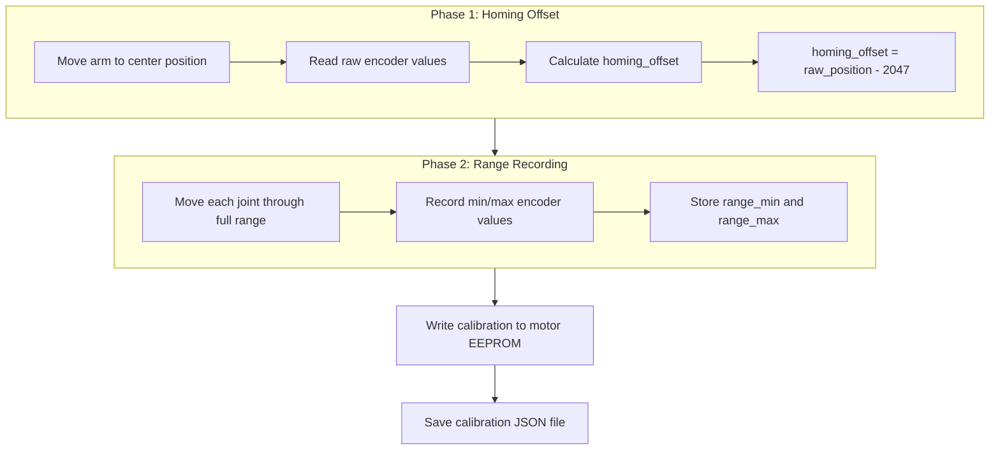
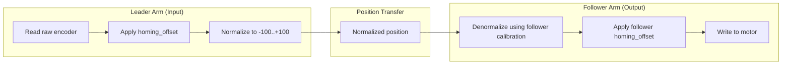
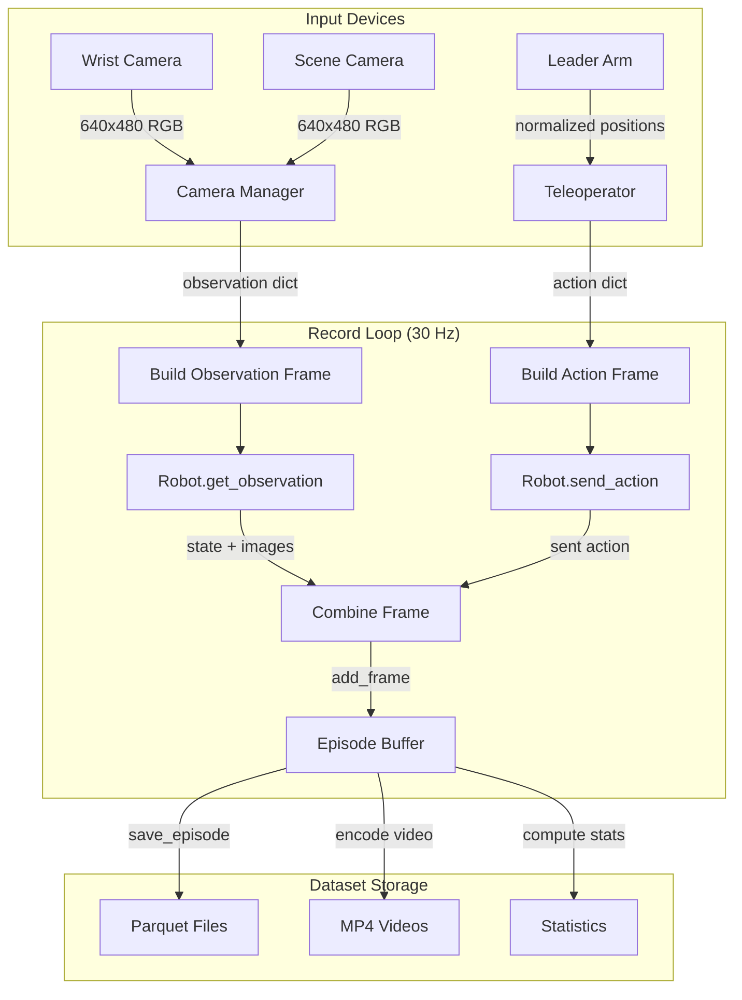
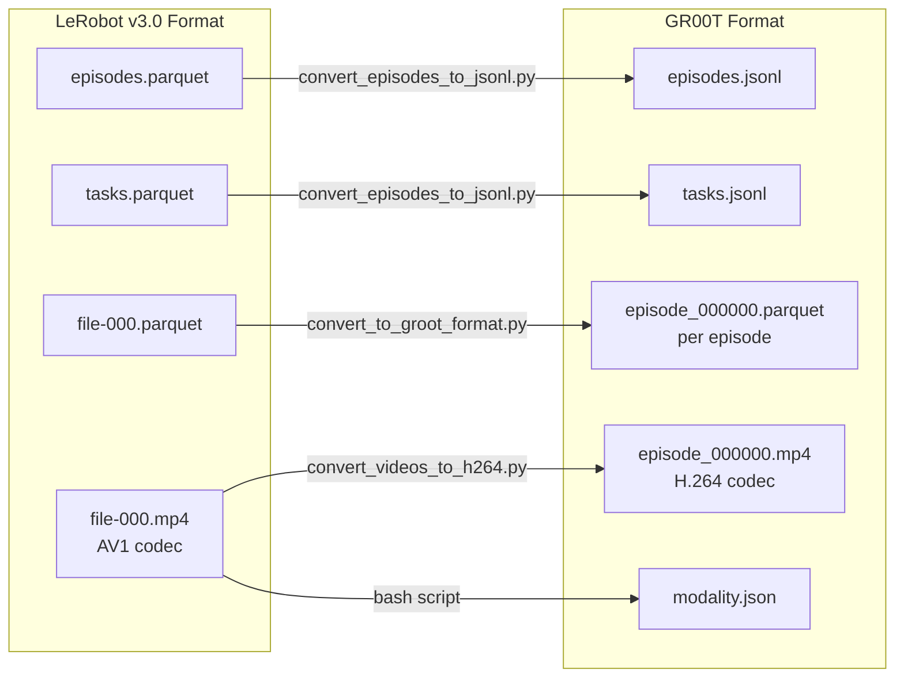
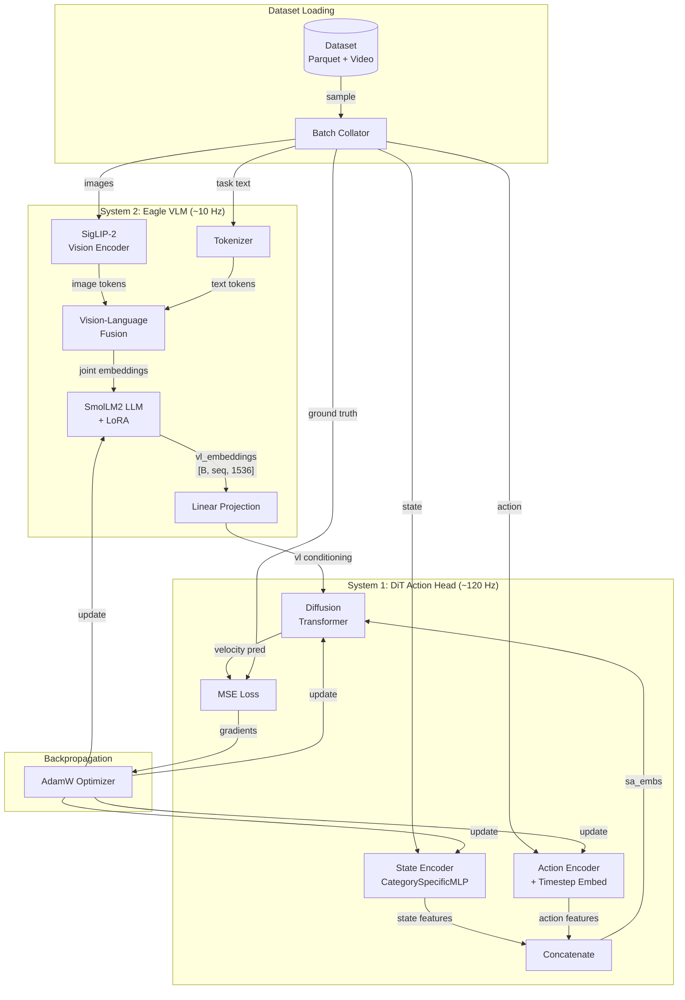
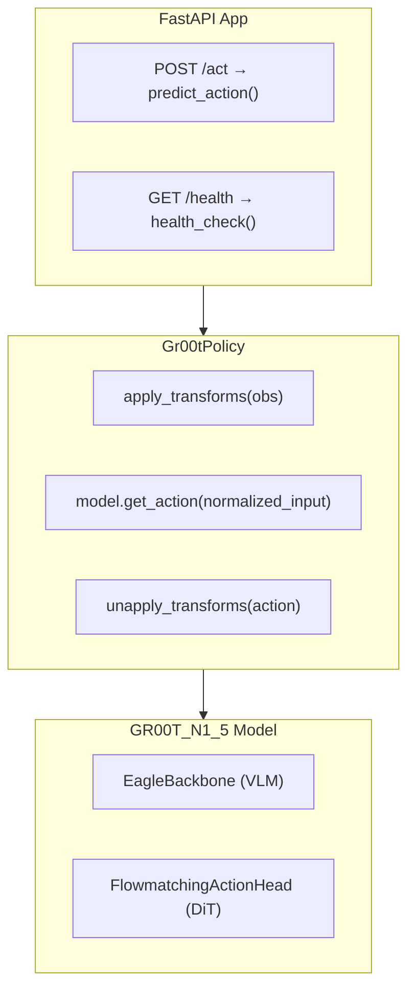
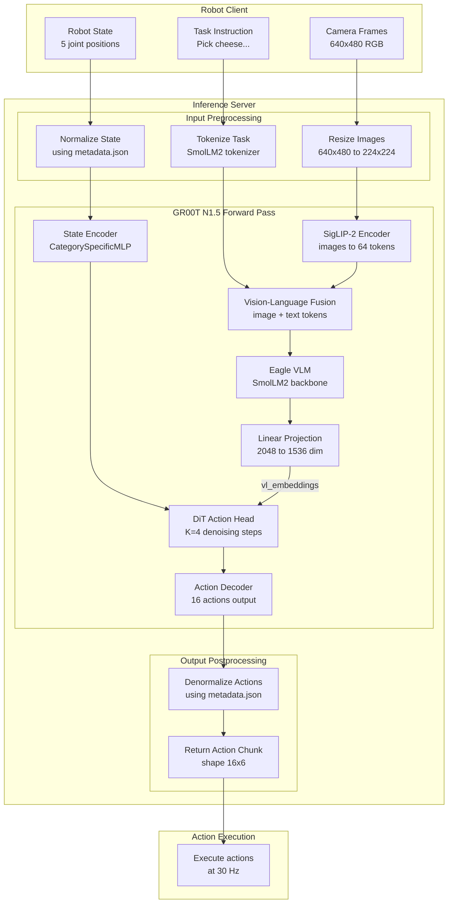
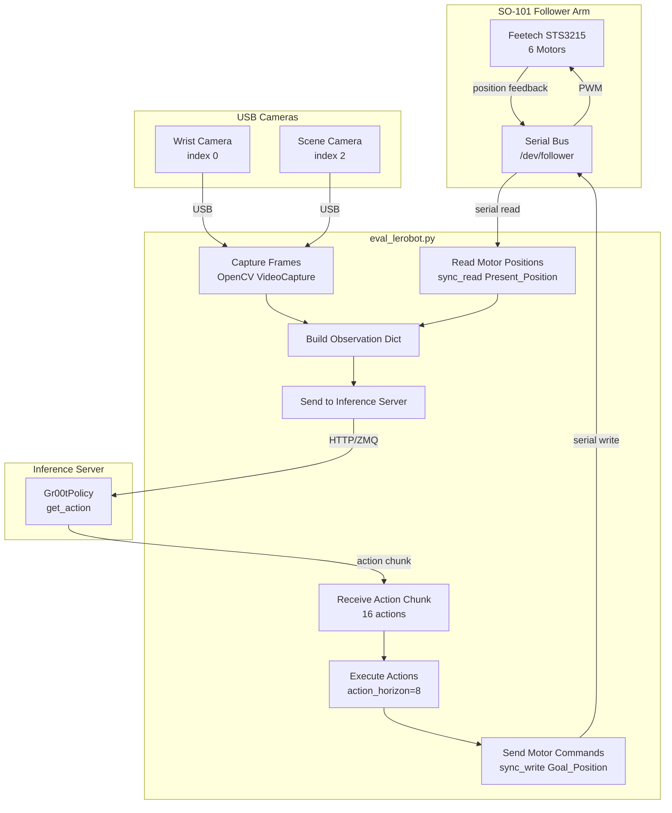

# Fine-Tuning GR00T N1.5

> **Navigation**: [← Architecture](architecture.md) | [Main README](../README.md) | [Simulation →](simulation.md)

---

<a id="7-fine-tuning-groot-n15"></a>
## 7. Fine-Tuning GR00T N1.5

This section documents the complete fine-tuning workflow for the SO-100 arm using the ChefMate training pipeline. The workflow follows the [Hugging Face GR00T N1.5 SO-101 Tuning Guide](https://huggingface.co/blog/nvidia/gr00t-n1-5-so101-tuning) but uses ChefMate-specific scripts.

**ChefMate Scripts Repository**: [github.com/mvipin/chefmate/tree/main/scripts/so100_groot](https://github.com/mvipin/chefmate/tree/main/scripts/so100_groot)
<a id="fine-tunable-parameters"></a>
### Fine-Tunable Parameters

This section documents the parameter-efficient fine-tuning strategy in GR00T N1.5, clarifying which weights are frozen vs. fine-tunable, how LoRA interacts with the `tune_*` flags, and providing accurate parameter counts for different configurations.

#### Fine-Tuning vs. Training from Scratch

**Critical clarification**: GR00T N1.5 fine-tuning loads **ALL weights** from NVIDIA's pretrained checkpoint (`nvidia/GR00T-N1.5-3B`). The `tune_*` flags control which pretrained weights are **frozen** (kept constant) vs. **fine-tunable** (updated during training).

| Term | Definition |
|------|------------|
| **Pretrained weights** | Weights loaded from `nvidia/GR00T-N1.5-3B` checkpoint (all components except LoRA) |
| **Frozen parameters** | Pretrained weights with `requires_grad=False` — loaded from checkpoint but not updated during training |
| **Fine-tunable parameters** | Pretrained weights with `requires_grad=True` — loaded from checkpoint and updated during training |
| **Randomly initialized** | Only LoRA adapter matrices (A, B) — not from any checkpoint |

The weight loading flow in `GR00TN15.from_pretrained()`:

```python
@classmethod
def from_pretrained(cls, pretrained_model_name_or_path: str, **kwargs):
    # Downloads nvidia/GR00T-N1.5-3B to ~/.cache/huggingface/hub/
    local_model_path = snapshot_download(pretrained_model_name_or_path, repo_type="model")

    # Calls parent's from_pretrained which loads model.safetensors
    pretrained_model = super().from_pretrained(
        local_model_path, local_model_path=local_model_path, **kwargs
    )

    # THEN applies tune flags to freeze/unfreeze already-loaded pretrained weights
    pretrained_model.backbone.set_trainable_parameters(tune_visual=tune_visual, tune_llm=tune_llm)
    pretrained_model.action_head.set_trainable_parameters(
        tune_projector=tune_projector, tune_diffusion_model=tune_diffusion_model
    )
    return pretrained_model
```

**Code Reference**: `lerobot/src/lerobot/policies/groot/groot_n1.py` (lines 343-376)

##### Weight Initialization by Component

| Component | Source | Pretrained From | Randomly Initialized? |
|-----------|--------|-----------------|----------------------|
| **SiglipVisionModel** | `nvidia/GR00T-N1.5-3B` | ✅ NVIDIA checkpoint (derived from Google SigLIP) | ❌ No |
| **Qwen3 LLM (12 layers)** | `nvidia/GR00T-N1.5-3B` | ✅ NVIDIA checkpoint (derived from Alibaba Qwen3) | ❌ No |
| **MLP Connector (mlp1)** | `nvidia/GR00T-N1.5-3B` | ✅ NVIDIA checkpoint | ❌ No |
| **Eagle Linear** | `nvidia/GR00T-N1.5-3B` | ✅ NVIDIA checkpoint | ❌ No |
| **DiT Action Head** | `nvidia/GR00T-N1.5-3B` | ✅ NVIDIA checkpoint | ❌ No |
| **State/Action Encoders** | `nvidia/GR00T-N1.5-3B` | ✅ NVIDIA checkpoint | ❌ No |
| **LoRA Adapters (A, B matrices)** | N/A | ❌ **Randomly initialized** (A~N(0, σ), B=0) | ✅ **Yes** |

> **Note**: LoRA adapters are the **only randomly initialized** components. PEFT's `get_peft_model()` initializes Matrix A with a normal distribution `N(0, σ)` and Matrix B with zeros (so LoRA output starts as zero, preserving pretrained behavior).

#### Parameter Control: `tune_llm` and `tune_visual`

The `EagleBackbone.set_trainable_parameters()` method controls which backbone modules have trainable parameters:

```python
def set_trainable_parameters(self, tune_llm: bool, tune_visual: bool):
    self.tune_llm = tune_llm
    self.tune_visual = tune_visual
    for p in self.parameters():
        p.requires_grad = True   # Start by making everything trainable
    if not tune_llm:
        self.eagle_model.language_model.requires_grad_(False)
    if not tune_visual:
        self.eagle_model.vision_model.requires_grad_(False)
        self.eagle_model.mlp1.requires_grad_(False)  # MLP connector frozen with vision
```

**Code Reference**: `lerobot/src/lerobot/policies/groot/groot_n1.py` (lines 99-117)

| Flag | When `False` (Frozen) | When `True` (Fine-Tunable) |
|------|----------------------|---------------------------|
| `tune_llm` | `language_model` (Qwen3-2B layers 0-11, ~1.12B params) — pretrained weights frozen | Full LLM backbone fine-tunable |
| `tune_visual` | `vision_model` (SigLIP ViT, ~400M params) + `mlp1` (MLP connector, ~2.4M params) — pretrained weights frozen | Both vision encoder and connector fine-tunable |

> **Important**: The `mlp1` connector is bundled with `tune_visual`, not separately controllable. Setting `tune_visual=False` freezes both the vision encoder AND the MLP connector.

#### Eval Mode for Frozen Modules

When frozen modules are set to training mode, they still maintain their pretrained weights but may have active dropout/batchnorm layers. The `set_frozen_modules_to_eval_mode()` method ensures frozen modules behave deterministically:

```python
def set_frozen_modules_to_eval_mode(self):
    """Set frozen modules to eval mode to disable dropout and batchnorm updates."""
    if self.training:
        if self.eagle_model.language_model and not self.tune_llm:
            self.eagle_model.language_model.eval()  # Disables dropout/batchnorm training
        if self.eagle_model.vision_model and not self.tune_visual:
            self.eagle_model.vision_model.eval()
```

**Code Reference**: `lerobot/src/lerobot/policies/groot/groot_n1.py` (lines 119-129)

**Why this matters**:
- **Dropout layers**: In training mode, dropout randomly zeros elements even for frozen modules, introducing unwanted stochasticity
- **BatchNorm layers**: In training mode, running statistics are updated even for frozen modules
- **Solution**: Calling `.eval()` on frozen modules ensures deterministic forward passes while the rest of the model trains normally

#### LoRA Interaction with Tune Flags

LoRA adapters are attached **at model construction time** in `Eagle25VLForConditionalGeneration.__init__()`, not through the `tune_*` flags. The interaction between these two mechanisms determines the final trainability:

| Scenario | Configuration | Behavior | Recommendation |
|----------|---------------|----------|----------------|
| **LoRA-only LLM** | `tune_llm=False`, `use_llm_lora=128` | ✅ LLM base weights frozen, only LoRA A/B matrices trainable. PEFT's `get_peft_model()` automatically sets base weights to `requires_grad=False` and LoRA weights to `requires_grad=True` | ✅ **Recommended** — Parameter-efficient, preserves pretrained knowledge |
| **Full LLM tuning** | `tune_llm=True`, `use_llm_lora=0` | ⚠️ All ~1.12B LLM parameters fine-tunable (expensive, risk of overfitting) | ⚠️ Use only with large datasets |
| **Hybrid (LoRA + Full)** | `tune_llm=True`, `use_llm_lora=128` | ⚠️ **Both** base weights AND LoRA adapters trainable — wasteful since LoRA's purpose is to avoid full tuning | ❌ **Not recommended** — Redundant |
| **LoRA-only Vision** | `tune_visual=False`, `use_backbone_lora=128` | ✅ Vision base weights frozen, LoRA adapters trainable | ✅ **Recommended** for novel visual domains |

**Code Reference**: `lerobot/src/lerobot/policies/groot/eagle2_hg_model/modeling_eagle2_5_vl.py` (lines 154-159, 170-206)

#### Fine-Tunable Parameter Calculation

This section provides mathematical calculations for the number of fine-tunable parameters in different GR00T-N1.5-3B configurations.

##### Model Architecture Dimensions

| Component | Parameter | Value |
|-----------|-----------|-------|
| **SigLIP Vision Encoder** | | |
| `hidden_size` | `d_v` | 1152 |
| `num_hidden_layers` | `L_v` | 27 |
| `num_attention_heads` | | 16 |
| `intermediate_size` | | 4 × 1152 = 4608 |
| `patch_size` | | 14 |
| **Qwen3 LLM** (12 layers used) | | |
| `hidden_size` | `d_l` | 2048 |
| `num_hidden_layers` | `L_l` | 12 (`select_layer=-1` removes layers 12-27) |
| `intermediate_size` | | 8192 |
| `num_attention_heads` | | 16 |
| **MLP Connector** | | |
| Input dim | | 1152 (no pixel shuffle) |
| Output dim | | 2048 |
| **DiT Action Head** | | |
| `inner_dim` | `d_dit` | 8 × 64 = 512 |
| `num_layers` | | 12 |
| **Projection Layer** | | |
| `eagle_linear` | | 2048 → 1536 |

##### Component Parameter Counts

**Vision Encoder (SigLIP ViT-L) — ~400M parameters**:
```
Per transformer block:
  Self-attention: 4 × d_v × d_v = 4 × 1152² = 5,308,416
  MLP (fc1 + fc2): 2 × d_v × 4d_v = 2 × 1152 × 4608 = 10,616,832
  LayerNorms: 2 × 2 × d_v = 4,608
  Total per block: ~15.9M

Total vision encoder:
  Patch embedding: 3 × 14² × 1152 + 1152 = 677,376
  27 transformer blocks: 27 × 15.9M ≈ 429M
  Position embedding + class token: ~263K
  ─────────────────────────────────────────
  Vision Encoder Total: ~400M parameters
```

**Language Model (Qwen3-2B, 12 layers) — ~1.12B parameters**:
```
Per transformer block:
  Self-attention (Q, K, V, O): 4 × d_l × d_l = 4 × 2048² = 16,777,216
  MLP (gate, up, down): 3 × d_l × 8192 = 50,331,648
  LayerNorms: 2 × 2 × d_l = 8,192
  Total per block: ~67M

Total LLM (12 layers):
  Token embedding: 151680 × 2048 = 310.6M
  12 transformer blocks: 12 × 67M = 804M
  Final LayerNorm: 2 × 2048 = 4,096
  LM Head: 2048 × 151680 = 310.6M (tied with embedding)
  ─────────────────────────────────────────
  LLM Total (12 layers): ~1.12B parameters
```

**MLP Connector — ~2.4M parameters** (without pixel shuffle):
```
Linear(1152 → 2048): 1152 × 2048 + 2048 = 2,361,344
```

**Eagle Linear — ~3.1M parameters**:
```
Linear(2048 → 1536): 2048 × 1536 + 1536 = 3,147,264
```

**DiT Action Head — ~70M parameters**:
```
Per transformer block:
  Cross-attention (Q, K, V, O): 4 × d_dit × d_dit = 4 × 512² = 1,048,576
  Feed-forward (GEGLU): 2 × d_dit × 4 × d_dit = 4,194,304
  AdaLN + norms: ~20K
  Total per block: ~5.3M

Total DiT:
  12 transformer blocks: 12 × 5.3M = 63.6M
  Timestep encoder: ~1M
  Output projection: 512 × 1024 + 512 × output_dim ≈ 0.5M
  State/Action encoders: ~3M
  Position embeddings: ~0.5M
  ─────────────────────────────────────────
  DiT Action Head Total: ~70M parameters
```

##### LoRA Parameter Calculation

LoRA adds low-rank matrices A ∈ ℝ^(r×d_in) and B ∈ ℝ^(d_out×r) to each target layer:
```
LoRA params per layer = r × (d_in + d_out)
```

**Vision LoRA (r=128)** — 6 targets per block × 27 blocks:
```
Per block targets:
  q_proj, k_proj, v_proj, out_proj: 4 × 128 × (1152 + 1152) = 1,179,648
  fc1: 128 × (1152 + 4608) = 737,280
  fc2: 128 × (4608 + 1152) = 737,280
  ─────────────────────────
  Per block: 2,654,208

27 blocks × 2.65M = ~71.7M LoRA parameters
```

**LLM LoRA (r=128)** — 7 targets per block × 12 blocks:
```
Per block targets:
  q_proj, k_proj, v_proj, o_proj: 4 × 128 × (2048 + 2048) = 2,097,152
  gate_proj: 128 × (2048 + 8192) = 1,310,720
  down_proj: 128 × (8192 + 2048) = 1,310,720
  up_proj: 128 × (2048 + 8192) = 1,310,720
  ─────────────────────────
  Per block: 6,029,312

12 blocks × 6.03M = ~72.4M LoRA parameters
```

##### Configuration Comparison

| Configuration | Vision Encoder | LLM Backbone | MLP Connector | Eagle Linear | DiT Action Head | **Total Fine-Tunable** |
|---------------|----------------|--------------|---------------|--------------|-----------------|------------------------|
| **Full Fine-Tuning** | 🔓 400M | 🔓 1.12B | 🔓 2.4M | 🔓 3.1M | 🔓 70M | **~1.6B** |
| `tune_visual=True, tune_llm=True` | (pretrained→fine-tuned) | (pretrained→fine-tuned) | | | | |
| **LoRA-Only (r=128)** | 🔒 400M + 🆕 72M | 🔒 1.12B + 🆕 72M | 🔒 2.4M | 🔓 3.1M | 🔓 70M | **~217M** |
| `tune_*=False, use_*_lora=128` | (frozen + LoRA) | (frozen + LoRA) | (frozen) | | | |
| **Default Config** | 🔒 400M | 🔒 1.12B | 🔒 2.4M | 🔓 3.1M | 🔓 70M | **~73M** |
| `tune_visual=False, tune_llm=False` | (pretrained→frozen) | (pretrained→frozen) | (frozen) | | | |

**Legend**:
- 🔓 = Pretrained weights loaded from NVIDIA checkpoint, **fine-tuned** (gradients enabled)
- 🔒 = Pretrained weights loaded from NVIDIA checkpoint, **frozen** (gradients disabled)
- 🆕 = Randomly initialized (LoRA adapters only)

#### Total Model Size: 3B Parameters Explained

The advertised "GR00T-N1.5-3B" model size refers to the **total checkpoint size**, which includes the full Qwen3-2B backbone before layer pruning:

| Component | Parameters | Notes |
|-----------|------------|-------|
| **Qwen3-2B LLM (full 28 layers)** | ~2.0B | Full pretrained backbone in checkpoint |
| **SigLIP Vision Encoder** | ~400M | SigLIP-2 ViT-L/14 |
| **MLP Connector** | ~2.4M | Projects vision → LLM space |
| **Eagle Linear** | ~3.1M | Projects LLM → action head space |
| **DiT Action Head** | ~70M | Flow-matching diffusion transformer |
| **State/Action Encoders** | ~10M | Multi-embodiment projectors |
| **Total Checkpoint** | **~2.5B** | Stored in `model.safetensors` |

> **Note**: The "3B" naming is approximate. The actual checkpoint is ~2.5B parameters, rounded up for marketing.

**Active Parameters During Inference**:

GR00T N1.5 uses only 12 LLM layers (`select_layer=-1` removes layers 12-27 at model construction):

```python
# From groot_n1.py lines 92-94
while len(self.eagle_model.language_model.model.layers) > select_layer:
    self.eagle_model.language_model.model.layers.pop(-1)  # Removes layers 12-27
```

This reduces the active LLM parameters from ~2.0B to ~1.12B, resulting in:

| Metric | Full Checkpoint | Active During Inference |
|--------|-----------------|------------------------|
| LLM parameters | ~2.0B (28 layers) | ~1.12B (12 layers) |
| Vision parameters | ~400M | ~400M |
| Action head | ~70M | ~70M |
| **Total** | **~2.5B** | **~1.6B** |

**Code Reference**: `lerobot/src/lerobot/policies/groot/groot_n1.py` (lines 92-94)

<a id="workflow-overview"></a>
### Workflow Overview

| Step | Script | Purpose | Architecture Component |
|------|--------|---------|----------------------|
| 0a | `00_calibrate_arms.sh` | Calibrate leader/follower arms | N/A (hardware setup) |
| 0b | `00_test_teleoperation.sh` | Verify teleoperation before recording | N/A (validation) |
| 1 | `01_record_dataset.sh` | Record demonstrations via teleoperation | Generates training data for State & Action Encoders |
| 2 | `02_prepare_dataset.sh` | Convert to GR00T format | Prepares inputs for Eagle VLM (video) + DiT (state/action) |
| 3 | `03_train_model.sh` | Fine-tune GR00T N1.5 | Trains Eagle VLM + Diffusion Transformer + State Encoders |
| 4 | `04_start_inference_server.sh` | Launch inference server | Runs System 2 (VLM) + System 1 (DiT) pipeline |
| 5 | `05_deploy_robot.sh` | Deploy on physical robot | Executes trained policy via inference server |

<a id="step-0-calibration"></a>
### Step 0: Calibration

**Scripts**:
- [`00_calibrate_arms.sh`](https://github.com/mvipin/chefmate/blob/main/scripts/so100_groot/00_calibrate_arms.sh) - Calibrate both arms
- [`00_test_teleoperation.sh`](https://github.com/mvipin/chefmate/blob/main/scripts/so100_groot/00_test_teleoperation.sh) - Verify teleoperation works

#### Why Calibration is Necessary

Calibration solves three critical problems:

1. **Encoder Zero-Point Variability**: Each Feetech STS3215 servo has a different absolute encoder position at assembly. Without calibration, "position 0" means something different on each motor.

2. **Range Normalization**: The same physical joint angle may correspond to different encoder values across motors. Calibration maps the physical range of motion to a consistent normalized range (`-100` to `+100` for body joints, `0` to `100` for gripper).

3. **Leader-Follower Alignment**: For teleoperation, both arms must agree on what "center position" means. If the leader reads `45°` but the follower interprets it as `60°`, movements will be distorted.

#### Calibration Process

```bash
# Step 0a: Calibrate both arms
./scripts/so100_groot/00_calibrate_arms.sh

# Step 0b: Test teleoperation
./scripts/so100_groot/00_test_teleoperation.sh
```

The calibration process involves two phases per arm:



#### Calibration Data Structure

**MotorCalibration** stores 5 values per motor:

| Field | Type | Units | Description |
|-------|------|-------|-------------|
| `id` | int | - | Motor ID (1-6) |
| `drive_mode` | int | - | Direction flag (0 = normal) |
| `homing_offset` | int | encoder ticks | Offset to center position (raw - 2047) |
| `range_min` | int | encoder ticks | Minimum observed encoder value |
| `range_max` | int | encoder ticks | Maximum observed encoder value |

**Units**: All values are in **encoder ticks** (0-4095 for 12-bit STS3215 servos). The firmware converts to/from degrees or normalized ranges during read/write operations.

#### Calibration File Storage

Calibration files are JSON files stored at:

```
~/.cache/huggingface/lerobot/calibration/
├── robots/
│   └── so101_follower/
│       └── so101_follower.json      # Follower arm calibration
└── teleoperators/
    └── so101_leader/
        └── so101_leader.json        # Leader arm calibration
```

**Example calibration file** (`so101_follower.json`):

```json
{
    "shoulder_pan": {
        "id": 1,
        "drive_mode": 0,
        "homing_offset": -156,
        "range_min": 1024,
        "range_max": 3072
    },
    "shoulder_lift": {
        "id": 2,
        "drive_mode": 0,
        "homing_offset": 89,
        "range_min": 1200,
        "range_max": 2900
    },
    // ... other joints
}
```

#### lerobot-calibrate Command

The `lerobot-calibrate` command runs the calibration wizard:

```bash
# Calibrate follower arm
lerobot-calibrate \
    --robot.type=so101_follower \
    --robot.port=/dev/follower \
    --robot.id=so101_follower

# Calibrate leader arm
lerobot-calibrate \
    --teleop.type=so101_leader \
    --teleop.port=/dev/leader \
    --teleop.id=so101_leader
```

**Calibration Algorithm**:

1. **Disable torque** on all motors (allows manual movement)
2. **Prompt user** to move arm to center of range
3. **Read raw encoder positions** for all 6 motors
4. **Calculate homing offsets**: `homing_offset = raw_position - 2047` (half of 4095)
5. **Write homing offsets** to motor EEPROM registers
6. **Prompt user** to move each joint through full range
7. **Record min/max** encoder values during movement
8. **Write range limits** to motor EEPROM
9. **Save JSON file** to `~/.cache/huggingface/lerobot/calibration/`

#### lerobot-teleoperate Command

After calibration, test with `lerobot-teleoperate`:

```bash
lerobot-teleoperate \
    --robot.type=so101_follower \
    --robot.port=/dev/follower \
    --robot.id=so101_follower \
    --teleop.type=so101_leader \
    --teleop.port=/dev/leader \
    --teleop.id=so101_leader
```

**How Teleoperation Uses Calibration**:



**Leader-Follower Relationship**:

1. **Leader reads** raw position → subtracts `homing_offset` → normalizes using `range_min`/`range_max`
2. **Normalized value** (e.g., `45.2` in range `-100` to `+100`) is transferred
3. **Follower receives** normalized value → denormalizes using its own `range_min`/`range_max` → adds its `homing_offset` → writes to motor

This ensures that when you move the leader's shoulder to 50% of its range, the follower's shoulder also moves to 50% of *its* range—even if the raw encoder values differ.

| Parameter | Value | Description |
|-----------|-------|-------------|
| `LEADER_PORT` | `/dev/leader` | Leader arm USB port (via udev symlink) |
| `FOLLOWER_PORT` | `/dev/follower` | Follower arm USB port (via udev symlink) |
| `robot.type` | `so101_follower` | Follower arm driver class |
| `teleop.type` | `so101_leader` | Leader arm driver class |
| `robot.id` / `teleop.id` | Unique identifier | Used to locate calibration JSON file |

**Architecture Mapping**: N/A (hardware configuration only, but calibration accuracy directly affects training data quality)

<a id="step-1-data-collection"></a>
### Step 1: Data Collection

**Script**: [`01_record_dataset.sh`](https://github.com/mvipin/chefmate/blob/main/scripts/so100_groot/01_record_dataset.sh)

Records demonstration episodes via leader-follower teleoperation with dual cameras.

```bash
./scripts/so100_groot/01_record_dataset.sh
```

#### lerobot-record Command

The recording script wraps the `lerobot-record` command with ChefMate-specific defaults:

```bash
lerobot-record \
    --robot.type=so101_follower \
    --robot.port=/dev/follower \
    --robot.id=so101_follower \
    --robot.cameras="{ wrist: {type: opencv, index_or_path: /dev/wrist, width: 640, height: 480, fps: 30}, scene: {type: opencv, index_or_path: /dev/scene, width: 640, height: 480, fps: 30}}" \
    --teleop.type=so101_leader \
    --teleop.port=/dev/leader \
    --teleop.id=so101_leader \
    --display_data=false \
    --dataset.repo_id="rubbotix/${DATASET_NAME}" \
    --dataset.num_episodes="${NUM_EPISODES}" \
    --dataset.single_task="${TASK_DESCRIPTION}" \
    --dataset.push_to_hub=false \
    --dataset.episode_time_s="${EPISODE_TIME}" \
    --dataset.reset_time_s="${RESET_TIME}"
```

#### Command Parameters

**Robot Configuration:**

| Parameter | Value | Description |
|-----------|-------|-------------|
| `robot.type` | `so101_follower` | Robot driver class (loads calibration, controls motors) |
| `robot.port` | `/dev/follower` | USB serial port (via udev symlink) |
| `robot.id` | `so101_follower` | Identifier for calibration file lookup |
| `robot.cameras` | JSON dict | Camera configuration (see below) |

**Camera Configuration:**

The `robot.cameras` parameter accepts a JSON dictionary mapping camera names to OpenCVCamera configurations:

```json
{
    "wrist": {
        "type": "opencv",
        "index_or_path": "/dev/wrist",
        "width": 640,
        "height": 480,
        "fps": 30
    },
    "scene": {
        "type": "opencv",
        "index_or_path": "/dev/scene",
        "width": 640,
        "height": 480,
        "fps": 30
    }
}
```

| Field | Type | Description |
|-------|------|-------------|
| `type` | string | Camera driver (`opencv` or `realsense`) |
| `index_or_path` | int/string | Camera index (0, 1, ...) or device path (`/dev/video0`, `/dev/wrist`) |
| `width` | int | Frame width in pixels |
| `height` | int | Frame height in pixels |
| `fps` | int | Target frame rate (matches dataset FPS) |

**Teleoperation Configuration:**

| Parameter | Value | Description |
|-----------|-------|-------------|
| `teleop.type` | `so101_leader` | Teleoperator driver class |
| `teleop.port` | `/dev/leader` | Leader arm USB port |
| `teleop.id` | `so101_leader` | Identifier for calibration file lookup |

**Dataset Configuration:**

| Parameter | Example | Description |
|-----------|---------|-------------|
| `dataset.repo_id` | `rubbotix/bread` | HuggingFace-style ID: `{username}/{dataset_name}` |
| `dataset.num_episodes` | `50` | Total episodes to record |
| `dataset.single_task` | `"Pick up the bread"` | Language instruction for this task |
| `dataset.episode_time_s` | `30` | Recording duration per episode (seconds) |
| `dataset.reset_time_s` | `5` | Time allowed for environment reset between episodes |
| `dataset.push_to_hub` | `false` | Push to HuggingFace Hub after recording |
| `dataset.fps` | `30` | Frames per second (default) |
| `dataset.video` | `true` | Encode frames as MP4 videos (default) |

**Display Options:**

| Parameter | Default | Description |
|-----------|---------|-------------|
| `display_data` | `false` | Enable Rerun visualization (requires GUI) |

#### Recording Data Flow



**Per-frame data captured:**

| Field | Shape | Source | Description |
|-------|-------|--------|-------------|
| `action` | `(6,)` | Leader arm | Target joint positions (normalized) |
| `observation.state` | `(6,)` | Follower arm | Current joint positions (normalized) |
| `observation.images.wrist` | `(480, 640, 3)` | Wrist camera | RGB frame |
| `observation.images.scene` | `(480, 640, 3)` | Scene camera | RGB frame |
| `task` | string | CLI arg | Language instruction for the episode |

#### Dataset Directory Structure

Recording creates a LeRobot v2 dataset at `~/.cache/huggingface/lerobot/{repo_id}/`:

```
~/.cache/huggingface/lerobot/rubbotix/bread/
├── meta/
│   ├── info.json              # Schema, FPS, features, path templates
│   ├── stats.json             # Global statistics (mean/std/min/max)
│   ├── tasks.parquet          # Task descriptions mapped to IDs
│   └── episodes/
│       └── chunk-000/
│           └── file-000.parquet   # Episode metadata (length, tasks)
├── data/
│   └── chunk-000/
│       └── file-000.parquet   # Frame-by-frame data (action, state)
└── videos/
    ├── observation.images.wrist/
    │   └── chunk-000/
    │       └── file-000.mp4   # Encoded wrist camera video
    └── observation.images.scene/
        └── chunk-000/
            └── file-000.mp4   # Encoded scene camera video
```

**Key Metadata Files:**

| File | Purpose |
|------|---------|
| `meta/info.json` | Dataset schema, FPS (30), robot type, feature shapes/dtypes |
| `meta/stats.json` | Normalization statistics for each feature |
| `meta/tasks.parquet` | Maps task strings to integer IDs for training |
| `meta/episodes/*.parquet` | Episode lengths, task assignments, chunk indices |

**Example `info.json`:**

```json
{
    "codebase_version": "v2.1",
    "robot_type": "so101_follower",
    "fps": 30,
    "features": {
        "action": {"dtype": "float32", "shape": [6], "names": ["shoulder_pan", "shoulder_lift", "elbow", "wrist_pitch", "wrist_roll", "gripper"]},
        "observation.state": {"dtype": "float32", "shape": [6], "names": ["shoulder_pan", "shoulder_lift", "elbow", "wrist_pitch", "wrist_roll", "gripper"]},
        "observation.images.wrist": {"dtype": "video", "shape": [480, 640, 3]},
        "observation.images.scene": {"dtype": "video", "shape": [480, 640, 3]}
    }
}
```

#### How Calibration Affects Recording

1. **Robot connects** → loads calibration from `~/.cache/huggingface/lerobot/calibration/robots/so101_follower/so101_follower.json`
2. **Teleoperator connects** → loads calibration from `~/.cache/huggingface/lerobot/calibration/teleoperators/so101_leader/so101_leader.json`
3. **Leader arm** reads raw encoder → applies homing offset → normalizes to `-100..+100`
4. **Action stored** as normalized float32 values in parquet
5. **Follower arm** receives normalized action → denormalizes → applies homing offset → writes to motor

Without calibration, the recorded actions would contain raw encoder values specific to your hardware, making the dataset non-transferable and training less effective.

#### Teleoperation Controls

| Key | Action |
|-----|--------|
| `→` (Right Arrow) | End current episode, start next |
| `←` (Left Arrow) | Discard and re-record current episode |
| `ESC` | Stop recording, save dataset, exit |

**Architecture Mapping**:
- **State & Action Encoders**: Recorded joint positions become training targets for the embodiment-specific MLPs
- **Eagle VLM**: Camera frames become vision inputs; `TASK_DESCRIPTION` becomes language conditioning input

<a id="step-2-dataset-preparation"></a>
### Step 2: Dataset Preparation

**Script**: [`02_prepare_dataset.sh`](https://github.com/mvipin/chefmate/blob/main/scripts/so100_groot/02_prepare_dataset.sh)

Converts LeRobot dataset to GR00T-compatible format with proper modality configuration.

```bash
./scripts/so100_groot/02_prepare_dataset.sh
```

#### Why Conversion is Necessary

LeRobot and GR00T use different dataset schemas. This conversion bridges the gap:

| Aspect | LeRobot v3.0 | GR00T Extension |
|--------|--------------|-----------------|
| Episode metadata | `meta/episodes/chunk-000/file-000.parquet` | `meta/episodes.jsonl` (one JSON per line) |
| Task descriptions | `meta/tasks.parquet` | `meta/tasks.jsonl` (JSON lines) |
| Data files | Combined `data/chunk-000/file-000.parquet` | Per-episode `data/chunk-000/episode_000000.parquet` |
| Video files | Combined `videos/*/chunk-000/file-000.mp4` | Per-episode `videos/*/chunk-000/episode_000000.mp4` |
| Modality mapping | Inferred from `info.json` | Explicit `meta/modality.json` |
| Video codec | libsvtav1 (AV1) | H.264 (for torchcodec) |



#### Conversion Pipeline

The `02_prepare_dataset.sh` script executes these steps:

```bash
# 1. Copy dataset from LeRobot cache to Isaac-GR00T demo_data
cp -r ~/.cache/huggingface/lerobot/rubbotix/${DATASET_NAME} \
      ~/Isaac-GR00T/demo_data/${DATASET_NAME}

# 2. Convert episode metadata to JSONL
python convert_episodes_to_jsonl.py ${DEST_DATASET}

# 3. Split combined files into per-episode files
python convert_to_groot_format.py ${DEST_DATASET}

# 4. Create modality.json
cat > ${DEST_DATASET}/meta/modality.json << 'EOF'
{ ... }
EOF

# 5. Convert videos to H.264
python convert_videos_to_h264.py ${DEST_DATASET}

# 6. Validate with GR00T loader
python -c "from gr00t.data.dataset import LeRobotSingleDataset; ..."
```

#### Episode JSONL Format

GR00T requires `meta/episodes.jsonl` with one JSON object per line:

```jsonl
{"episode_index": 0, "length": 284, "tasks": ["Pick up the bread slice"]}
{"episode_index": 1, "length": 291, "tasks": ["Pick up the bread slice"]}
{"episode_index": 2, "length": 278, "tasks": ["Pick up the bread slice"]}
```

| Field | Type | Description |
|-------|------|-------------|
| `episode_index` | int | Zero-based episode ID |
| `length` | int | Number of frames in this episode |
| `tasks` | list[str] | Task descriptions (language instructions) |

**Conversion Script** (`convert_episodes_to_jsonl.py`):

```python
# Read LeRobot parquet
episodes_df = pd.read_parquet("meta/episodes/chunk-000/file-000.parquet")

# Write JSONL
with open("meta/episodes.jsonl", 'w') as f:
    for idx, row in episodes_df.iterrows():
        episode_data = {
            "episode_index": int(row['episode_index']),
            "length": int(row['length']),
            "tasks": row['tasks'].tolist()
        }
        f.write(json.dumps(episode_data) + '\n')
```

The script also creates `meta/tasks.jsonl`:

```jsonl
{"task": "Pick up the bread slice", "task_index": 0}
```

#### Modality Configuration Deep Dive

The `meta/modality.json` file tells GR00T how to interpret the dataset:

```json
{
    "state": {
        "single_arm": {"start": 0, "end": 5},
        "gripper": {"start": 5, "end": 6}
    },
    "action": {
        "single_arm": {"start": 0, "end": 5},
        "gripper": {"start": 5, "end": 6}
    },
    "video": {
        "scene": {"original_key": "observation.images.scene"},
        "wrist": {"original_key": "observation.images.wrist"}
    },
    "annotation": {
        "human.task_description": {"original_key": "task_index"}
    }
}
```

**Why modality.json is Required:**

1. **Semantic Grouping**: GR00T's `CategorySpecificMLP` needs to know which joints belong together
2. **Key Remapping**: LeRobot uses verbose keys (`observation.images.scene`), GR00T uses short keys (`scene`)
3. **Action Chunking**: GR00T predicts action sequences; modality config defines which indices to predict
4. **Annotation Routing**: Maps task indices to language descriptions for Eagle VLM conditioning

**Index Mapping for SO-101 (6 DOF):**

```
observation.state / action = [shoulder_pan, shoulder_lift, elbow, wrist_pitch, wrist_roll, gripper]
                              |<--------- single_arm -------->|                           |gripper|
                              index: 0      1         2       3           4                5
```

| Modality | Split | Start | End | Joints |
|----------|-------|-------|-----|--------|
| state/action | `single_arm` | 0 | 5 | shoulder_pan, shoulder_lift, elbow, wrist_pitch, wrist_roll |
| state/action | `gripper` | 5 | 6 | gripper |

**What Happens If Indices Are Wrong:**

| Error | Consequence |
|-------|-------------|
| `end` > actual DOF | Index out of bounds during training, crash |
| `start`/`end` overlap | Same joint counted twice, incorrect gradient updates |
| Missing joints | Model learns incomplete actions, robot moves erratically |
| Wrong grouping | MLP learns wrong joint correlations, poor generalization |

**Video Key Remapping:**

```json
"video": {
    "scene": {"original_key": "observation.images.scene"},
    "wrist": {"original_key": "observation.images.wrist"}
}
```

- **`scene`**: External camera view → feeds into Eagle VLM for scene understanding
- **`wrist`**: Gripper-mounted camera → provides close-up for precise manipulation

GR00T's `LeRobotSingleDataset` uses these mappings to locate video files:

```python
# video_path pattern from info.json
video_path = "videos/{video_key}/chunk-{episode_chunk:03d}/episode_{episode_index:06d}.mp4"

# For scene camera, episode 0:
videos/observation.images.scene/chunk-000/episode_000000.mp4
```

#### Video Format Conversion

**Why H.264 is Required:**

LeRobot v3.0 uses **libsvtav1 (AV1)** codec for better compression, but GR00T's default video backend is **torchcodec**, which has limited AV1 support:

| Codec | Compression | Decode Speed | torchcodec Support |
|-------|-------------|--------------|-------------------|
| AV1 (libsvtav1) | Excellent | Slow | ❌ Limited/Broken |
| H.264 (libx264) | Good | Fast | ✅ Full |
| HEVC (H.265) | Better | Medium | ⚠️ Partial |

**torchcodec** is Meta's high-performance video decoder built on FFmpeg, optimized for ML training:

```python
# GR00T's video loading (gr00t/utils/video.py)
import torchcodec
decoder = torchcodec.decoders.VideoDecoder(
    video_path,
    device="cpu",           # Can also use "cuda" for GPU decode
    dimension_order="NHWC", # Channel-last for transformer input
    num_ffmpeg_threads=0    # Auto-detect thread count
)
frames = decoder.get_frames_at(indices=[0, 30, 60])  # Efficient random access
```

**Conversion Process** (`convert_videos_to_h264.py`):

```bash
ffmpeg -i input.mp4 \
    -c:v libx264 \      # H.264 encoder
    -preset medium \    # Balance speed/quality
    -crf 23 \           # Constant Rate Factor (18-28 typical)
    -pix_fmt yuv420p \  # Standard pixel format
    -y output.mp4
```

| Parameter | Value | Purpose |
|-----------|-------|---------|
| `-c:v libx264` | H.264 | Encoder selection |
| `-preset medium` | Speed/quality balance | `ultrafast` to `veryslow` |
| `-crf 23` | Quality (0-51, lower=better) | 18-28 visually lossless range |
| `-pix_fmt yuv420p` | Color format | Maximum compatibility |

**File Size Comparison:**

| Codec | 50 Episodes (wrist) | 50 Episodes (scene) |
|-------|---------------------|---------------------|
| AV1 | ~120 MB | ~150 MB |
| H.264 | ~180 MB | ~220 MB |

The ~50% size increase is acceptable for reliable decoding during training.

#### Dataset Validation

After conversion, the script validates the dataset with GR00T's loader:

```python
from gr00t.data.dataset import LeRobotSingleDataset, ModalityConfig
from gr00t.model.gr00t_n1 import GR00T_N1

# Load model config for modality settings
model = GR00T_N1.from_pretrained("nvidia/GR00T-N1.5-3B")
modality_configs = model.get_modality_config()

# Attempt to load dataset
dataset = LeRobotSingleDataset(
    dataset_path="~/Isaac-GR00T/demo_data/bread",
    modality_configs=modality_configs,
    embodiment_tag="new_embodiment",
    video_backend="torchcodec"
)

# Verify sample loading
sample = dataset[0]
print(f"Loaded {len(dataset)} samples")
```

**Validation Checks:**

| Check | Source | Error if Missing |
|-------|--------|------------------|
| `meta/modality.json` exists | `_get_lerobot_modality_meta()` | `AssertionError: Please provide meta/modality.json` |
| `meta/info.json` exists | `_get_lerobot_info_meta()` | `FileNotFoundError` |
| `meta/episodes.jsonl` exists | `_get_trajectories()` | `FileNotFoundError` |
| `meta/tasks.jsonl` exists | `_get_tasks()` | `FileNotFoundError` |
| Video files decode | `get_frames_by_indices()` | `RuntimeError: No valid stream found` |
| Modality keys valid | `_check_integrity()` | `ValueError: Unable to find key in modality metadata` |

**Common Errors and Solutions:**

| Error | Cause | Solution |
|-------|-------|----------|
| `No valid stream found in input file` | AV1 codec not supported | Run `convert_videos_to_h264.py` |
| `Unable to find key 'state.single_arm'` | Missing modality.json section | Add state/action keys to modality.json |
| `Index out of bounds` | Wrong start/end indices | Verify indices match SO-101's 6 DOF |
| `Failed to load dataset statistics` | Missing stats.json (normal) | GR00T auto-calculates and caches |

#### GR00T Dataset Directory Structure

After conversion, the dataset at `~/Isaac-GR00T/demo_data/{dataset}/` should look like:

```
~/Isaac-GR00T/demo_data/bread/
├── meta/
│   ├── info.json              # Schema (updated with per-episode paths)
│   ├── stats.json             # Statistics (auto-generated if missing)
│   ├── modality.json          # GR00T-specific modality mapping
│   ├── episodes.jsonl         # Episode metadata (JSONL format)
│   ├── tasks.jsonl            # Task descriptions (JSONL format)
│   └── episodes/              # Original LeRobot metadata (unused)
├── data/
│   └── chunk-000/
│       ├── episode_000000.parquet  # Episode 0 frames
│       ├── episode_000001.parquet  # Episode 1 frames
│       └── ...
└── videos/
    ├── observation.images.wrist/
    │   └── chunk-000/
    │       ├── episode_000000.mp4  # Wrist camera, episode 0 (H.264)
    │       ├── episode_000001.mp4
    │       └── ...
    └── observation.images.scene/
        └── chunk-000/
            ├── episode_000000.mp4  # Scene camera, episode 0 (H.264)
            ├── episode_000001.mp4
            └── ...
```

**Architecture Mapping**:
- **State & Action Encoders**: `state`/`action` fields map to `CategorySpecificMLP` input dimensions
- **Eagle VLM**: `video` fields configure which camera streams feed into SigLIP-2 encoder
- **Embodiment**: Uses `new_embodiment` tag (projector index 31) for SO-100 arm

<a id="step-3-training"></a>
### Step 3: Training

**Script**: [`03_train_model.sh`](https://github.com/mvipin/chefmate/blob/main/scripts/so100_groot/03_train_model.sh)

Fine-tunes GR00T N1.5 on the prepared dataset using LoRA adapters.

```bash
./scripts/so100_groot/03_train_model.sh
```

#### gr00t_finetune.py Command

The training script wraps the GR00T fine-tuning command with ChefMate-specific settings:

```bash
python scripts/gr00t_finetune.py \
    --dataset-path ./demo_data/cheese/ ./demo_data/bread/ \
    --num-gpus 1 \
    --output-dir ~/so100-groot-checkpoints/cheese_bread_multitask \
    --max-steps 10000 \
    --data-config so100_dualcam \
    --video-backend torchvision_av \
    --batch-size 16 \
    --gradient-accumulation-steps 8 \
    --dataloader-num-workers 8 \
    --save-steps 500 \
    --learning-rate 0.0001 \
    --lora-rank 32 \
    --lora-alpha 64 \
    --lora-dropout 0.1 \
    --tune-llm \
    --tune-visual \
    --tune-projector \
    --tune-diffusion-model \
    --balance-dataset-weights \
    --balance-trajectory-weights \
    --report-to tensorboard
```

#### Command Parameters

**Dataset Configuration:**

| Parameter | Value | Description |
|-----------|-------|-------------|
| `--dataset-path` | `./demo_data/cheese/ ./demo_data/bread/` | One or more GR00T-format dataset paths |
| `--data-config` | `so100_dualcam` | Predefined config for SO-100 with dual cameras |
| `--video-backend` | `torchvision_av` | Video decoder backend (also: `torchcodec`, `decord`) |
| `--balance-dataset-weights` | Flag | Equal sampling probability across datasets |
| `--balance-trajectory-weights` | Flag | Equal sampling probability across trajectories |

**Training Hyperparameters:**

| Parameter | Value | Description |
|-----------|-------|-------------|
| `--batch-size` | `16` | Per-GPU batch size |
| `--gradient-accumulation-steps` | `8` | Accumulate gradients over N steps |
| `--max-steps` | `10000` | Total training steps |
| `--learning-rate` | `0.0001` | AdamW optimizer learning rate |
| `--warmup-ratio` | `0.05` | 5% of steps for LR warmup |
| `--weight-decay` | `1e-5` | L2 regularization strength |

**Effective Batch Size:**
```
effective_batch_size = batch_size × gradient_accumulation_steps × num_gpus
                     = 16 × 8 × 1 = 128
```

**LoRA Configuration:**

| Parameter | Value | Description |
|-----------|-------|-------------|
| `--lora-rank` | `32` | Low-rank decomposition dimension |
| `--lora-alpha` | `64` | Scaling factor (typically 2× rank) |
| `--lora-dropout` | `0.1` | Dropout rate for LoRA layers |
| `--lora-full-model` | `false` | If true, applies LoRA to entire model |

**LoRA Target Modules** (when `--tune-llm` enabled):
```python
lora_config = LoraConfig(
    r=32,                    # rank
    lora_alpha=64,           # scaling factor
    lora_dropout=0.1,
    target_modules=[
        "self_attn.q_proj",  # Query projection
        "self_attn.k_proj",  # Key projection
        "self_attn.v_proj",  # Value projection
        "self_attn.o_proj",  # Output projection
        "mlp.gate_proj",     # FFN gate
        "mlp.down_proj",     # FFN down projection
        "mlp.up_proj",       # FFN up projection
    ],
    task_type="CAUSAL_LM",
)
```

**Component Tuning Flags:**

| Flag | Component | Default | Effect |
|------|-----------|---------|--------|
| `--tune-llm` | SmolLM2 LLM | `False` | ⚠️ **Required** for language conditioning |
| `--tune-visual` | SigLIP-2 Vision | `False` | Recommended for object recognition |
| `--tune-projector` | VL→Action Projector | `True` | Maps VLM output to action space |
| `--tune-diffusion-model` | DiT Action Head | `True` | ⚠️ **Required** for action generation |

**Checkpointing:**

| Parameter | Value | Description |
|-----------|-------|-------------|
| `--save-steps` | `500` | Save checkpoint every N steps |
| `--save-total-limit` | `8` | Keep only the N most recent checkpoints |
| `--resume` | Flag | Resume from latest checkpoint in output-dir |

#### Training Data Flow



**Forward Pass Details:**

1. **Dataset Sample** → Batch of (video frames, state, action, task)
2. **SigLIP-2** → Encodes 224×224 images to 64 tokens per frame
3. **Tokenizer** → Converts task string to text tokens
4. **Eagle VLM** → Fuses vision + language into joint embeddings
5. **State Encoder** → Encodes robot joint positions via `CategorySpecificMLP`
6. **Action Encoder** → Encodes target actions + diffusion timestep
7. **DiT** → Cross-attends state/action to VL embeddings, predicts velocity
8. **Loss** → MSE between predicted and ground-truth velocity

**Loss Computation** (`flow_matching_action_head.py`):
```python
# Predict velocity field
model_output = self.model(
    hidden_states=sa_embs,           # State + action embeddings
    encoder_hidden_states=vl_embs,   # Vision-language conditioning
    timestep=t_discretized,          # Diffusion timestep
)
pred = self.action_decoder(model_output, embodiment_id)

# MSE loss with action mask
loss = F.mse_loss(pred_actions, velocity, reduction="none") * action_mask
loss = loss.sum() / action_mask.sum()
```

#### Modality Configuration Usage

During training, the `data_config` (e.g., `so100_dualcam`) defines how modalities are sampled:

```python
# From data config
modality_configs = {
    "video": ModalityConfig(
        delta_indices=[0],                    # Current frame only
        modality_keys=["video.scene", "video.wrist"]
    ),
    "state": ModalityConfig(
        delta_indices=[0],                    # Current state
        modality_keys=["state.single_arm", "state.gripper"]
    ),
    "action": ModalityConfig(
        delta_indices=[0, 1, 2, ..., 15],     # Action horizon = 16
        modality_keys=["action.single_arm", "action.gripper"]
    ),
}
```

**Action Chunking:**
- **Action horizon**: 16 timesteps (default)
- **Delta indices**: `[0, 1, 2, ..., 15]` samples actions at t, t+1, ..., t+15
- Model learns to predict entire action chunk in one forward pass

**Embodiment Tag:**
```python
# new_embodiment uses projector index 31 (reserved for custom robots)
dataset = LeRobotSingleDataset(
    dataset_path="demo_data/cheese",
    modality_configs=modality_configs,
    embodiment_tag="new_embodiment",  # Maps to projector index 31
)
```

#### Hardware Requirements

**GPU Memory Scaling:**

| Configuration | VRAM Usage | Notes |
|---------------|------------|-------|
| Frozen backbone, batch=16 | ~6 GB | Fastest, no language conditioning |
| +tune-llm, batch=16 | ~8 GB | Required for multi-task |
| +tune-visual, batch=16 | ~10 GB | Best for novel objects |
| +tune-llm +tune-visual, batch=16 | ~12 GB | Full fine-tuning |
| +tune-llm +tune-visual, batch=32 | ~16 GB | Maximum for RTX 4080 |

**Memory Optimization:**

| Technique | Flag/Setting | Effect |
|-----------|--------------|--------|
| BFloat16 | `bf16=True` (default) | 50% memory reduction vs FP32 |
| TensorFloat32 | `tf32=True` (default) | Faster matmul on Ampere+ GPUs |
| Flash Attention 2 | Automatic | 2-4× faster attention, less memory |
| Gradient Accumulation | `--gradient-accumulation-steps 8` | Simulates larger batch |
| LoRA | `--lora-rank 32` | 90%+ parameter reduction |

**Flash Attention** is automatically enabled for Eagle VLM:
```python
# Eagle VLM config
_attn_implementation = "flash_attention_2"
```

**Expected Training Time:**

| Steps | Time (RTX 4080) | Time (A100) |
|-------|-----------------|-------------|
| 1,000 | ~6 min | ~4 min |
| 5,000 | ~30 min | ~18 min |
| 10,000 | ~1 hour | ~35 min |
| 15,000 | ~1.5 hours | ~50 min |

#### Checkpoint Management

**Checkpoint Location:**
```
~/so100-groot-checkpoints/cheese_bread_multitask/
├── checkpoint-500/
│   ├── config.json              # Training config
│   ├── model.safetensors        # Model weights
│   ├── optimizer.pt             # Optimizer state
│   ├── scheduler.pt             # LR scheduler state
│   ├── trainer_state.json       # Training progress
│   └── adapter_model.safetensors # LoRA weights (if using LoRA)
├── checkpoint-1000/
├── checkpoint-1500/
└── ...
```

**Checkpoint Contents:**

| File | Contents | Size |
|------|----------|------|
| `model.safetensors` | Full model weights | ~6 GB |
| `adapter_model.safetensors` | LoRA adapters only | ~50-100 MB |
| `optimizer.pt` | AdamW momentum/variance | ~12 GB |
| `scheduler.pt` | LR scheduler state | ~1 KB |
| `trainer_state.json` | Step count, loss history | ~10 KB |

**Resume Training:**
```bash
# Automatic resume from latest checkpoint
./scripts/so100_groot/03_train_model.sh  # with RESUME_TRAINING="true"

# Or manually specify
python scripts/gr00t_finetune.py \
    --resume \
    --output-dir ~/so100-groot-checkpoints/cheese_bread_multitask \
    ...
```

**Best Checkpoint Selection:**

After training, evaluate each checkpoint:
```bash
python scripts/eval_policy.py \
    --model_path ~/so100-groot-checkpoints/checkpoint-5000 \
    --dataset_path demo_data/cheese \
    --data_config so100_dualcam \
    --embodiment_tag new_embodiment \
    --plot
```

Select checkpoint with:
- Lowest validation loss
- Highest task success rate on held-out episodes
- Best visual alignment between predicted and recorded actions

#### Training Monitoring

**TensorBoard Setup:**
```bash
# Terminal 1: Start TensorBoard
tensorboard --logdir ~/so100-groot-checkpoints/cheese_bread_multitask/

# Terminal 2: Open in browser
# Navigate to http://localhost:6006
```

**Key Metrics to Watch:**

| Metric | Good | Bad | Action |
|--------|------|-----|--------|
| `train/loss` | Decreases smoothly | Oscillates wildly | Reduce LR |
| `train/loss` | ~0.01-0.1 | >1.0 | Check data pipeline |
| `train/learning_rate` | Cosine decay curve | Flat | Verify warmup_ratio |
| GPU utilization | >90% | <50% | Increase batch size |

**Loss Curve Interpretation:**

```
Loss
│
│  ┌──────┐
│ /        \                  ← Overfitting: val loss increases
│/          \                    Solution: Early stopping, reduce steps
│            ──────────────── ← Good: loss plateaus
│                               Solution: Stop training
│
└──────────────────────────── Steps
```

**Signs of Problems:**

| Symptom | Diagnosis | Solution |
|---------|-----------|----------|
| Loss stays flat from start | Learning rate too low | Increase `--learning-rate` |
| Loss explodes (NaN) | Learning rate too high | Reduce `--learning-rate` by 10× |
| Loss drops then rises | Overfitting | Reduce `--max-steps`, add regularization |
| Loss oscillates | Batch size too small | Increase `--gradient-accumulation-steps` |
| OOM error | Insufficient VRAM | Reduce `--batch-size`, use LoRA |

**GPU Monitoring:**
```bash
# Real-time GPU usage
watch -n 1 nvidia-smi

# Expected output during training:
# GPU Memory: 12-14 GB / 16 GB
# GPU Util: 95-100%
# Power: 250-300W
```

**When to Stop Training:**

1. **Loss plateau**: Training loss hasn't improved in 1000+ steps
2. **Overfitting**: Validation loss starts increasing while training loss decreases
3. **Good enough**: Evaluation shows acceptable task success rate (>80%)
4. **Budget**: Reached maximum allocated training time/cost

**Architecture Mapping**:

| Flag | Component | Effect |
|------|-----------|--------|
| `--tune-llm` | **Eagle VLM Backbone** (System 2) | Unfreezes SmolLM2 LLM, enables task-specific language learning |
| `--tune-visual` | **Eagle VLM Backbone** (System 2) | Unfreezes SigLIP-2 vision encoder, learns object recognition |
| `--tune-diffusion-model` | **Diffusion Transformer** (System 1) | Trains DiT to generate actions conditioned on VLM output |
| `--lora-rank` | **All trainable layers** | Reduces trainable parameters via LoRA decomposition |
| `--data-config so100_dualcam` | **State & Action Encoders** | Configures embodiment-specific MLP dimensions |

**Expected Resources:**
- VRAM: ~7-8GB with LLM + Vision fine-tuning
- Training speed: ~2.8 iterations/second
- Training time: ~3-4 hours for 10,000 steps

<a id="training-configuration"></a>
### Training Configuration

Complete configuration reference for GR00T N1.5 fine-tuning:

```python
@dataclass
class TrainingConfig:
    # Tuning flags
    tune_llm: bool = True              # ⚠️ Must be True for language conditioning
    tune_visual: bool = False           # Vision encoder (frozen by default)
    tune_projector: bool = True         # Action head projector
    tune_diffusion_model: bool = True   # ⚠️ Must be True for language conditioning

    # Training hyperparameters
    learning_rate: float = 1e-4
    weight_decay: float = 1e-5
    warmup_ratio: float = 0.05
    batch_size: int = 32
    max_steps: int = 10000

    # LoRA parameters
    lora_rank: int = 32                 # 0 = no LoRA
    lora_alpha: int = 64
    lora_dropout: float = 0.05
```

**Critical Notes:**
- `tune_llm=True` and `tune_diffusion_model=True` are **required** for language conditioning to work
- See [Troubleshooting: Language Conditioning Not Working](#training-issues) for debugging details
- Full analysis: [LANGUAGE_CONDITIONING_FIX.md](scripts/so100_groot/LANGUAGE_CONDITIONING_FIX.md)

<a id="multi-task-training"></a>
<a id="step-4-inference-server"></a>
### Step 4: Inference Server

**Script**: [`04_start_inference_server.sh`](https://github.com/mvipin/chefmate/blob/main/scripts/so100_groot/04_start_inference_server.sh)

Launches the inference server that runs the trained policy.

```bash
./scripts/so100_groot/04_start_inference_server.sh [checkpoint_step]
```

#### inference_service.py Command

The script wraps the GR00T inference service with ChefMate-specific settings:

```bash
python scripts/inference_service.py \
    --model-path ~/so100-groot-checkpoints/cheese_bread_multitask/checkpoint-10000 \
    --server \
    --port 8000 \
    --embodiment_tag new_embodiment \
    --data_config so100_dualcam \
    --denoising-steps 4 \
    --http-server
```

#### Command Parameters

| Parameter | Value | Description |
|-----------|-------|-------------|
| `--model-path` | `checkpoint-10000` | Path to trained model checkpoint |
| `--server` | Flag | Run in server mode (vs client mode for testing) |
| `--port` | `8000` | Port for HTTP/ZMQ server |
| `--host` | `0.0.0.0` | Bind to all network interfaces |
| `--embodiment_tag` | `new_embodiment` | Robot type identifier (projector index 31) |
| `--data_config` | `so100_dualcam` | Modality configuration for SO-100 |
| `--denoising-steps` | `4` | K=4 Euler integration steps for DiT |
| `--http-server` | Flag | Use HTTP/REST API (vs ZMQ for low-latency) |
| `--api-token` | Optional | Authentication token for secure access |

#### Server Architecture

GR00T supports two server backends:

| Backend | Port | Protocol | Latency | Use Case |
|---------|------|----------|---------|----------|
| **HTTP (FastAPI)** | 8000 | REST/JSON | ~60-100ms | Web integration, debugging |
| **ZMQ** | 5555 | MessagePack | ~40-60ms | Low-latency robot control |

**HTTP Server Stack:**



#### Model Loading Process

When the server starts, `Gr00tPolicy` initializes the model:

```python
class Gr00tPolicy:
    def __init__(self, model_path, embodiment_tag, modality_config, ...):
        # 1. Try HuggingFace Hub, fallback to local path
        model_path = snapshot_download(model_path, repo_type="model")

        # 2. Load model weights (includes LoRA adapters if trained with LoRA)
        model = GR00T_N1_5.from_pretrained(model_path, torch_dtype=torch.bfloat16)

        # 3. Set to evaluation mode (disables dropout, batchnorm training)
        model.eval()

        # 4. Move to GPU
        model.to(device="cuda")

        # 5. Load normalization stats from metadata.json
        self._load_metadata(model_path / "experiment_cfg")

        # 6. Configure denoising steps for DiT
        model.action_head.num_inference_timesteps = denoising_steps  # K=4
```

**Embodiment Tag Mapping:**
```python
# new_embodiment → projector index 31 (custom robots)
embodiment_tag = EmbodimentTag("new_embodiment")
# Determines which CategorySpecificMLP to use for state/action encoding
```

#### Inference Data Flow



#### get_action() Deep Dive

The core inference method in `Gr00tPolicy`:

```python
def get_action(self, observations: Dict[str, Any]) -> Dict[str, Any]:
    # Input format:
    # obs = {
    #     "video.scene": np.ndarray (1, 480, 640, 3),      # Scene camera
    #     "video.wrist": np.ndarray (1, 480, 640, 3),      # Wrist camera
    #     "state.single_arm": np.ndarray (1, 5),           # Joint positions
    #     "state.gripper": np.ndarray (1, 1),              # Gripper position
    #     "annotation.human.action.task_description": ["Pick cheese..."],
    # }

    # 1. Normalize inputs using training statistics
    normalized_input = self.apply_transforms(obs_copy)

    # 2. Run model inference with autocast
    with torch.inference_mode(), torch.autocast(device_type="cuda", dtype=torch.bfloat16):
        model_pred = self.model.get_action(normalized_input)

    # 3. Extract predicted actions (shape: 16, 6)
    normalized_action = model_pred["action_pred"].float()

    # 4. Denormalize to robot joint space
    unnormalized_action = self.unapply_transforms({"action": normalized_action})

    # Output format:
    # {
    #     "action.single_arm": np.ndarray (16, 5),  # 16 future arm positions
    #     "action.gripper": np.ndarray (16, 1),     # 16 future gripper positions
    # }
    return unnormalized_action
```

**Action Chunking During Inference:**
- Model predicts **16 future actions** in one forward pass
- Client executes actions at **30 Hz** (one every ~33ms)
- Total chunk duration: 16 × 33ms = **~533ms**
- Client requests new prediction before chunk completes
- Overlapping predictions provide smooth, reactive control

#### API Endpoints

**POST /act** - Get action prediction from observation

Request:
```json
{
  "observation": {
    "video.scene": [[...pixel data...]],
    "video.wrist": [[...pixel data...]],
    "state.single_arm": [[0.1, 0.2, 0.3, 0.4, 0.5]],
    "state.gripper": [[0.8]],
    "annotation.human.action.task_description": ["Pick up the cheese"]
  }
}
```

Response:
```json
{
  "action.single_arm": [[...16 x 5 array...]],
  "action.gripper": [[...16 x 1 array...]]
}
```

**GET /health** - Health check

Response:
```json
{
  "status": "healthy",
  "model": "GR00T"
}
```

**Example curl commands:**

```bash
# Health check
curl http://localhost:8000/health

# Test prediction (Python script recommended for numpy arrays)
python -c "
import requests
import json_numpy
json_numpy.patch()
import numpy as np

obs = {
    'video.scene': np.random.randint(0, 256, (1, 480, 640, 3), dtype=np.uint8),
    'video.wrist': np.random.randint(0, 256, (1, 480, 640, 3), dtype=np.uint8),
    'state.single_arm': np.random.rand(1, 5).astype(np.float32),
    'state.gripper': np.random.rand(1, 1).astype(np.float32),
    'annotation.human.action.task_description': ['Pick up the cheese'],
}
response = requests.post('http://localhost:8000/act', json={'observation': obs})
print(response.json())
"
```

#### Performance Characteristics

**Inference Latency Breakdown:**

| Stage | Time | Description |
|-------|------|-------------|
| Network I/O | 5-15ms | Request/response serialization |
| Image preprocessing | 3-5ms | Resize 640×480 → 224×224 |
| SigLIP-2 encoding | 8-12ms | Vision encoder forward pass |
| Eagle VLM forward | 15-25ms | Language model inference |
| DiT denoising (K=4) | 12-20ms | 4 Euler integration steps |
| Action denormalization | 1-2ms | Scale to robot joint space |
| **Total** | **50-80ms** | End-to-end latency |

**Throughput:**

| Configuration | Actions/Second | Notes |
|---------------|----------------|-------|
| Batch size 1 | 12-20 Hz | Single observation |
| Batch size 4 | 40-60 Hz | Parallel inference |
| With action chunking | **Effective 30 Hz** | Execute from chunk buffer |

**GPU Memory Usage:**

| Component | VRAM | Notes |
|-----------|------|-------|
| Model weights | ~5.5 GB | GR00T N1.5 in BF16 |
| Activation memory | ~0.5-1 GB | Inference mode (no gradients) |
| CUDA context | ~0.5 GB | PyTorch overhead |
| **Total** | **~6-7 GB** | Fits on RTX 3060+ |

**CPU vs GPU Inference:**

| Device | Latency | Throughput | Recommended |
|--------|---------|------------|-------------|
| GPU (RTX 4080) | 50-80ms | 12-20 Hz | ✅ Production |
| GPU (RTX 3060) | 80-120ms | 8-12 Hz | ✅ Development |
| CPU only | 2-5 seconds | 0.2-0.5 Hz | ❌ Not recommended |

#### Error Handling

**Camera Feed Lost:**
```python
# Client-side handling (eval_lerobot.py)
try:
    frame = camera.capture()
except CameraError:
    # Use last valid frame or zero array
    frame = self.last_valid_frame or np.zeros((480, 640, 3), dtype=np.uint8)
    logging.warning("Camera frame unavailable, using fallback")
```

**Invalid Robot State:**
```python
# Server-side validation in apply_transforms()
if np.any(np.isnan(obs["state.single_arm"])):
    raise ValueError("NaN values in robot state")
if np.any(np.abs(obs["state.single_arm"]) > 10):
    raise ValueError("State values out of expected range")
```

**Timeout Handling (ZMQ):**
```python
# Client timeout configuration
client = RobotInferenceClient(
    host="localhost",
    port=5555,
    timeout_ms=15000,  # 15 second timeout
)
# Automatic socket recreation on timeout
```

**Graceful Shutdown:**
```bash
# Server responds to Ctrl+C (SIGINT)
# ZMQ server has kill endpoint:
# client.call_endpoint("kill", requires_input=False)

# HTTP server stops when uvicorn receives SIGTERM
# Cleanup: socket.close(), context.term()
```

**Common Errors and Solutions:**

| Error | Cause | Solution |
|-------|-------|----------|
| `Port 8000 in use` | Server already running | Kill existing: `lsof -ti:8000 \| xargs kill` |
| `CUDA out of memory` | Insufficient VRAM | Reduce batch size or use smaller GPU |
| `No metadata found for embodiment` | Wrong embodiment_tag | Check `experiment_cfg/metadata.json` for valid tags |
| `Model not found` | Invalid checkpoint path | Verify checkpoint directory exists |
| `Action shape mismatch` | Wrong data_config | Ensure data_config matches training config |

**Architecture Mapping**:
- **System 2 (Eagle VLM)**: Processes camera frames + language instruction → backbone features (~10 Hz)
- **System 1 (DiT)**: Generates H=16 action chunks via K=4 denoising steps (~120 Hz effective)
- **Inference latency**: ~50-80ms per action chunk

<a id="step-5-robot-deployment"></a>
### Step 5: Robot Deployment

**Script**: [`05_deploy_robot.sh`](https://github.com/mvipin/chefmate/blob/main/scripts/so100_groot/05_deploy_robot.sh)

Deploys the trained model on the physical robot.

```bash
# Terminal 1: Start inference server
./scripts/so100_groot/04_start_inference_server.sh

# Terminal 2: Deploy on robot
./scripts/so100_groot/05_deploy_robot.sh
```

#### eval_lerobot.py Command

The deployment script wraps the GR00T evaluation script with ChefMate-specific settings:

```bash
python eval_lerobot.py \
    --robot.type=so101_follower \
    --robot.port=/dev/follower \
    --robot.id=so101_follower \
    --robot.cameras="{ wrist: {type: opencv, index_or_path: 0, width: 640, height: 480, fps: 30}, scene: {type: opencv, index_or_path: 2, width: 640, height: 480, fps: 30}}" \
    --policy_host="localhost" \
    --policy_port="8000" \
    --action_horizon=8 \
    --lang_instruction="Pick up the yellow cheese and put it into the white plate"
```

#### Command Parameters

**Robot Configuration:**

| Parameter | Value | Description |
|-----------|-------|-------------|
| `--robot.type` | `so101_follower` | Robot type identifier (SO-101 follower arm) |
| `--robot.port` | `/dev/follower` | Serial port for motor communication |
| `--robot.id` | `so101_follower` | Robot instance identifier for calibration lookup |
| `--robot.cameras` | JSON dict | Camera configuration (see below) |

**Camera Configuration:**

```json
{
  "wrist": {
    "type": "opencv",
    "index_or_path": 0,
    "width": 640,
    "height": 480,
    "fps": 30
  },
  "scene": {
    "type": "opencv",
    "index_or_path": 2,
    "width": 640,
    "height": 480,
    "fps": 30
  }
}
```

| Field | Value | Description |
|-------|-------|-------------|
| `type` | `opencv` | Camera backend (OpenCV VideoCapture) |
| `index_or_path` | `0`, `2` | V4L2 device index or `/dev/videoN` path |
| `width` | `640` | Capture width in pixels |
| `height` | `480` | Capture height in pixels |
| `fps` | `30` | Target frame rate |

**Policy Server Connection:**

| Parameter | Value | Description |
|-----------|-------|-------------|
| `--policy_host` | `localhost` | Inference server hostname or IP |
| `--policy_port` | `8000` | Inference server port (HTTP) or `5555` (ZMQ) |
| `--action_horizon` | `8` | Number of actions to execute per inference call |

**Language Instruction:**

| Parameter | Description |
|-----------|-------------|
| `--lang_instruction` | Natural language task description |

**Example Instructions:**
```bash
# Pick and place
"Pick up the yellow cheese and put it into the white plate"

# Multi-step assembly
"Stack the bread, cheese, and patty to make a sandwich"

# Specific object
"Grab the red block and place it on the left side"
```

#### Deployment Data Flow



#### Control Loop Timing

The deployment runs an infinite control loop:

```python
# Control loop at ~6 Hz (inference) with 30 Hz action execution
while True:
    # 1. Get observation (~30ms)
    observation_dict = robot.get_observation()  # Read motors + capture frames

    # 2. Get action chunk from server (~60ms)
    action_chunk = policy.get_action(observation_dict, language_instruction)
    # Returns 16 actions, but we only execute action_horizon=8

    # 3. Execute actions at 50 Hz
    for i in range(cfg.action_horizon):  # action_horizon=8
        action_dict = action_chunk[i]
        robot.send_action(action_dict)
        time.sleep(0.02)  # 20ms = 50 Hz motor command rate
```

**Timing Breakdown:**

| Stage | Duration | Frequency |
|-------|----------|-----------|
| Motor position read | ~5ms | Per loop |
| Camera frame capture | ~25ms (2 cameras) | Per loop |
| Network round-trip | ~10-50ms | Per loop |
| Model inference | ~50-80ms | Per loop |
| Action execution | 8 × 20ms = 160ms | Per chunk |
| **Total loop time** | ~250-300ms | ~3-4 Hz |

#### Robot Control Process

**SO-101 Initialization:**

```python
class SO101Follower(Robot):
    def __init__(self, config):
        # Motor configuration with normalization mode
        norm_mode = MotorNormMode.RANGE_M100_100  # -100 to +100 range

        self.bus = FeetechMotorsBus(
            port=config.port,  # /dev/follower
            motors={
                "shoulder_pan":  Motor(1, "sts3215", norm_mode),
                "shoulder_lift": Motor(2, "sts3215", norm_mode),
                "elbow_flex":    Motor(3, "sts3215", norm_mode),
                "wrist_flex":    Motor(4, "sts3215", norm_mode),
                "wrist_roll":    Motor(5, "sts3215", norm_mode),
                "gripper":       Motor(6, "sts3215", MotorNormMode.RANGE_0_100),
            },
            calibration=self.calibration,  # From ~/.cache/huggingface/lerobot/calibration/
        )
```

**Motor Configuration on Connect:**

```python
def configure(self):
    with self.bus.torque_disabled():
        for motor in self.bus.motors:
            # Position control mode
            self.bus.write("Operating_Mode", motor, OperatingMode.POSITION.value)

            # PID tuning for smooth motion (reduce shakiness)
            self.bus.write("P_Coefficient", motor, 16)   # Default: 32
            self.bus.write("I_Coefficient", motor, 0)    # Default: 0
            self.bus.write("D_Coefficient", motor, 32)   # Default: 32

            # Gripper-specific safety limits
            if motor == "gripper":
                self.bus.write("Max_Torque_Limit", motor, 500)     # 50% max
                self.bus.write("Protection_Current", motor, 250)  # 50% max
                self.bus.write("Overload_Torque", motor, 25)      # 25% on overload
```

**Reading Robot State:**

```python
def get_observation(self) -> dict:
    # Read all motor positions in one bus transaction
    obs_dict = self.bus.sync_read("Present_Position")
    # Returns: {"shoulder_pan": 0.45, "shoulder_lift": -0.12, ...}

    # Rename to .pos suffix format
    obs_dict = {f"{motor}.pos": val for motor, val in obs_dict.items()}
    # Returns: {"shoulder_pan.pos": 0.45, "shoulder_lift.pos": -0.12, ...}

    # Capture camera frames
    for cam_key, cam in self.cameras.items():
        obs_dict[cam_key] = cam.async_read(timeout_ms=1000)

    return obs_dict
```

**Sending Motor Commands:**

```python
def send_action(self, action: dict) -> dict:
    goal_pos = {key.removesuffix(".pos"): val for key, val in action.items()}
    # Convert: {"shoulder_pan.pos": 0.5} → {"shoulder_pan": 0.5}

    # Safety: Cap goal position when too far from current position
    if self.config.max_relative_target is not None:
        present_pos = self.bus.sync_read("Present_Position")
        goal_pos = ensure_safe_goal_position(goal_pos, self.config.max_relative_target)

    # Send to all motors simultaneously
    self.bus.sync_write("Goal_Position", goal_pos)
    return action
```

#### Camera Setup and Calibration

**Identifying Camera Indices:**

```bash
# List all video devices
ls -la /dev/video*

# Check which camera is which
v4l2-ctl --list-devices

# Example output:
# USB Camera (usb-0000:00:14.0-1):
#     /dev/video0   # Wrist camera
#     /dev/video1
#
# USB Camera (usb-0000:00:14.0-2):
#     /dev/video2   # Scene camera
#     /dev/video3
```

**Camera Mounting:**

| Camera | Position | Angle | Purpose |
|--------|----------|-------|---------|
| **Wrist** (index 0) | Mounted on wrist link | 45° down | Close-up gripper view |
| **Scene** (index 2) | Fixed overhead | 45° front | Workspace overview |

**Troubleshooting Camera Detection:**

| Issue | Symptom | Solution |
|-------|---------|----------|
| Camera not found | `OpenCV: Camera 0 failed to open` | Check USB connection, try different index |
| Wrong camera | Scene shows gripper view | Swap indices (0 ↔ 2) |
| Low FPS | Jerky video | Reduce resolution or use USB 3.0 port |
| Permission denied | `VIDIOC_STREAMON: Permission denied` | Run `sudo chmod 666 /dev/video*` |

**Creating Persistent Device Names:**

```bash
# /etc/udev/rules.d/99-cameras.rules
SUBSYSTEM=="video4linux", ATTRS{idVendor}=="1234", ATTRS{serial}=="WRIST001", SYMLINK+="wrist"
SUBSYSTEM=="video4linux", ATTRS{idVendor}=="1234", ATTRS{serial}=="SCENE001", SYMLINK+="scene"

# Reload rules
sudo udevadm control --reload-rules
sudo udevadm trigger
```

#### Performance Characteristics

**End-to-End Latency:**

| Component | Latency | Notes |
|-----------|---------|-------|
| Camera capture (2 cams) | 25-35ms | Parallel async capture |
| Motor state read | 3-5ms | Serial bus sync_read |
| Network to server | 5-15ms | Localhost: ~5ms |
| Model inference | 50-80ms | GPU inference |
| Network from server | 5-15ms | JSON response |
| Motor command write | 2-3ms | Serial bus sync_write |
| **Total round-trip** | **90-150ms** | Per inference call |

**Control Loop Frequency:**

| Configuration | Inference Rate | Effective Rate |
|---------------|----------------|----------------|
| action_horizon=1 | 4-6 Hz | 4-6 Hz |
| action_horizon=4 | 4-6 Hz | 16-24 Hz |
| action_horizon=8 | 4-6 Hz | 32-48 Hz |
| **action_horizon=8 + 20ms sleep** | 4-6 Hz | **~50 Hz motor commands** |

**Network Latency Impact:**

| Server Location | Round-Trip | Usable? |
|-----------------|------------|---------|
| Localhost | 5-10ms | ✅ Optimal |
| Same LAN | 10-30ms | ✅ Good |
| VPN/Remote | 50-200ms | ⚠️ Marginal |
| Cloud server | 100-500ms | ❌ Too slow |

#### Error Handling and Safety

**Server Unreachable:**

```python
# In Gr00tRobotInferenceClient
try:
    action_chunk = self.policy.get_action(obs_dict)
except ConnectionError:
    logging.error("Inference server unreachable")
    # Robot stops - no new commands sent
    # Last motor position is held (servos maintain position)
```

**Camera Feed Lost:**

```python
# In SO101Follower.get_observation()
try:
    frame = cam.async_read(timeout_ms=1000)
except TimeoutError:
    logging.warning(f"Camera {cam_key} timeout, using last frame")
    frame = self.last_valid_frames.get(cam_key, np.zeros((480, 640, 3)))
```

**Robot State Read Failure:**

```python
# FeetechMotorsBus handles serial errors
try:
    obs_dict = self.bus.sync_read("Present_Position")
except SerialException:
    logging.error("Motor bus communication failed")
    raise DeviceNotConnectedError("Robot disconnected")
```

**Emergency Stop:**

```bash
# Ctrl+C in terminal triggers graceful shutdown
# Robot holds last position (servos maintain torque)

# For hardware E-stop:
# 1. Cut power to motor bus
# 2. Motors go limp (no torque)
# 3. Arm may fall - ensure safe workspace
```

**Joint Limit Enforcement:**

```python
def ensure_safe_goal_position(goal_present_pos, max_relative_target):
    """Caps relative action magnitude for safety."""
    for key, (goal_pos, present_pos) in goal_present_pos.items():
        diff = goal_pos - present_pos
        # Clamp to [-max_diff, +max_diff]
        safe_diff = max(min(diff, max_relative_target), -max_relative_target)
        safe_goal_pos = present_pos + safe_diff

        if abs(safe_goal_pos - goal_pos) > 1e-4:
            logging.warning(f"{key}: clamped {goal_pos:.2f} → {safe_goal_pos:.2f}")

    return safe_goal_positions
```

**Safety Checklist (from deploy script):**

```
Before deploying, ensure:
  1. ✓ Inference server is running
  2. Robot workspace is clear
  3. Emergency stop is accessible
  4. Target object is in starting position
  5. Destination (plate) is positioned correctly
  6. Both cameras have clear view
  7. You are ready to monitor robot behavior
```

**Common Deployment Errors:**

| Error | Cause | Solution |
|-------|-------|----------|
| `Device /dev/follower not found` | USB disconnected | Reconnect robot, check udev rules |
| `No server listening on port 8000` | Server not started | Run `04_start_inference_server.sh` first |
| `Permission denied: /dev/ttyACM0` | No serial access | Run `sudo chmod 666 /dev/ttyACM*` |
| `robot_state_keys should be size 6` | Wrong robot type | Verify `--robot.type=so101_follower` |
| `Action shape mismatch` | Wrong data_config | Ensure server uses `so100_dualcam` |

**Architecture Mapping**:
- **Language Conditioning**: `--lang_instruction` text is tokenized by SmolLM2 and processed by Eagle VLM
- **Vision Input**: Camera frames (640×480 → 224×224) encoded to 64 image tokens per frame
- **Action Output**: DiT generates 6-DOF actions (5 arm joints + gripper) every ~50ms

---

<a id="8-simulation--data-pipeline"></a>
