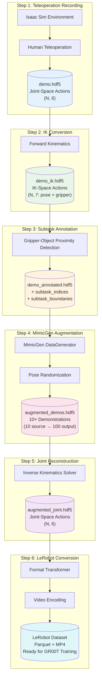
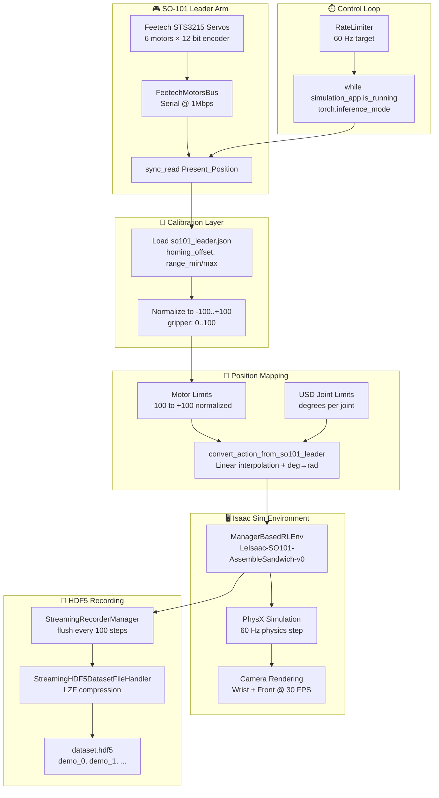
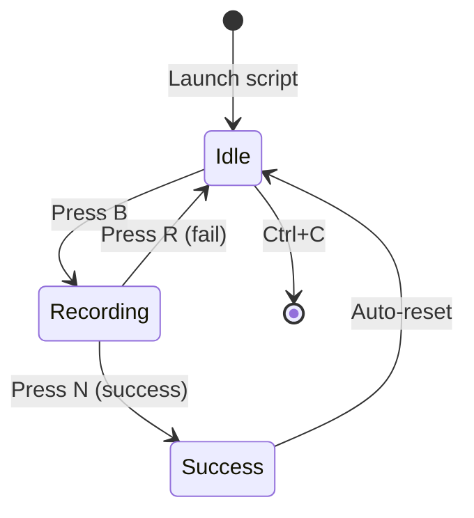
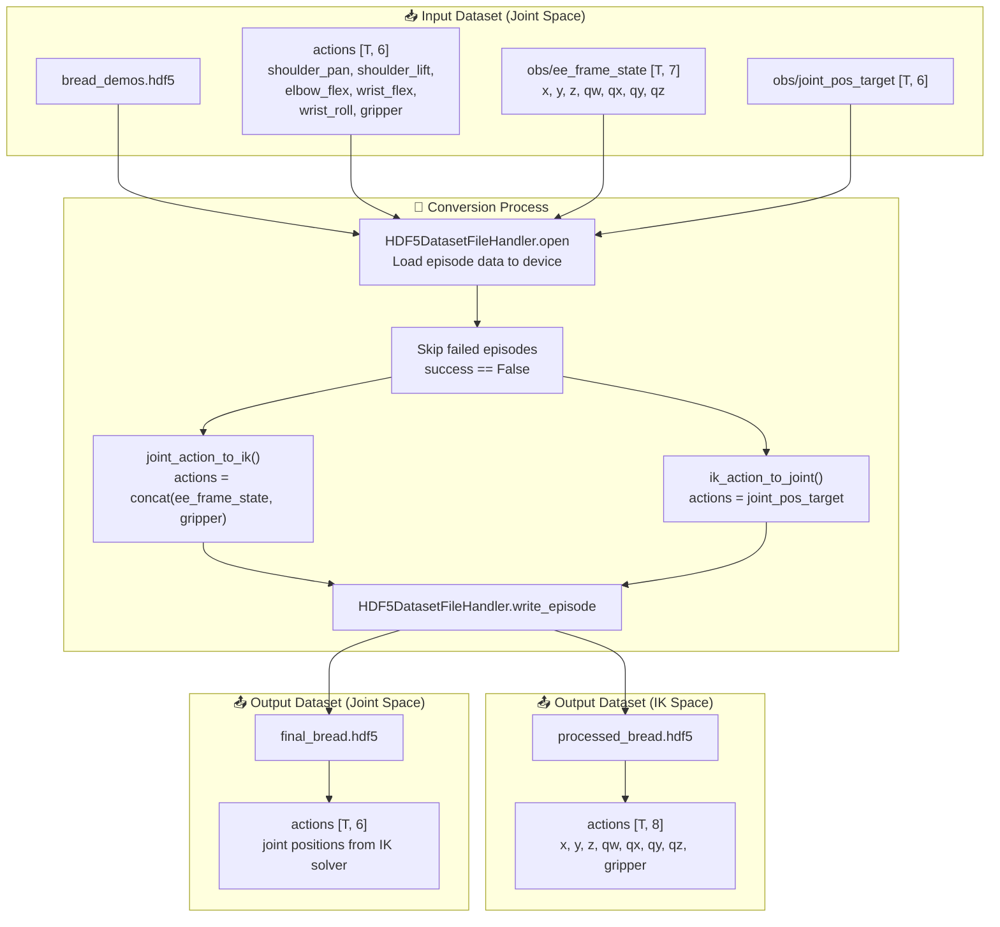
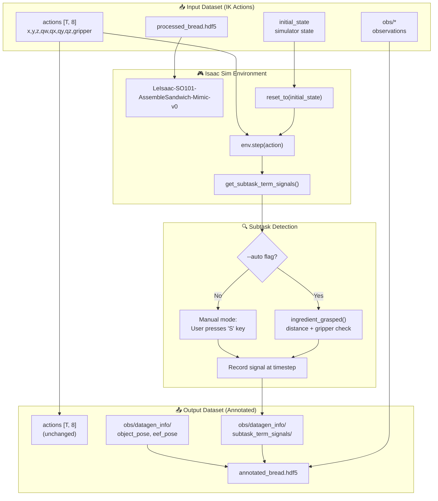
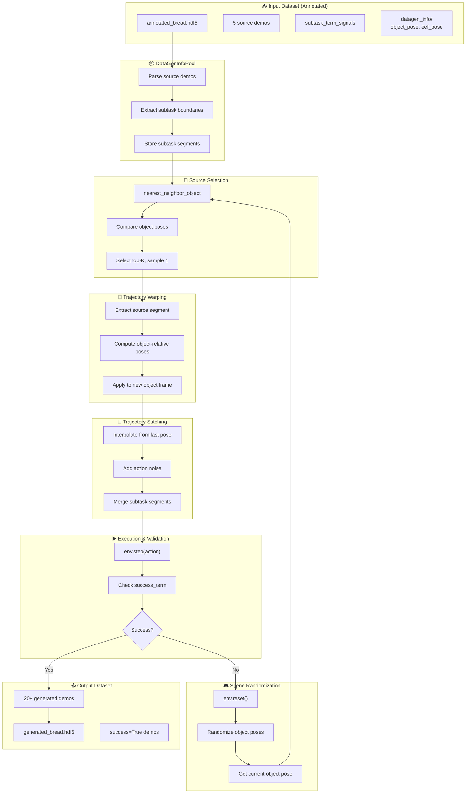
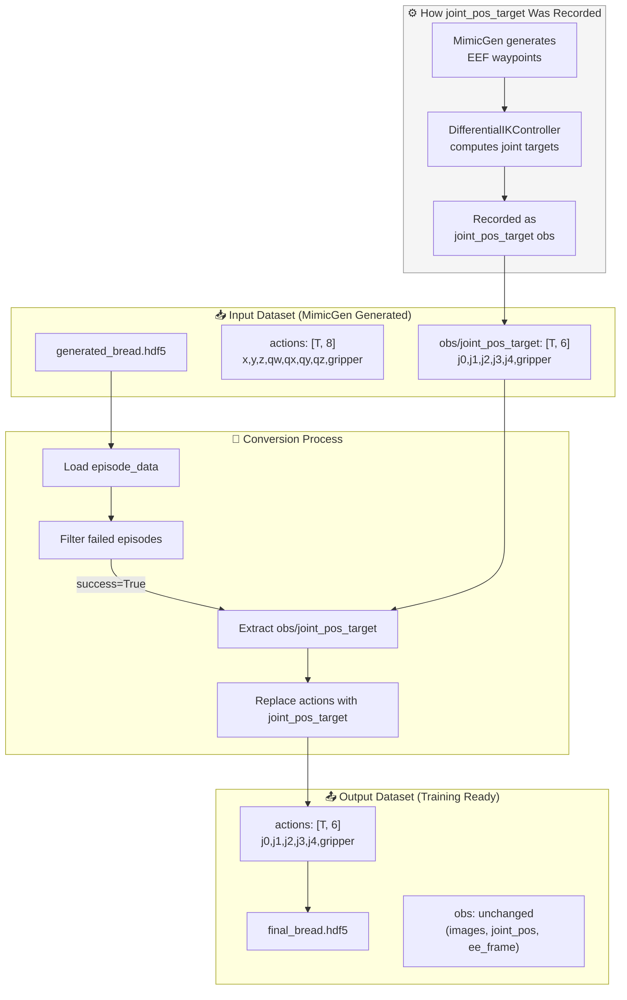
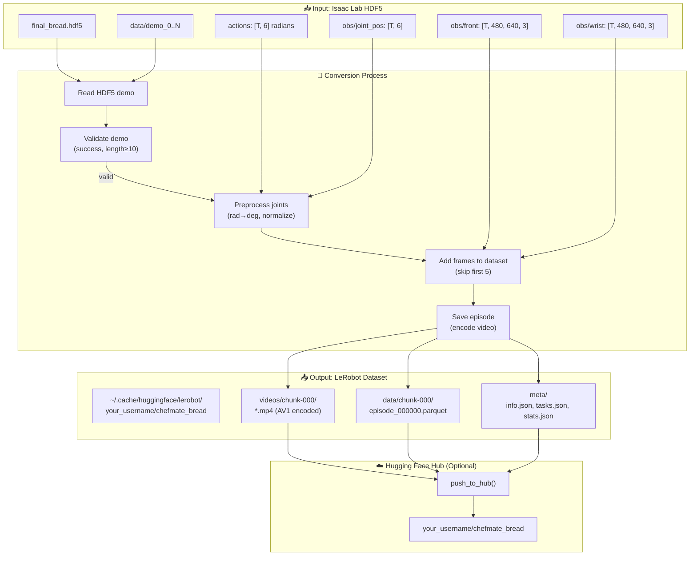

# Simulation & Data Pipeline

> **Navigation**: [← Fine-Tuning](fine-tuning.md) | [Main README](../README.md) | [Evaluation →](evaluation.md)

---

<a id="8-simulation--data-pipeline"></a>
## 8. Simulation & Data Pipeline

This section covers the complete real-to-sim and sim-to-real pipeline, MimicGen data augmentation, and automatic subtask detection.

<a id="usd-scene-design"></a>
### USD Scene Design

The simulation environment uses a simplified kitchen scene optimized for robotic manipulation training.


<!-- TODO: Add screenshot of USD scene in Isaac Sim -->

**Scene Hierarchy:**

```
/Root
├── Scene
│   └── table                    # Static: kinematicEnabled = true
├── bread_slice_1                # Dynamic: kinematicEnabled = false
├── bread_slice_2                # Dynamic
├── cheese_slice                 # Dynamic
├── patty                        # Dynamic
├── plate                        # Static
└── ingredients_holder           # Static
```

**Table Layout:**

```
┌─────────────────────────────────────────┐
│  [Ingredients Holder]     [🍽️]          │  ← Left: Holder, Right: Plate
│  ┌─┬─┬─┬─┐              Plate           │
│  │🍞│🍞│🥩│🧀│                            │  ← Slots: bread, bread, patty, cheese
│  └─┴─┴─┴─┘                              │
│                                          │
│        Assembly Area                     │
└─────────────────────────────────────────┘
```

**Physics Configuration:**

| Object Type | Physics APIs | `kinematicEnabled` | Behavior |
|-------------|--------------|---------------------|----------|
| **Dynamic** (ingredients) | `RigidBodyAPI`, `CollisionAPI`, `MassAPI` | `false` | Affected by gravity, graspable |
| **Static** (fixtures) | `RigidBodyAPI`, `CollisionAPI` | `true` | Fixed in place |

> **Critical Learning: Rigid Body Hierarchy Crisis**
>
> Manipulable objects must be direct children of `/Root`, NOT nested inside `Scene` or table. Nested rigid bodies cause physics engine errors.

**Incorrect Hierarchy (causes physics errors):**

```
/Root
└── Scene
    └── table
        └── bread_slice_1  ❌ Nested inside table - FAILS
```

**Correct Hierarchy (works properly):**

```
/Root
├── Scene
│   └── table              # Static fixture
└── bread_slice_1          ✅ Direct child of /Root - WORKS
```

**Why This Matters:**

When a rigid body is nested inside another rigid body, Isaac Sim's physics engine cannot properly simulate independent motion. The child object becomes "welded" to the parent, making grasping impossible. I discovered this after hours of debugging why the gripper could not pick up ingredients that were visually correct but physically attached to the table.

<a id="isaac-sim-environment"></a>
### Isaac Sim Environment

**Environment IDs:**

| Environment ID | Purpose | Action Space |
|----------------|---------|--------------|
| `LeIsaac-SO101-AssembleSandwich-v0` | Teleoperation, data collection | Joint (6D) |
| `LeIsaac-SO101-AssembleSandwich-Mimic-v0` | MimicGen generation | IK (8D) |

**Language Prompt Support:**

```python
# The generalized environment supports language prompt differentiation
"Grasp bread slice and place on plate"
"Grasp patty and place on plate"
"Grasp cheese slice and place on plate"
```

<a id="simulation-workflow-overview"></a>
### Workflow Overview

The simulation data pipeline transforms a small number of human teleoperation demonstrations into a large, augmented training dataset suitable for GR00T N1.5 fine-tuning. The 6-step pipeline achieves **10× data augmentation** via MimicGen, reducing the required human demonstrations by **80%**.

**Simulation Scripts Repository**: [github.com/mvipin/leisaac](https://github.com/mvipin/leisaac)

| Step | Script | Purpose | Architecture Component |
|------|--------|---------|----------------------|
| 1 | `record_demonstrations.py` | Record teleoperation demos in Isaac Sim | Generates source HDF5 with joint-space actions |
| 2 | `convert_joint_to_ik.py` | Convert joint actions to IK-space | Prepares pose-based actions for MimicGen |
| 3 | `annotate_subtasks.py` | Mark subtask boundaries via gripper proximity | Enables MimicGen segment-wise augmentation |
| 4 | `generate_augmented_demos.py` | Run MimicGen 10× data augmentation | Multiplies demonstrations with pose variations |
| 5 | `convert_ik_to_joint.py` | Convert IK-space back to joint actions | Reconstructs trainable joint-space trajectories |
| 6 | `convert_to_lerobot.py` | Convert Isaac Lab HDF5 to LeRobot format | Prepares inputs for Eagle VLM (video) + DiT (state/action) |



**Key Data Transformations:**

| Step | Input Format | Output Format | Key Transformation |
|------|--------------|---------------|-------------------|
| 1 → 2 | Joint positions `(N, 6)` | EE pose + gripper `(N, 7)` | Forward kinematics |
| 2 → 3 | Clean trajectories | Annotated trajectories | Subtask boundary detection |
| 3 → 4 | 10 source demos | 100 augmented demos | Pose randomization within workspace |
| 4 → 5 | EE pose + gripper `(N, 7)` | Joint positions `(N, 6)` | Inverse kinematics |
| 5 → 6 | Isaac Lab HDF5 | LeRobot Parquet + MP4 | Schema conversion + video encoding |

<a id="isaac-sim-teleoperation-recording"></a>
### Isaac Sim Teleoperation Recording

This section provides comprehensive documentation for collecting demonstration data using the SO-101 leader arm to control a simulated follower arm in Isaac Sim.

#### Teleoperation Script Command

The teleoperation script `teleop_se3_agent.py` enables real-time control of the simulated SO-101 follower arm using a physical SO-101 leader arm:

```bash
~/IsaacSim/_build/linux-x86_64/release/python.sh \
    scripts/environments/teleoperation/teleop_se3_agent.py \
    --task=LeIsaac-SO101-AssembleSandwich-v0 \
    --teleop_device=so101leader \
    --port=/dev/leader \
    --num_envs=1 \
    --device=cuda \
    --enable_cameras \
    --record \
    --step_hz=60 \
    --dataset_file=./datasets/bread_demos.hdf5
```

**Command-Line Arguments:**

| Argument | Type | Default | Description |
|----------|------|---------|-------------|
| `--task` | str | None | Isaac Lab environment ID (e.g., `LeIsaac-SO101-AssembleSandwich-v0`) |
| `--teleop_device` | str | `keyboard` | Teleoperation device: `keyboard`, `so101leader`, `bi-so101leader` |
| `--port` | str | `/dev/ttyACM0` | Serial port for SO-101 leader arm |
| `--left_arm_port` | str | `/dev/ttyACM0` | Left arm port for bi-manual setup |
| `--right_arm_port` | str | `/dev/ttyACM1` | Right arm port for bi-manual setup |
| `--num_envs` | int | 1 | Number of parallel environments |
| `--device` | str | `cuda` | Compute device (`cuda` or `cpu`) |
| `--enable_cameras` | flag | False | Enable camera rendering for observations |
| `--record` | flag | False | Enable HDF5 dataset recording |
| `--step_hz` | int | 60 | Control loop frequency in Hz |
| `--dataset_file` | str | `./datasets/dataset.hdf5` | Output HDF5 file path |
| `--resume` | flag | False | Resume recording to existing dataset |
| `--num_demos` | int | 0 | Target demo count (0 = infinite) |
| `--recalibrate` | flag | False | Force leader arm recalibration |
| `--quality` | flag | False | Enable high-quality rendering (FXAA) |
| `--seed` | int | None | Random seed (defaults to current timestamp) |

#### Teleoperation Configuration Deep Dive

**Task Configuration:**

The environment configuration is parsed and modified for teleoperation:

```python
env_cfg = parse_env_cfg(args_cli.task, device=args_cli.device, num_envs=args_cli.num_envs)
env_cfg.use_teleop_device(args_cli.teleop_device)  # Configure action space for device
env_cfg.seed = args_cli.seed if args_cli.seed is not None else int(time.time())

# Disable automatic termination for manual control
env_cfg.terminations.time_out = None
env_cfg.terminations.success = None
```

**Teleop Device Setup:**

```python
# Single-arm teleoperation
if args_cli.teleop_device == "so101leader":
    teleop_interface = SO101Leader(env, port=args_cli.port, recalibrate=args_cli.recalibrate)

# Bi-manual teleoperation
elif args_cli.teleop_device == "bi-so101leader":
    teleop_interface = BiSO101Leader(
        env,
        left_port=args_cli.left_arm_port,
        right_port=args_cli.right_arm_port,
        recalibrate=args_cli.recalibrate
    )
```

**Serial Port Mapping:**

Create persistent device symlinks for reliable port identification:

```bash
# Create udev rule for consistent port naming
sudo nano /etc/udev/rules.d/99-lerobot.rules

# Add rules based on USB device serial numbers
SUBSYSTEM=="tty", ATTRS{idVendor}=="1a86", ATTRS{idProduct}=="7523", \
    ATTRS{serial}=="LEADER_SERIAL", SYMLINK+="leader"
SUBSYSTEM=="tty", ATTRS{idVendor}=="1a86", ATTRS{idProduct}=="7523", \
    ATTRS{serial}=="FOLLOWER_SERIAL", SYMLINK+="follower"

# Reload udev rules
sudo udevadm control --reload-rules && sudo udevadm trigger
```

**Isaac Sim Environment Settings:**

```python
# High-quality rendering mode (optional)
if args_cli.quality:
    env_cfg.sim.render.antialiasing_mode = 'FXAA'
    env_cfg.sim.render.rendering_mode = 'quality'

# Recording configuration
if args_cli.record:
    env_cfg.recorders.dataset_export_mode = DatasetExportMode.EXPORT_ALL
    env_cfg.recorders.dataset_export_dir_path = output_dir
    env_cfg.recorders.dataset_filename = output_file_name
```

**Camera Rendering:**

Cameras are enabled with `--enable_cameras` flag. The dual-camera system captures:

| Camera | Resolution | FPS | Purpose |
|--------|------------|-----|---------|
| Wrist | 640×480 | 30 | Close-up manipulation view |
| Front | 640×480 | 30 | Workspace overview |

**Recording Mode:**

The `StreamingRecorderManager` replaces the default recorder for efficient HDF5 streaming:

```python
if args_cli.record:
    del env.recorder_manager
    env.recorder_manager = StreamingRecorderManager(env_cfg.recorders, env)
    env.recorder_manager.flush_steps = 100  # Flush every 100 steps
    env.recorder_manager.compression = 'lzf'  # Fast compression
```

#### Teleoperation Data Flow



#### Leader-Follower Mapping Process

**Motor Configuration:**

The SO-101 leader arm uses 6 Feetech STS3215 servos with different normalization modes:

```python
self._bus = FeetechMotorsBus(
    port=self.port,
    motors={
        "shoulder_pan": Motor(1, "sts3215", MotorNormMode.RANGE_M100_100),   # -100 to +100
        "shoulder_lift": Motor(2, "sts3215", MotorNormMode.RANGE_M100_100),
        "elbow_flex": Motor(3, "sts3215", MotorNormMode.RANGE_M100_100),
        "wrist_flex": Motor(4, "sts3215", MotorNormMode.RANGE_M100_100),
        "wrist_roll": Motor(5, "sts3215", MotorNormMode.RANGE_M100_100),
        "gripper": Motor(6, "sts3215", MotorNormMode.RANGE_0_100),           # 0 to 100
    },
    calibration=calibration,
)
```

**Joint Limits Mapping:**

| Joint | Motor Limits (normalized) | USD Limits (degrees) | Conversion |
|-------|---------------------------|----------------------|------------|
| shoulder_pan | -100 to +100 | -110° to +110° | Linear interpolation |
| shoulder_lift | -100 to +100 | -100° to +100° | Linear interpolation |
| elbow_flex | -100 to +100 | -100° to +90° | Linear interpolation |
| wrist_flex | -100 to +100 | -95° to +95° | Linear interpolation |
| wrist_roll | -100 to +100 | -160° to +160° | Linear interpolation |
| gripper | 0 to 100 | -10° to +100° | Linear interpolation |

**Position Conversion Algorithm:**

```python
def convert_action_from_so101_leader(joint_state, motor_limits, teleop_device):
    processed_action = torch.zeros(teleop_device.env.num_envs, 6, device=teleop_device.env.device)
    joint_limits = SO101_FOLLOWER_USD_JOINT_LIMLITS

    for joint_name, motor_id in joint_names_to_motor_ids.items():
        motor_limit_range = motor_limits[joint_name]      # e.g., (-100, 100)
        joint_limit_range = joint_limits[joint_name]      # e.g., (-110, 110) degrees

        # Linear interpolation from motor space to joint space
        processed_degree = (joint_state[joint_name] - motor_limit_range[0]) \
            / (motor_limit_range[1] - motor_limit_range[0]) \
            * (joint_limit_range[1] - joint_limit_range[0]) \
            + joint_limit_range[0]

        # Convert degrees to radians for physics simulation
        processed_radius = processed_degree / 180.0 * torch.pi
        processed_action[:, motor_id] = processed_radius

    return processed_action
```

**Calibration Process:**

The leader arm requires calibration to establish homing offsets and range limits:

```bash
# Run with --recalibrate flag to force recalibration
~/IsaacSim/_build/linux-x86_64/release/python.sh \
    scripts/environments/teleoperation/teleop_se3_agent.py \
    --task=LeIsaac-SO101-AssembleSandwich-v0 \
    --teleop_device=so101leader \
    --port=/dev/leader \
    --recalibrate
```

Calibration steps:
1. Move leader arm to middle of range of motion
2. Press ENTER to record homing offsets
3. Move each joint through full range of motion
4. Press ENTER to save calibration to `so101_leader.json`

**Calibration File Format:**

```json
{
    "shoulder_pan": {
        "id": 1,
        "drive_mode": 0,
        "homing_offset": 2048,
        "range_min": 1024,
        "range_max": 3072
    },
    "shoulder_lift": { ... },
    "elbow_flex": { ... },
    "wrist_flex": { ... },
    "wrist_roll": { ... },
    "gripper": { ... }
}
```

#### HDF5 Dataset Format

**Dataset Structure:**

```
dataset.hdf5
├── data/
│   ├── attrs: {total: N}
│   ├── demo_0/
│   │   ├── attrs: {num_samples: T, seed: S, success: true/false}
│   │   ├── actions              # [T, 6] joint positions (radians)
│   │   ├── states/
│   │   │   └── robot_joint_pos  # [T, 6] current joint positions
│   │   ├── obs/
│   │   │   ├── wrist            # [T, 480, 640, 3] RGB images
│   │   │   ├── front            # [T, 480, 640, 3] RGB images
│   │   │   └── joint_pos        # [T, 6] joint positions
│   │   └── initial_state/
│   │       └── robot_joint_pos  # [1, 6] initial joint positions
│   ├── demo_1/
│   │   └── ...
│   └── demo_N/
└── env_args: {env_name: "...", type: 2}
```

**Data Captured Per Timestep:**

| Data Type | Shape | Description |
|-----------|-------|-------------|
| `actions` | [6] | Target joint positions in radians |
| `obs/wrist` | [480, 640, 3] | Wrist camera RGB image (uint8) |
| `obs/front` | [480, 640, 3] | Front camera RGB image (uint8) |
| `obs/joint_pos` | [6] | Current joint positions (float32) |
| `states/robot_joint_pos` | [6] | Robot state joint positions |

**Compression Options:**

| Compression | Ratio | Latency | Use Case |
|-------------|-------|---------|----------|
| `lzf` | 30-50% | Low | **Recommended** for real-time recording |
| `gzip` | 50-80% | High | Post-processing, archival |
| `None` | 0% | Minimal | Maximum performance, large files |

**Streaming Write Mode:**

The `StreamingHDF5DatasetFileHandler` uses chunked writing for efficient real-time recording:

```python
# Chunk configuration
chunks_length = 100  # Flush every 100 timesteps
compression = 'lzf'  # Fast compression

# Dynamic dataset resizing
dataset = group.create_dataset(
    key,
    shape=data.shape,
    maxshape=(None, *data.shape[1:]),  # Unlimited first dimension
    chunks=(chunks_length, *data.shape[1:]),
    dtype=data.dtype,
    compression=compression,
)
```

#### RateLimiter Implementation

The control loop uses a `RateLimiter` class to maintain consistent timing while keeping the simulation responsive:

```python
class RateLimiter:
    def __init__(self, hz):
        self.hz = hz
        self.sleep_duration = 1.0 / hz
        self.render_period = min(0.0166, self.sleep_duration)  # ~60 FPS render

    def sleep(self, env):
        next_wakeup_time = self.last_time + self.sleep_duration
        while time.time() < next_wakeup_time:
            time.sleep(self.render_period)
            env.sim.render()  # Keep rendering during wait
        self.last_time = self.last_time + self.sleep_duration
```

#### Keyboard Controls During Teleoperation

| Key | Action | Description |
|-----|--------|-------------|
| `B` | Start control | Begin leader-follower synchronization |
| `R` | Reset (fail) | Reset environment, mark episode as failed |
| `N` | Reset (success) | Reset environment, mark episode as successful |
| `Ctrl+C` | Quit | Exit teleoperation and save dataset |

**Control State Machine:**



#### Troubleshooting and Best Practices

**Leader Arm Disconnection:**

```python
# Error: DeviceNotConnectedError
# Solution: Check USB connection and port permissions

# Verify port exists
ls -la /dev/ttyACM*

# Add user to dialout group
sudo usermod -a -G dialout $USER
# Log out and back in for changes to take effect
```

**Isaac Sim Crashes During Recording:**

Common causes and solutions:

| Issue | Cause | Solution |
|-------|-------|----------|
| OOM crash | Large dataset in memory | Use `flush_steps=100` |
| Physics explosion | Invalid joint positions | Check calibration |
| Render timeout | GPU overload | Reduce `--step_hz` |

**Dataset Integrity Verification:**

```python
import h5py

def verify_dataset(filepath):
    with h5py.File(filepath, 'r') as f:
        data = f['data']
        print(f"Total episodes: {len(data)}")
        print(f"Total samples: {data.attrs['total']}")

        for demo_name in data.keys():
            demo = data[demo_name]
            num_samples = demo.attrs['num_samples']
            success = demo.attrs.get('success', False)
            print(f"  {demo_name}: {num_samples} samples, success={success}")

            # Verify data shapes
            if 'actions' in demo:
                assert demo['actions'].shape[0] == num_samples
            if 'obs/wrist' in demo:
                assert demo['obs/wrist'].shape[0] == num_samples

verify_dataset('./datasets/bread_demos.hdf5')
```

**Resume Recording After Interruption:**

```bash
# Use --resume flag to continue recording to existing dataset
~/IsaacSim/_build/linux-x86_64/release/python.sh \
    scripts/environments/teleoperation/teleop_se3_agent.py \
    --task=LeIsaac-SO101-AssembleSandwich-v0 \
    --teleop_device=so101leader \
    --port=/dev/leader \
    --enable_cameras \
    --record \
    --resume \
    --dataset_file=./datasets/bread_demos.hdf5
```

The script validates the existing file and continues from the last recorded episode:

```python
if args_cli.resume:
    env_cfg.recorders.dataset_export_mode = EnhanceDatasetExportMode.EXPORT_ALL_RESUME
    assert os.path.exists(args_cli.dataset_file), "Dataset file must exist for resume"
else:
    env_cfg.recorders.dataset_export_mode = DatasetExportMode.EXPORT_ALL
    assert not os.path.exists(args_cli.dataset_file), "Dataset file must not exist"
```

**Tips for Smooth Teleoperation:**

1. **Workspace Setup:**
   - Position leader arm at comfortable height
   - Ensure clear line of sight to Isaac Sim display
   - Minimize cable tension on leader arm

2. **Motion Quality:**
   - Move slowly and deliberately (avoid jerky motions)
   - Pause briefly at grasp/release points
   - Complete full task before pressing N (success)

3. **Recording Strategy:**
   - Record 10-15 demonstrations per ingredient type
   - Vary starting positions slightly between demos
   - Discard failed attempts with R key immediately

4. **Performance Optimization:**
   - Use `--step_hz=30` for slower, more stable control
   - Disable `--quality` flag during data collection
   - Close unnecessary applications to free GPU memory

<a id="convert-to-ik-actions"></a>
### Convert to IK Actions

This section documents the conversion of joint-space teleoperation demonstrations to end-effector (IK) action space for MimicGen compatibility.

#### Why IK Conversion is Necessary

MimicGen requires end-effector (EEF) pose-based actions to perform trajectory generalization across different object positions. The teleoperation recording captures joint-space actions, which must be converted:

| Action Space | Dimensions | Description | Use Case |
|--------------|------------|-------------|----------|
| **Joint Space** | 6D | `[shoulder_pan, shoulder_lift, elbow_flex, wrist_flex, wrist_roll, gripper]` | Teleoperation, final deployment |
| **End-Effector (IK)** | 8D | `[x, y, z, qw, qx, qy, qz, gripper]` | MimicGen data augmentation |

**Why MimicGen needs EEF actions:**

1. **Trajectory Generalization**: MimicGen warps trajectories based on object pose differences, requiring Cartesian coordinates
2. **Object-Relative Motion**: End-effector poses can be expressed relative to target objects for pose-invariant learning
3. **Subtask Segmentation**: Grasp/release detection uses EEF-to-object distance thresholds
4. **Interpolation**: Smooth trajectory generation requires continuous pose representation

#### Script Command and Parameters

The `eef_action_process.py` script converts between joint-space and IK action representations:

```bash
~/IsaacSim/_build/linux-x86_64/release/python.sh \
    scripts/mimic/eef_action_process.py \
    --input_file=./datasets/bread_demos.hdf5 \
    --output_file=./datasets/processed_bread.hdf5 \
    --to_ik \
    --device=cuda \
    --headless
```

**Command-Line Arguments:**

| Argument | Type | Default | Description |
|----------|------|---------|-------------|
| `--input_file` | str | `./datasets/mimic-lift-cube-example.hdf5` | Input HDF5 dataset with joint-space actions |
| `--output_file` | str | `./datasets/processed_mimic-lift-cube-example.hdf5` | Output HDF5 dataset with converted actions |
| `--to_ik` | flag | False | Convert joint actions → IK actions (6D → 8D) |
| `--to_joint` | flag | False | Convert IK actions → joint actions (8D → 6D) |
| `--device` | str | `cuda` | Compute device (`cuda` or `cpu`) |
| `--headless` | flag | False | Run without GUI (recommended for batch processing) |

**Mutually Exclusive Flags:**

- `--to_ik` and `--to_joint` cannot be used together
- Exactly one must be specified

#### Conversion Process Deep Dive

**Joint-to-IK Conversion (`--to_ik`):**

The conversion uses pre-recorded end-effector state observations, not forward kinematics computation. During teleoperation, the environment records both joint actions AND the corresponding end-effector pose at each timestep.

**Implementation**: [`scripts/mimic/eef_action_process.py::joint_action_to_ik()`](https://github.com/mvipin/leisaac/blob/main/scripts/mimic/eef_action_process.py#L37-L46)

Key transformation: Concatenates `ee_frame_state` (7D pose) with gripper action → 8D IK action: `[x, y, z, qw, qx, qy, qz, gripper]`

**IK-to-Joint Conversion (`--to_joint`):**

After MimicGen generates new trajectories with IK actions, they must be converted back to joint space for robot execution:

**Implementation**: [`scripts/mimic/eef_action_process.py::ik_action_to_joint()`](https://github.com/mvipin/leisaac/blob/main/scripts/mimic/eef_action_process.py#L49-L56)

Key transformation: Extracts `joint_pos_target` observation (pre-computed by IK controller during MimicGen) as new 6D joint actions.

**End-Effector Frame Computation:**

The `ee_frame_state` observation is computed by the Isaac Lab `FrameTransformer` sensor during recording. The sensor transforms the gripper pose from world frame to robot base frame and outputs a 7D vector: `[x, y, z, qw, qx, qy, qz]`.

**FrameTransformer Configuration:**

```python
ee_frame: FrameTransformerCfg = FrameTransformerCfg(
    prim_path="{ENV_REGEX_NS}/Robot/base",
    debug_vis=False,
    target_frames=[
        FrameTransformerCfg.FrameCfg(
            prim_path="{ENV_REGEX_NS}/Robot/gripper",
            name="gripper"
        ),
    ]
)
```

#### Data Flow Diagram



#### HDF5 Format Transformation

**Input Format (Joint-Space Recording):**

```
bread_demos.hdf5
├── data/
│   ├── attrs: {total: N}
│   ├── demo_0/
│   │   ├── attrs: {num_samples: T, seed: S, success: true}
│   │   ├── actions              # [T, 6] joint positions (radians)
│   │   ├── obs/
│   │   │   ├── ee_frame_state   # [T, 7] x,y,z,qw,qx,qy,qz (preserved)
│   │   │   ├── joint_pos        # [T, 6] current joint positions
│   │   │   ├── joint_pos_target # [T, 6] target joint positions
│   │   │   ├── wrist            # [T, H, W, 3] wrist camera
│   │   │   └── front            # [T, H, W, 3] front camera
│   │   └── states/
│   │       └── robot_joint_pos  # [T, 6] robot joint state
```

**Output Format (IK-Space for MimicGen):**

```
processed_bread.hdf5
├── data/
│   ├── attrs: {total: N}
│   ├── demo_0/
│   │   ├── attrs: {num_samples: T, seed: S, success: true}
│   │   ├── actions              # [T, 8] x,y,z,qw,qx,qy,qz,gripper ← CHANGED
│   │   ├── obs/
│   │   │   ├── ee_frame_state   # [T, 7] unchanged (preserved)
│   │   │   ├── joint_pos        # [T, 6] unchanged
│   │   │   ├── joint_pos_target # [T, 6] unchanged
│   │   │   ├── wrist            # [T, H, W, 3] unchanged
│   │   │   └── front            # [T, H, W, 3] unchanged
│   │   └── states/              # unchanged
```

**Data Transformation Summary:**

| Data Field | Input Shape | Output Shape | Transformation |
|------------|-------------|--------------|----------------|
| `actions` | [T, 6] | [T, 8] | Joint → EEF pose + gripper |
| `obs/ee_frame_state` | [T, 7] | [T, 7] | Preserved (source for actions) |
| `obs/joint_pos_target` | [T, 6] | [T, 6] | Preserved (used for reverse conversion) |
| `obs/wrist`, `obs/front` | [T, H, W, 3] | [T, H, W, 3] | Preserved |
| Episode metadata | - | - | Preserved (seed, success) |

**Action Space Details:**

| Index | Joint-Space (6D) | IK-Space (8D) |
|-------|------------------|---------------|
| 0 | shoulder_pan (rad) | x position (m) |
| 1 | shoulder_lift (rad) | y position (m) |
| 2 | elbow_flex (rad) | z position (m) |
| 3 | wrist_flex (rad) | qw (quaternion w) |
| 4 | wrist_roll (rad) | qx (quaternion x) |
| 5 | gripper (rad) | qy (quaternion y) |
| 6 | - | qz (quaternion z) |
| 7 | - | gripper (rad) |

#### Isaac Sim Initialization

The script requires Isaac Sim to be launched (AppLauncher) even though no simulation is performed. This is because:
1. Torch tensor operations use Isaac Sim's CUDA context
2. HDF5 file handler is part of Isaac Lab utilities
3. Episode data structures depend on Isaac Lab classes

#### Troubleshooting and Best Practices

**Common Errors:**

| Error | Cause | Solution |
|-------|-------|----------|
| `KeyError: 'ee_frame_state'` | Missing EEF observation in recording | Re-record with `ee_frame_state` observation enabled |
| `KeyError: 'joint_pos_target'` | Missing joint target observation | Re-record with `joint_pos_target` observation enabled |
| `FileNotFoundError` | Input file doesn't exist | Verify `--input_file` path |
| `FileExistsError` | Output file already exists | Remove existing file or use different name |
| `Cannot convert to both` | Both `--to_ik` and `--to_joint` specified | Use only one conversion flag |

**Verify Observation Availability:**

Before conversion, verify the required observations exist in the dataset:

```python
import h5py

def check_dataset_observations(filepath):
    with h5py.File(filepath, 'r') as f:
        demo = f['data/demo_0']
        print("Available observations:")
        for key in demo['obs'].keys():
            shape = demo['obs'][key].shape
            print(f"  obs/{key}: {shape}")

        # Check required keys for --to_ik
        if 'ee_frame_state' in demo['obs']:
            print("✅ ee_frame_state available for --to_ik")
        else:
            print("❌ ee_frame_state MISSING - cannot use --to_ik")

        # Check required keys for --to_joint
        if 'joint_pos_target' in demo['obs']:
            print("✅ joint_pos_target available for --to_joint")
        else:
            print("❌ joint_pos_target MISSING - cannot use --to_joint")

check_dataset_observations('./datasets/bread_demos.hdf5')
```

**Dataset Validation After Conversion:**

```python
import h5py
import numpy as np

def validate_ik_conversion(input_file, output_file):
    with h5py.File(input_file, 'r') as f_in, h5py.File(output_file, 'r') as f_out:
        for demo_name in f_in['data'].keys():
            # Check action dimensions
            in_actions = f_in[f'data/{demo_name}/actions'][:]
            out_actions = f_out[f'data/{demo_name}/actions'][:]

            assert in_actions.shape[0] == out_actions.shape[0], "Timestep mismatch"
            assert in_actions.shape[1] == 6, f"Input should be 6D, got {in_actions.shape[1]}"
            assert out_actions.shape[1] == 8, f"Output should be 8D, got {out_actions.shape[1]}"

            # Verify gripper is preserved
            gripper_in = in_actions[:, -1]
            gripper_out = out_actions[:, -1]
            assert np.allclose(gripper_in, gripper_out), "Gripper mismatch"

            # Verify EEF state matches
            eef_state = f_in[f'data/{demo_name}/obs/ee_frame_state'][:]
            eef_in_output = out_actions[:, :7]
            assert np.allclose(eef_state, eef_in_output), "EEF state mismatch"

            print(f"✅ {demo_name}: validated successfully")

validate_ik_conversion('./datasets/bread_demos.hdf5', './datasets/processed_bread.hdf5')
```

**Batch Processing Script:**

```bash
#!/bin/bash
# batch_convert_ik.sh - Convert multiple datasets to IK space

PYTHON="~/IsaacSim/_build/linux-x86_64/release/python.sh"
SCRIPT="scripts/mimic/eef_action_process.py"

for ingredient in bread patty cheese; do
    echo "Converting ${ingredient} demos to IK..."
    $PYTHON $SCRIPT \
        --input_file=./datasets/${ingredient}_demos.hdf5 \
        --output_file=./datasets/processed_${ingredient}.hdf5 \
        --to_ik \
        --device=cuda \
        --headless

    if [ $? -eq 0 ]; then
        echo "✅ ${ingredient} conversion successful"
    else
        echo "❌ ${ingredient} conversion failed"
        exit 1
    fi
done

echo "All conversions complete!"
```

**Tips for Efficient Processing:**

1. **Use Headless Mode:**
   ```bash
   --headless  # Faster startup, lower memory
   ```

2. **GPU Acceleration:**
   ```bash
   --device=cuda  # Faster tensor operations
   ```

3. **Verify Before Large Batches:**
   - Test conversion on a single demo first
   - Validate output structure matches expectations

4. **Failed Episode Filtering:**
   - The script automatically skips episodes with `success=False`
   - Only successful demonstrations are included in output

5. **Disk Space Considerations:**
   - Output file size ≈ input file size (observations preserved)
   - Actions increase from 6D to 8D (minimal size impact)
   - Use separate directories for input/output to avoid confusion

<a id="annotate-demonstrations"></a>
### Annotate Demonstrations with Subtasks

This section documents the annotation of demonstrations with subtask boundaries for MimicGen data augmentation.

#### Why Subtask Annotation is Necessary

MimicGen requires demonstrations to be segmented into subtasks for trajectory generalization. Subtask boundaries define where one manipulation phase ends and another begins, enabling:

| Concept | Description | Example |
|---------|-------------|---------|
| **Subtask** | A contiguous trajectory segment achieving a single manipulation objective | "Grasp bread", "Place on plate" |
| **Subtask Boundary** | The timestep where one subtask ends and another begins | Grasp completes at timestep 45 |
| **Termination Signal** | Binary flag (0→1) indicating subtask completion | `grasp_ingredient` signal |
| **Object Reference** | The object used as spatial reference for trajectory warping | `bread_slice_1`, `plate` |

**Why MimicGen needs subtask segmentation:**

1. **Trajectory Warping**: MimicGen warps each subtask segment independently based on new object positions
2. **Segment Selection**: The `nearest_neighbor_object` strategy selects source segments based on object proximity
3. **Interpolation**: Smooth transitions between subtask segments require known boundary points
4. **Generalization**: Object-centric subtasks transfer better to new object configurations

#### Script Command and Parameters

The `annotate_demos.py` script adds subtask annotations to IK-converted demonstrations:

```bash
~/IsaacSim/_build/linux-x86_64/release/python.sh \
    scripts/mimic/annotate_demos.py \
    --task=LeIsaac-SO101-AssembleSandwich-Mimic-v0 \
    --input_file=./datasets/processed_bread.hdf5 \
    --output_file=./datasets/annotated_bread.hdf5 \
    --device=cuda \
    --enable_cameras \
    --auto
```

**Command-Line Arguments:**

| Argument | Type | Default | Description |
|----------|------|---------|-------------|
| `--task` | str | None | Task environment name (must implement MimicEnv API) |
| `--input_file` | str | `./datasets/dataset.hdf5` | Input HDF5 dataset with IK actions |
| `--output_file` | str | `./datasets/dataset_annotated.hdf5` | Output HDF5 dataset with subtask annotations |
| `--task_type` | str | None | Task type (`keyboard` for teleoperated demos) |
| `--auto` | flag | False | Enable automatic subtask detection |
| `--force_completion` | flag | False | Accept incomplete demos (testing mode) |
| `--enable_pinocchio` | flag | False | Enable Pinocchio IK solver |
| `--device` | str | `cuda` | Compute device (`cuda` or `cpu`) |
| `--enable_cameras` | flag | False | Enable camera rendering during replay |
| `--headless` | flag | False | Run without GUI (batch processing) |

**Automatic vs Manual Mode:**

| Mode | Flag | Behavior | Use Case |
|------|------|----------|----------|
| **Automatic** | `--auto` | Detects subtask boundaries using environment signals | High-quality demos with clear grasp events |
| **Manual** | (no `--auto`) | User presses 'S' key at subtask boundaries | Ambiguous demos, custom segmentation |

#### Subtask Detection Process Deep Dive

**Automatic Detection (`--auto`):**

The automatic detection replays each episode in the Isaac Sim environment and queries the `get_subtask_term_signals()` method at each timestep. This method retrieves subtask termination signals from the environment's observation buffer.

**Grasp Detection Algorithm (`ingredient_grasped`):**

**Implementation**: [`leisaac/tasks/assemble_sandwich/mdp/observations.py::ingredient_grasped()`](https://github.com/mvipin/leisaac/blob/main/source/leisaac/leisaac/tasks/assemble_sandwich/mdp/observations.py#L8-L70)

The AssembleSandwich task uses dual-criteria grasp detection:
- **Distance check**: EEF-to-ingredient distance < 5cm (`diff_threshold=0.05`)
- **Gripper check**: Gripper position < 0.60 (`grasp_threshold=0.60`)

The function iterates through all ingredients (`bread_slice_1`, `bread_slice_2`, `patty`, `cheese_slice`) and returns `True` if any is grasped.

**Detection Parameters:**

| Parameter | Value | Description |
|-----------|-------|-------------|
| `diff_threshold` | 0.05m (5cm) | Maximum EEF-to-object distance for grasp |
| `grasp_threshold` | 0.60 | Gripper joint position threshold (closed < 0.60) |
| `ee_frame_idx` | 1 | Index of "jaw" frame in FrameTransformer |

**Subtask Signal Storage:**

During replay, the `PreStepSubtaskTermsObservationsRecorder` captures subtask signals at each timestep and stores them under `obs/datagen_info/subtask_term_signals/`.

**Signal Format:**

For each subtask signal, a boolean tensor is created:
- `False` (0) until subtask completes
- `True` (1) after subtask completes

```python
# Example: grasp_ingredient signal for 100 timesteps, grasp at t=45
# [0, 0, 0, ..., 0, 1, 1, 1, ..., 1]
#  t=0           t=44 t=45        t=99
```

#### Data Flow Diagram



#### HDF5 Format Transformation

**Input Format (IK Actions, no annotations):**

```
processed_bread.hdf5
├── data/
│   ├── attrs: {total: N, env_args: {...}}
│   ├── demo_0/
│   │   ├── attrs: {num_samples: T, seed: S, success: true}
│   │   ├── actions              # [T, 8] IK actions
│   │   ├── initial_state/       # Initial simulator state
│   │   ├── obs/
│   │   │   ├── ee_frame_state   # [T, 7]
│   │   │   ├── joint_pos        # [T, 6]
│   │   │   ├── wrist            # [T, H, W, 3]
│   │   │   └── front            # [T, H, W, 3]
│   │   └── states/              # Per-timestep states
```

**Output Format (Annotated with subtask signals):**

```
annotated_bread.hdf5
├── data/
│   ├── attrs: {total: N, env_args: {...}}
│   ├── demo_0/
│   │   ├── attrs: {num_samples: T, seed: S, success: true}
│   │   ├── actions              # [T, 8] unchanged
│   │   ├── initial_state/       # unchanged
│   │   ├── obs/
│   │   │   ├── ee_frame_state   # [T, 7] unchanged
│   │   │   ├── joint_pos        # [T, 6] unchanged
│   │   │   ├── wrist            # [T, H, W, 3] unchanged
│   │   │   ├── front            # [T, H, W, 3] unchanged
│   │   │   └── datagen_info/    # ← NEW: MimicGen metadata
│   │   │       ├── object_pose/ # Object poses per timestep
│   │   │       │   ├── bread_slice_1  # [T, 4, 4] pose matrices
│   │   │       │   └── plate          # [T, 4, 4] pose matrices
│   │   │       ├── eef_pose/    # End-effector poses
│   │   │       │   └── eef      # [T, 4, 4] pose matrices
│   │   │       ├── target_eef_pose/   # Target EEF poses
│   │   │       │   └── eef      # [T, 4, 4] pose matrices
│   │   │       └── subtask_term_signals/  # ← Subtask boundaries
│   │   │           └── grasp_ingredient   # [T] bool: 0→1 at grasp
│   │   └── states/              # unchanged
```

**Subtask Signal Structure:**

| Signal Name | Shape | Type | Description |
|-------------|-------|------|-------------|
| `grasp_ingredient` | [T] | bool | True after ingredient is grasped |

**Signal Value Timeline:**

```
Timestep:     0    10    20    30    40    50    60    70    80
Action:      reach→approach→close→lift→move→lower→open→retract
Signal:       0     0     0     0     1     1     1     1     1
                                     ↑ Grasp detected at t=40
```

#### SubTaskConfig Parameters

The task configuration defines how subtasks are used during MimicGen data generation:

```python
@configclass
class AssembleSandwichMimicEnvCfg(MimicEnvCfg):
    def __post_init__(self):
        subtask_configs = []

        # Subtask 1: Grasp ingredient
        subtask_configs.append(
            SubTaskConfig(
                object_ref="bread_slice_1",       # Object for trajectory warping
                subtask_term_signal="grasp_ingredient",  # Signal name
                subtask_term_offset_range=(10, 20),  # Random offset range
                selection_strategy="nearest_neighbor_object",
                selection_strategy_kwargs={"nn_k": 5},
                action_noise=0.002,
                num_interpolation_steps=8,
                description="Grasp bread slice from cartridge",
            )
        )

        # Subtask 2: Place on plate (final subtask)
        subtask_configs.append(
            SubTaskConfig(
                object_ref="plate",
                subtask_term_signal=None,  # Final subtask: no signal
                subtask_term_offset_range=(0, 0),  # Required: (0,0) for final
                selection_strategy="nearest_neighbor_object",
                selection_strategy_kwargs={"nn_k": 5},
                action_noise=0.002,
                num_interpolation_steps=8,
                description="Place bread slice on plate",
            )
        )

        self.subtask_configs = {"eef": subtask_configs}
```

**SubTaskConfig Parameters:**

| Parameter | Type | Default | Description |
|-----------|------|---------|-------------|
| `object_ref` | str | None | Object name for spatial reference |
| `subtask_term_signal` | str | None | Signal name (None for final subtask) |
| `subtask_term_offset_range` | tuple | (0, 0) | Random offset added to boundary |
| `selection_strategy` | str | `"random"` | How to select source segments |
| `selection_strategy_kwargs` | dict | {} | Additional strategy parameters |
| `action_noise` | float | 0.03 | Noise amplitude for augmentation |
| `num_interpolation_steps` | int | 5 | Steps for inter-subtask transitions |
| `num_fixed_steps` | int | 0 | Fixed steps before segment |
| `apply_noise_during_interpolation` | bool | False | Apply noise in transitions |
| `description` | str | "" | Human-readable description |

**Selection Strategies:**

| Strategy | Description | Use Case |
|----------|-------------|----------|
| `random` | Random source segment selection | General purpose |
| `nearest_neighbor_object` | Select based on object pose similarity | Object manipulation |
| `nearest_neighbor_robot_distance` | Select based on robot pose similarity | Robot-centric tasks |

#### Manual Annotation Workflow

When `--auto` is not used, the script enters manual annotation mode:

**Keyboard Controls:**

| Key | Action |
|-----|--------|
| `N` | Start/resume episode playback |
| `B` | Pause playback |
| `S` | Mark subtask boundary at current timestep |
| `Q` | Skip current episode |

**Manual Workflow:**

1. Script displays expected subtask signals for each end-effector
2. Episode begins playing (paused initially, press `N` to start)
3. Watch the visualization and press `S` when subtask completes
4. Script validates that all expected signals were marked
5. If incorrect count, episode replays for re-marking

```
Annotating episode #0 (demo_0)
    Playing the episode for subtask annotations for eef "eef".
    Subtask signals to annotate:
        - Termination:	['grasp_ingredient']

    Press "N" to begin.
    Press "B" to pause.
    Press "S" to annotate subtask signals.
    Press "Q" to skip the episode.

Marked a subtask signal at action index: 47
    Subtasks marked at action indices: [47]
    All 1 subtask signals for eef "eef" were annotated.
    Exported the annotated episode.
```

#### Troubleshooting and Best Practices

**Common Errors:**

| Error | Cause | Solution |
|-------|-------|----------|
| `NotImplementedError: get_subtask_term_signals` | Task doesn't implement MimicEnv API | Use manual mode or implement `get_subtask_term_signals()` |
| `Did not detect completion for subtask "grasp_ingredient"` | Grasp thresholds too strict | Adjust `diff_threshold` or `grasp_threshold` in config |
| `The final task was not completed.` | Episode doesn't satisfy success criteria | Use `--force_completion` for testing |
| `No episodes found in the dataset.` | Empty or invalid input file | Verify input file contains demos |

**Verify Annotation Quality:**

```python
import h5py
import numpy as np

def verify_annotations(filepath):
    """Verify subtask annotations in dataset."""
    with h5py.File(filepath, 'r') as f:
        for demo_name in f['data'].keys():
            demo = f[f'data/{demo_name}']

            # Check datagen_info exists
            if 'obs/datagen_info' not in demo:
                print(f"❌ {demo_name}: Missing datagen_info")
                continue

            # Check subtask_term_signals
            if 'obs/datagen_info/subtask_term_signals' not in demo:
                print(f"❌ {demo_name}: Missing subtask_term_signals")
                continue

            signals = demo['obs/datagen_info/subtask_term_signals']
            for signal_name in signals.keys():
                signal = signals[signal_name][:]

                # Find boundary index (first True)
                boundary_indices = np.where(signal)[0]
                if len(boundary_indices) == 0:
                    print(f"❌ {demo_name}/{signal_name}: Never triggered")
                else:
                    boundary_idx = boundary_indices[0]
                    total_steps = len(signal)
                    print(f"✅ {demo_name}/{signal_name}: boundary at {boundary_idx}/{total_steps}")

verify_annotations('./datasets/annotated_bread.hdf5')
```

**Visualize Subtask Boundaries:**

```python
import h5py
import matplotlib.pyplot as plt
import numpy as np

def plot_subtask_timeline(filepath, demo_name="demo_0"):
    """Visualize subtask signals over time."""
    with h5py.File(filepath, 'r') as f:
        demo = f[f'data/{demo_name}']
        signals = demo['obs/datagen_info/subtask_term_signals']

        fig, axes = plt.subplots(len(signals), 1, figsize=(12, 2*len(signals)))
        if len(signals) == 1:
            axes = [axes]

        for ax, signal_name in zip(axes, signals.keys()):
            signal = signals[signal_name][:].astype(float)
            ax.fill_between(range(len(signal)), signal, alpha=0.3)
            ax.plot(signal, linewidth=2)
            ax.set_ylabel(signal_name)
            ax.set_ylim(-0.1, 1.1)

            # Mark boundary
            boundary = np.where(signal)[0]
            if len(boundary) > 0:
                ax.axvline(boundary[0], color='red', linestyle='--', label=f'Boundary: {boundary[0]}')
                ax.legend()

        axes[-1].set_xlabel('Timestep')
        plt.suptitle(f'Subtask Signals: {demo_name}')
        plt.tight_layout()
        plt.savefig('subtask_timeline.png')
        print("Saved: subtask_timeline.png")

plot_subtask_timeline('./datasets/annotated_bread.hdf5')
```

**Tips for Improving Automatic Detection:**

1. **Tune Detection Thresholds:**
   ```python
   # In assemble_sandwich_mimic_env_cfg.py
   grasp_ingredient = ObsTerm(
       func=mdp.ingredient_grasped,
       params={
           "diff_threshold": 0.08,   # Increase for looser detection (8cm)
           "grasp_threshold": 0.70,  # Increase for earlier trigger
       },
   )
   ```

2. **Use Force Completion for Testing:**
   ```bash
   --force_completion  # Accept incomplete demos for pipeline testing
   ```

3. **Handle Edge Cases:**
   - Failed grasps: Use `--force_completion` or manual mode
   - Multiple grasps: Only first grasp is detected
   - Ambiguous boundaries: Use manual mode for precise control

4. **Batch Processing Script:**

```bash
#!/bin/bash
# batch_annotate.sh - Annotate multiple datasets

PYTHON="~/IsaacSim/_build/linux-x86_64/release/python.sh"
SCRIPT="scripts/mimic/annotate_demos.py"
TASK="LeIsaac-SO101-AssembleSandwich-Mimic-v0"

for ingredient in bread patty cheese; do
    echo "Annotating ${ingredient} demos..."
    $PYTHON $SCRIPT \
        --task=$TASK \
        --input_file=./datasets/processed_${ingredient}.hdf5 \
        --output_file=./datasets/annotated_${ingredient}.hdf5 \
        --device=cuda \
        --enable_cameras \
        --auto \
        --headless

    if [ $? -eq 0 ]; then
        echo "✅ ${ingredient} annotation successful"
    else
        echo "❌ ${ingredient} annotation failed"
    fi
done

echo "All annotations complete!"
```

<a id="generate-augmented-demonstrations"></a>
### Generate Augmented Demonstrations with MimicGen

This section documents the MimicGen data augmentation pipeline that generates new demonstrations from annotated source demonstrations.

#### Why MimicGen Data Augmentation is Necessary

MimicGen enables 10x data augmentation from a small set of human demonstrations, dramatically reducing the number of required teleoperated demonstrations:

| Approach | Required Human Demos | Generated Demos | Total Training Data |
|----------|---------------------|-----------------|---------------------|
| Direct Training | 50+ | 0 | 50+ |
| MimicGen 10x | 5 | 50 | 55 |
| **Reduction** | **90%** | - | - |

**What MimicGen Does:**

1. **Trajectory Warping**: Transforms source EEF poses relative to new object positions
2. **Segment Recombination**: Combines subtask segments from different source demos
3. **Interpolation**: Smoothly connects subtask segments with linear interpolation
4. **Noise Injection**: Adds action noise for trajectory diversity

**Key Concepts:**

| Concept | Description |
|---------|-------------|
| **Source Demonstration** | Human-collected demo with subtask annotations (5-10 demos) |
| **Generated Demonstration** | Automatically created demo via trajectory warping (50+ demos) |
| **Object-Centric Warping** | Transforms EEF trajectory to new object pose while preserving relative motion |
| **Subtask Segment** | Portion of demo between subtask boundaries (e.g., approach→grasp) |
| **Selection Strategy** | Algorithm for choosing source segments (random, nearest_neighbor) |

#### Script Command and Parameters

The `generate_dataset.py` script generates augmented demonstrations from annotated source data:

```bash
~/IsaacSim/_build/linux-x86_64/release/python.sh \
    scripts/mimic/generate_dataset.py \
    --task=LeIsaac-SO101-AssembleSandwich-Mimic-v0 \
    --input_file=./datasets/annotated_bread.hdf5 \
    --output_file=./datasets/generated_bread.hdf5 \
    --ingredient_type=bread_slice_1 \
    --generation_num_trials=20 \
    --num_envs=1 \
    --device=cuda \
    --enable_cameras
```

**Command-Line Arguments:**

| Argument | Type | Default | Description |
|----------|------|---------|-------------|
| `--task` | str | None | Task environment name (must implement MimicEnv API) |
| `--input_file` | str | Required | Input HDF5 dataset with subtask annotations |
| `--output_file` | str | `./datasets/output_dataset.hdf5` | Output HDF5 dataset for generated demos |
| `--ingredient_type` | str | None | Object reference for subtask config (`bread_slice_1`, `bread_slice_2`, `cheese_slice`, `patty`) |
| `--generation_num_trials` | int | 10 | Number of demos to generate |
| `--num_envs` | int | 1 | Parallel environments for generation |
| `--task_type` | str | None | Set to `keyboard` for teleoperated demos |
| `--pause_subtask` | flag | False | Pause after each subtask (debugging) |
| `--enable_pinocchio` | flag | False | Enable Pinocchio IK solver |
| `--device` | str | `cuda` | Compute device (`cuda` or `cpu`) |
| `--enable_cameras` | flag | False | Enable camera rendering |
| `--headless` | flag | False | Run without GUI |

**Ingredient Type Mapping:**

| `--ingredient_type` | Object Reference | Description |
|---------------------|------------------|-------------|
| `bread_slice_1` | `bread_slice_1` | Bottom bread slice |
| `bread_slice_2` | `bread_slice_2` | Top bread slice |
| `cheese_slice` | `cheese_slice` | Cheese layer |
| `patty` | `patty` | Burger patty |

#### MimicGen Generation Process Deep Dive

**1. Source Demonstration Selection (`nearest_neighbor_object`):**

The `NearestNeighborObjectStrategy` selects source segments based on object pose similarity. It computes weighted distances (position + rotation) between source object poses and the current scene, then samples from the top-K nearest neighbors.

**Selection Strategies Comparison:**

| Strategy | Criteria | Best For | Parameters |
|----------|----------|----------|------------|
| `random` | Uniform random | Simple tasks, diverse objects | None |
| `nearest_neighbor_object` | Object pose similarity | Pick-and-place, object manipulation | `pos_weight`, `rot_weight`, `nn_k` |
| `nearest_neighbor_robot_distance` | EEF travel distance | Minimize motion, sequential tasks | `pos_weight`, `rot_weight`, `nn_k` |

**2. Subtask Segment Extraction:**

For each selected source demonstration, the system extracts:
- EEF poses `[T, 4, 4]` within subtask boundaries
- Target EEF poses `[T, 4, 4]` (IK controller targets)
- Gripper actions `[T]`

**3. Object-Centric Trajectory Warping:**

The warping preserves the relative pose between EEF and object:
1. Convert source EEF poses to object-relative frame
2. Apply relative poses to new object frame in world coordinates

**Warping Visualization:**

```
Source Demo (Object at A):          Generated Demo (Object at B):
    EEF trajectory                      Warped EEF trajectory
         ↓                                     ↓
    ┌─────────┐                          ┌─────────┐
    │  ──→──  │ Object A                 │  ──→──  │ Object B
    │   ↓     │                          │   ↓     │
    │  grasp  │                          │  grasp  │
    └─────────┘                          └─────────┘

    Relative motion preserved: EEF-to-Object distance same
```

**4. Subtask Interpolation:**

Smooth transitions between subtask segments using linear interpolation. Parameters:
- `num_interpolation_steps`: Steps for transition (default: 5-8)
- `num_fixed_steps`: Pause duration at boundaries (default: 0)
- `action_noise`: Applied during interpolation if enabled

**5. Action Noise Injection:**

```python
# WaypointSequence adds noise during construction
transformed_seq = WaypointSequence.from_poses(
    poses=transformed_eef_poses,
    gripper_actions=src_subtask_gripper_actions,
    action_noise=subtask_configs[subtask_ind].action_noise,  # Default: 0.002-0.03
)
```

**Noise Parameters:**

| Parameter | Range | Effect |
|-----------|-------|--------|
| `action_noise` | 0.001-0.05 | Position noise amplitude (meters) |
| Low noise (0.002) | Conservative | Higher success, less diversity |
| High noise (0.03) | Aggressive | Lower success, more diversity |

#### Data Flow Diagram



#### HDF5 Format Transformation

**Input Format (Annotated Source Demos):**

```
annotated_bread.hdf5
├── data/
│   ├── attrs: {total: 5, env_args: {...}}  # 5 source demos
│   ├── demo_0/
│   │   ├── attrs: {num_samples: 120, seed: 1, success: true}
│   │   ├── actions              # [120, 8] IK actions
│   │   ├── obs/
│   │   │   ├── ee_frame_state   # [120, 7]
│   │   │   ├── joint_pos        # [120, 6]
│   │   │   ├── wrist            # [120, H, W, 3]
│   │   │   ├── front            # [120, H, W, 3]
│   │   │   └── datagen_info/    # MimicGen metadata
│   │   │       ├── object_pose/ # Object poses per timestep
│   │   │       ├── eef_pose/    # EEF poses
│   │   │       ├── target_eef_pose/
│   │   │       └── subtask_term_signals/
│   │   │           └── grasp_ingredient  # [120] bool
│   │   ├── initial_state/
│   │   └── states/
│   ├── demo_1/ ... demo_4/
```

**Output Format (Generated Demos):**

```
generated_bread.hdf5
├── data/
│   ├── attrs: {total: 20, env_args: {...}}  # 20 generated demos
│   ├── demo_0/
│   │   ├── attrs: {
│   │   │   num_samples: 135,
│   │   │   seed: 1,
│   │   │   success: true,
│   │   │   src_demo_inds: [2, 2],      # Source demo for each subtask
│   │   │   mimic_generated: true        # Flag for generated demo
│   │   │ }
│   │   ├── actions              # [135, 8] Generated IK actions
│   │   ├── obs/
│   │   │   ├── ee_frame_state   # [135, 7] From simulation
│   │   │   ├── joint_pos        # [135, 6] From simulation
│   │   │   ├── wrist            # [135, H, W, 3] Rendered
│   │   │   ├── front            # [135, H, W, 3] Rendered
│   │   │   └── datagen_info/    # Regenerated during execution
│   │   │       ├── object_pose/
│   │   │       ├── eef_pose/
│   │   │       └── subtask_term_signals/
│   │   ├── initial_state/       # Randomized initial state
│   │   └── states/              # Per-timestep states
│   ├── demo_1/ ... demo_19/
```

**Data Transformation Summary:**

| Data | Source | Generated | Notes |
|------|--------|-----------|-------|
| Actions | Human | MimicGen | Warped + noise added |
| Observations | Human | Simulation | Fresh renders from new poses |
| Object Poses | Fixed | Randomized | New random positions |
| EEF Poses | Human | Computed | From warped trajectory |
| Camera Images | Human | Rendered | New viewpoints |
| Subtask Signals | Human | Detected | Re-detected during execution |

#### Generation Parameters and Their Impact

**SubTaskConfig Parameters:**

| Parameter | Default | Range | Impact |
|-----------|---------|-------|--------|
| `selection_strategy` | `random` | `random`, `nearest_neighbor_object`, `nearest_neighbor_robot_distance` | Source segment selection method |
| `nn_k` | 3 | 1-10 | Diversity (higher = more) vs. quality (lower = better) |
| `action_noise` | 0.03 | 0.001-0.05 | Trajectory diversity |
| `num_interpolation_steps` | 5 | 3-15 | Smoothness of transitions |
| `num_fixed_steps` | 0 | 0-10 | Pause duration at boundaries |
| `subtask_term_offset_range` | (0, 0) | (-10, 10) | Boundary randomization |

**DataGenConfig Parameters:**

| Parameter | Default | Description |
|-----------|---------|-------------|
| `generation_num_trials` | 10 | Target number of successful demos |
| `generation_guarantee` | True | Retry until target reached |
| `generation_keep_failed` | False | Save failed attempts |
| `max_num_failures` | 50 | Stop after this many failures |
| `seed` | 1 | Random seed for reproducibility |
| `generation_select_src_per_subtask` | False | Different source per subtask |
| `generation_interpolate_from_last_target_pose` | True | Smooth subtask transitions |

**Parameter Tuning Tips:**

| Issue | Parameter | Adjustment |
|-------|-----------|------------|
| Generation failures | `action_noise` | Decrease (0.002) |
| Jerky transitions | `num_interpolation_steps` | Increase (10-15) |
| Collisions | `nn_k` | Decrease (1-2) |
| Low diversity | `action_noise` | Increase (0.03) |
| Monotonous demos | `nn_k` | Increase (5+) |

#### Troubleshooting and Best Practices

**Common Errors:**

| Error | Cause | Solution |
|-------|-------|----------|
| `0/N (0.0%) successful demos` | Warped trajectories fail | Reduce `action_noise`, check source demos |
| `IK solver failure` | Target pose unreachable | Use `--enable_pinocchio`, check workspace |
| `Collision detected` | Warped path intersects objects | Use `nearest_neighbor_robot_distance` |
| `max_num_failures exceeded` | Too many consecutive failures | Increase limit or improve source demos |
| `Object not found in scene` | Incorrect `--ingredient_type` | Match ingredient to source demo objects |

**Verify Generation Quality:**

```python
import h5py
import numpy as np

def verify_generated_dataset(filepath):
    """Verify generated dataset quality."""
    with h5py.File(filepath, 'r') as f:
        total = f['data'].attrs['total']
        success_count = 0
        demo_lengths = []

        for demo_name in f['data'].keys():
            demo = f[f'data/{demo_name}']
            success = demo.attrs.get('success', False)
            num_samples = demo.attrs.get('num_samples', 0)

            if success:
                success_count += 1
            demo_lengths.append(num_samples)

            # Check for mimic_generated flag
            is_generated = demo.attrs.get('mimic_generated', False)
            src_demos = demo.attrs.get('src_demo_inds', [])

            print(f"{demo_name}: success={success}, len={num_samples}, "
                  f"generated={is_generated}, src_demos={list(src_demos)}")

        print(f"\nSummary:")
        print(f"  Total demos: {total}")
        print(f"  Successful: {success_count} ({100*success_count/total:.1f}%)")
        print(f"  Avg length: {np.mean(demo_lengths):.1f} steps")
        print(f"  Length range: {min(demo_lengths)}-{max(demo_lengths)} steps")

verify_generated_dataset('./datasets/generated_bread.hdf5')
```

**Visualize Trajectory Diversity:**

```python
import h5py
import matplotlib.pyplot as plt
import numpy as np

def plot_trajectory_diversity(filepath, max_demos=10):
    """Plot EEF trajectories to visualize diversity."""
    fig = plt.figure(figsize=(12, 8))
    ax = fig.add_subplot(111, projection='3d')

    with h5py.File(filepath, 'r') as f:
        for i, demo_name in enumerate(list(f['data'].keys())[:max_demos]):
            demo = f[f'data/{demo_name}']
            if 'obs/ee_frame_state' in demo:
                eef = demo['obs/ee_frame_state'][:]  # [T, 7]
                x, y, z = eef[:, 0], eef[:, 1], eef[:, 2]
                ax.plot(x, y, z, alpha=0.6, label=demo_name)

    ax.set_xlabel('X (m)')
    ax.set_ylabel('Y (m)')
    ax.set_zlabel('Z (m)')
    ax.set_title('Generated Trajectory Diversity')
    ax.legend(loc='upper left', fontsize=8)
    plt.tight_layout()
    plt.savefig('trajectory_diversity.png', dpi=150)
    print("Saved: trajectory_diversity.png")

plot_trajectory_diversity('./datasets/generated_bread.hdf5')
```

**Tips for Improving Success Rate:**

1. **Source Demo Quality:**
   - Record 5-10 high-quality demos with clean grasps
   - Ensure diverse object positions in source demos
   - Avoid jerky or hesitant motions

2. **Parameter Tuning:**
   ```python
   # Conservative settings for high success rate
   subtask_config = SubTaskConfig(
       action_noise=0.002,            # Low noise
       num_interpolation_steps=10,    # Smooth transitions
       selection_strategy="nearest_neighbor_object",
       selection_strategy_kwargs={"nn_k": 2},  # Prefer similar poses
   )
   ```

3. **Incremental Generation:**
   ```bash
   # Generate in batches to monitor success rate
   --generation_num_trials=5   # Small batch first
   # If success rate > 60%, increase to 20+
   ```

4. **Headless Mode for Batch Processing:**
   ```bash
   --headless --enable_cameras  # Faster, still records images
   ```

**Batch Processing Script:**

```bash
#!/bin/bash
# batch_generate.sh - Generate demos for all ingredients

PYTHON="~/IsaacSim/_build/linux-x86_64/release/python.sh"
SCRIPT="scripts/mimic/generate_dataset.py"
TASK="LeIsaac-SO101-AssembleSandwich-Mimic-v0"
NUM_TRIALS=20

for ingredient in bread_slice_1 bread_slice_2 cheese_slice patty; do
    echo "Generating demos for ${ingredient}..."

    $PYTHON $SCRIPT \
        --task=$TASK \
        --input_file=./datasets/annotated_${ingredient}.hdf5 \
        --output_file=./datasets/generated_${ingredient}.hdf5 \
        --ingredient_type=$ingredient \
        --generation_num_trials=$NUM_TRIALS \
        --num_envs=1 \
        --device=cuda \
        --enable_cameras \
        --headless

    if [ $? -eq 0 ]; then
        echo "✅ ${ingredient}: Generation successful"
    else
        echo "❌ ${ingredient}: Generation failed"
    fi
done

echo "Batch generation complete!"
```

**Combine Generated Datasets:**

```python
import h5py
import shutil

def combine_datasets(input_files, output_file):
    """Combine multiple generated datasets into one."""
    # Copy first file as base
    shutil.copy(input_files[0], output_file)

    with h5py.File(output_file, 'a') as out_f:
        demo_count = out_f['data'].attrs['total']

        for input_file in input_files[1:]:
            with h5py.File(input_file, 'r') as in_f:
                for demo_name in in_f['data'].keys():
                    new_name = f"demo_{demo_count}"
                    in_f.copy(f'data/{demo_name}', out_f['data'], name=new_name)
                    demo_count += 1

        out_f['data'].attrs['total'] = demo_count
        print(f"Combined {demo_count} demos into {output_file}")

combine_datasets([
    './datasets/generated_bread_slice_1.hdf5',
    './datasets/generated_cheese_slice.hdf5',
    './datasets/generated_patty.hdf5',
], './datasets/generated_combined.hdf5')
```

<a id="convert-to-joint-actions"></a>
### Convert Generated Demos Back to Joint Actions

This section documents the reverse conversion process that transforms MimicGen-generated demonstrations from IK (end-effector) action space back to joint-space actions for policy training.

#### Why Reverse Conversion (IK → Joint) is Necessary

The MimicGen data augmentation pipeline requires IK actions for trajectory warping, but GR00T N1.5 policy training requires joint-space actions:

| Pipeline Stage | Action Format | Reason |
|----------------|---------------|--------|
| Teleoperation Recording | Joint-space (6D) | Direct joint position control |
| → Convert to IK | IK-space (8D) | MimicGen needs EEF poses for warping |
| MimicGen Generation | IK-space (8D) | Trajectory warping operates on EEF poses |
| → **Convert to Joint** | **Joint-space (6D)** | **Policy training requires joint actions** |
| GR00T N1.5 Training | Joint-space (6D) | Action head predicts joint positions |

**Action Format Comparison:**

| Format | Dimensions | Components | Policy Compatibility |
|--------|------------|------------|---------------------|
| IK-space (8D) | [T, 8] | x, y, z, qw, qx, qy, qz, gripper | ❌ Not for GR00T N1.5 |
| Joint-space (6D) | [T, 6] | j0, j1, j2, j3, j4, gripper | ✅ GR00T N1.5 compatible |

**Key Insight:**

The conversion doesn't run an IK solver during post-processing. During MimicGen generation, the environment uses a `DifferentialIKController` to compute joint targets in real-time. These targets are recorded as `joint_pos_target` observations. The `--to_joint` conversion simply extracts these pre-recorded joint targets.

#### Script Command and Parameters

The `eef_action_process.py` script with `--to_joint` converts IK actions back to joint actions:

```bash
~/IsaacSim/_build/linux-x86_64/release/python.sh \
    scripts/mimic/eef_action_process.py \
    --input_file=./datasets/generated_bread.hdf5 \
    --output_file=./datasets/final_bread.hdf5 \
    --to_joint \
    --device=cuda \
    --headless
```

**Command-Line Arguments:**

| Argument | Type | Default | Description |
|----------|------|---------|-------------|
| `--input_file` | str | Required | Input HDF5 dataset with IK actions (from MimicGen) |
| `--output_file` | str | `./datasets/processed_*.hdf5` | Output HDF5 dataset with joint actions |
| `--to_joint` | flag | False | Enable IK-to-joint conversion mode |
| `--to_ik` | flag | False | Enable joint-to-IK conversion mode |
| `--device` | str | `cuda` | Compute device (`cuda` or `cpu`) |
| `--headless` | flag | False | Run without GUI |

**Conversion Modes Comparison:**

| Mode | Direction | Input Actions | Output Actions | Use Case |
|------|-----------|---------------|----------------|----------|
| `--to_ik` | Joint → IK | [T, 6] joint | [T, 8] EEF pose | Before MimicGen |
| `--to_joint` | IK → Joint | [T, 8] EEF pose | [T, 6] joint | After MimicGen |

> ⚠️ **Mutually Exclusive**: `--to_ik` and `--to_joint` cannot be used together.

#### Reverse Conversion Process Deep Dive

**1. Core Conversion Function (`ik_action_to_joint`):**

**Implementation**: [`scripts/mimic/eef_action_process.py::ik_action_to_joint()`](https://github.com/mvipin/leisaac/blob/main/scripts/mimic/eef_action_process.py#L49-L56)

Key transformation: Extracts `obs/joint_pos_target` (pre-computed by IK controller during MimicGen) as new 6D joint actions.

**2. How `joint_pos_target` is Recorded:**

During MimicGen trajectory execution, the environment uses Isaac Lab's `DifferentialIKController` to compute joint targets from desired EEF poses using Jacobian-based inverse kinematics.

**3. Differential IK Methods:**

The `DifferentialIKController` supports multiple IK solving methods:

| Method | Formula | Parameters | Singularity Handling |
|--------|---------|------------|---------------------|
| `pinv` | Δq = k · J⁺ · Δx | `k_val=1.0` | Pseudo-inverse |
| `svd` | Adaptive SVD | `k_val=1.0`, `min_singular_value=1e-5` | Suppresses small singular values |
| `trans` | Δq = k · Jᵀ · Δx | `k_val=1.0` | Always stable |
| `dls` | Δq = J^T(JJ^T + λI)^-1 · Δx | `lambda_val=0.01` | **Default for SO-101** |

**4. Main Processing Loop:**

**Implementation**: [`scripts/mimic/eef_action_process.py::main()`](https://github.com/mvipin/leisaac/blob/main/scripts/mimic/eef_action_process.py#L59-L91)

The script iterates through all episodes, skips failed demos (`success=False`), and replaces IK actions with the pre-recorded `joint_pos_target` observations.

#### Data Flow Diagram



#### HDF5 Format Transformation

**Input Format (IK Actions from MimicGen):**

```
generated_bread.hdf5
├── data/
│   ├── attrs: {total: 20, env_args: {...}}
│   ├── demo_0/
│   │   ├── attrs: {num_samples: 135, success: true, mimic_generated: true}
│   │   ├── actions              # [135, 8]: x,y,z,qw,qx,qy,qz,gripper
│   │   ├── obs/
│   │   │   ├── ee_frame_state   # [135, 7]: x,y,z,qw,qx,qy,qz
│   │   │   ├── joint_pos        # [135, 6]: current joint positions
│   │   │   ├── joint_pos_target # [135, 6]: IK-computed joint targets ← KEY
│   │   │   ├── wrist            # [135, H, W, 3]
│   │   │   └── front            # [135, H, W, 3]
│   │   ├── initial_state/
│   │   └── states/
```

**Output Format (Joint Actions for Training):**

```
final_bread.hdf5
├── data/
│   ├── attrs: {total: 20, env_args: {...}}
│   ├── demo_0/
│   │   ├── attrs: {num_samples: 135, success: true, mimic_generated: true}
│   │   ├── actions              # [135, 6]: j0,j1,j2,j3,j4,gripper ← CONVERTED
│   │   ├── obs/
│   │   │   ├── ee_frame_state   # [135, 7]: unchanged
│   │   │   ├── joint_pos        # [135, 6]: unchanged
│   │   │   ├── joint_pos_target # [135, 6]: unchanged (preserved)
│   │   │   ├── wrist            # [135, H, W, 3]: unchanged
│   │   │   └── front            # [135, H, W, 3]: unchanged
│   │   ├── initial_state/       # unchanged
│   │   └── states/              # unchanged
```

**Data Transformation Summary:**

| Data | Input | Output | Transformation |
|------|-------|--------|----------------|
| `actions` | [T, 8] IK | [T, 6] Joint | Replaced with `joint_pos_target` |
| `obs/joint_pos_target` | [T, 6] | [T, 6] | Preserved (source of new actions) |
| `obs/ee_frame_state` | [T, 7] | [T, 7] | Unchanged |
| `obs/joint_pos` | [T, 6] | [T, 6] | Unchanged |
| `obs/wrist` | [T,H,W,3] | [T,H,W,3] | Unchanged |
| `obs/front` | [T,H,W,3] | [T,H,W,3] | Unchanged |
| Attributes | all | all | Preserved |

**Action Dimension Mapping:**

| Input (IK) | Index | Output (Joint) | Index |
|------------|-------|----------------|-------|
| x position | 0 | shoulder_pan | 0 |
| y position | 1 | shoulder_lift | 1 |
| z position | 2 | elbow_flex | 2 |
| qw orientation | 3 | wrist_flex | 3 |
| qx orientation | 4 | wrist_roll | 4 |
| qy orientation | 5 | gripper | 5 |
| qz orientation | 6 | - | - |
| gripper | 7 | - | - |

#### IK Solver Parameters and Configuration

The joint targets in `joint_pos_target` were computed during MimicGen execution using these IK settings:

**DifferentialIKControllerCfg (for SO-101):**

```python
DifferentialIKControllerCfg(
    command_type="pose",           # Full 6-DOF control
    use_relative_mode=False,       # Absolute EEF pose targets
    ik_method="dls",               # Damped Least Squares
    ik_params={"lambda_val": 0.01} # Damping coefficient
)
```

**IK Methods Comparison:**

| Method | Pros | Cons | When to Use |
|--------|------|------|-------------|
| `pinv` | Fastest, accurate | Unstable at singularities | Far from singularities |
| `svd` | Handles singularities | Slower computation | Near singularities |
| `trans` | Always stable | Slow convergence | Constrained motion |
| `dls` | **Stable + fast** | **Slight tracking error** | **Default choice** |

**DLS Damping Parameter (`lambda_val`):**

| Value | Effect | Use Case |
|-------|--------|----------|
| 0.001 | High accuracy, less stable | Precise positioning |
| **0.01** | **Balanced (default)** | **General manipulation** |
| 0.1 | Very stable, lower accuracy | Near singularities |

#### Troubleshooting and Best Practices

**Common Errors:**

| Error | Cause | Solution |
|-------|-------|----------|
| `KeyError: 'joint_pos_target'` | Missing observation in dataset | Ensure MimicGen recorded with IK controller |
| `Cannot convert to both ik and joint` | Both flags specified | Use only one flag |
| `Must convert to either ik or joint` | No flag specified | Add `--to_ik` or `--to_joint` |
| `Dataset file does not exist` | Wrong input path | Check file path |
| `0 episodes processed` | All episodes failed | Check source dataset quality |

**Verify `joint_pos_target` Availability:**

```python
import h5py

def check_joint_pos_target(filepath):
    """Verify joint_pos_target observation exists."""
    with h5py.File(filepath, 'r') as f:
        for demo_name in list(f['data'].keys())[:3]:
            demo = f[f'data/{demo_name}']
            obs_keys = list(demo['obs'].keys()) if 'obs' in demo else []

            has_target = 'joint_pos_target' in obs_keys
            print(f"{demo_name}:")
            print(f"  Observations: {obs_keys}")
            print(f"  Has joint_pos_target: {has_target}")

            if has_target:
                shape = demo['obs/joint_pos_target'].shape
                print(f"  joint_pos_target shape: {shape}")

check_joint_pos_target('./datasets/generated_bread.hdf5')
```

**Validate Conversion Correctness:**

```python
import h5py
import numpy as np

def validate_conversion(input_file, output_file):
    """Verify actions match joint_pos_target from input."""
    with h5py.File(input_file, 'r') as in_f, h5py.File(output_file, 'r') as out_f:
        for demo_name in out_f['data'].keys():
            # Get input joint_pos_target
            input_target = in_f[f'data/{demo_name}/obs/joint_pos_target'][:]

            # Get output actions
            output_actions = out_f[f'data/{demo_name}/actions'][:]

            # Compare
            is_equal = np.allclose(input_target, output_actions)
            print(f"{demo_name}: {'✅ Match' if is_equal else '❌ Mismatch'}")
            print(f"  Input joint_pos_target shape: {input_target.shape}")
            print(f"  Output actions shape: {output_actions.shape}")

            if not is_equal:
                diff = np.abs(input_target - output_actions).max()
                print(f"  Max difference: {diff}")

validate_conversion('./datasets/generated_bread.hdf5', './datasets/final_bread.hdf5')
```

**Compare Action Distributions:**

```python
import h5py
import matplotlib.pyplot as plt
import numpy as np

def plot_action_comparison(input_file, output_file):
    """Plot IK vs Joint action distributions."""
    fig, axes = plt.subplots(2, 4, figsize=(16, 8))

    with h5py.File(input_file, 'r') as in_f, h5py.File(output_file, 'r') as out_f:
        # Collect all actions
        ik_actions = []
        joint_actions = []

        for demo_name in in_f['data'].keys():
            if demo_name in out_f['data']:
                ik_actions.append(in_f[f'data/{demo_name}/actions'][:])
                joint_actions.append(out_f[f'data/{demo_name}/actions'][:])

        ik_all = np.concatenate(ik_actions, axis=0)
        joint_all = np.concatenate(joint_actions, axis=0)

        # Plot IK actions (8D)
        ik_labels = ['x', 'y', 'z', 'qw', 'qx', 'qy', 'qz', 'grip']
        for i in range(8):
            ax = axes[0, i % 4] if i < 4 else axes[1, i % 4]
            if i < ik_all.shape[1]:
                ax.hist(ik_all[:, i], bins=50, alpha=0.5, label=f'IK {ik_labels[i]}')

        # Plot Joint actions (6D)
        joint_labels = ['j0', 'j1', 'j2', 'j3', 'j4', 'grip']
        for i in range(6):
            ax = axes[0, i % 4] if i < 4 else axes[1, i % 4]
            ax.hist(joint_all[:, i], bins=50, alpha=0.5, label=f'Joint {joint_labels[i]}')
            ax.legend()
            ax.set_xlabel('Value')
            ax.set_ylabel('Count')

    plt.suptitle('IK Actions (8D) vs Joint Actions (6D)')
    plt.tight_layout()
    plt.savefig('action_comparison.png', dpi=150)
    print("Saved: action_comparison.png")

plot_action_comparison('./datasets/generated_bread.hdf5', './datasets/final_bread.hdf5')
```

**Tips for Best Results:**

1. **Always Run After MimicGen:**
   ```bash
   # Pipeline order
   1. teleoperation → raw_demo.hdf5
   2. --to_ik      → ik_demo.hdf5
   3. annotate     → annotated_demo.hdf5
   4. generate     → generated_demo.hdf5
   5. --to_joint   → final_demo.hdf5  ← This step
   ```

2. **Use Headless Mode:**
   ```bash
   --headless  # Faster, no GUI overhead
   ```

3. **Verify Before Training:**
   ```python
   # Check action dimensions
   with h5py.File('final_bread.hdf5', 'r') as f:
       actions = f['data/demo_0/actions'][:]
       assert actions.shape[1] == 6, f"Expected 6D, got {actions.shape[1]}D"
   ```

4. **Preserve Original Dataset:**
   ```bash
   # Keep generated dataset for debugging
   --output_file=./datasets/final_bread.hdf5  # Don't overwrite input
   ```

**Batch Processing Script:**

```bash
#!/bin/bash
# batch_convert_to_joint.sh - Convert all generated datasets to joint actions

PYTHON="~/IsaacSim/_build/linux-x86_64/release/python.sh"
SCRIPT="scripts/mimic/eef_action_process.py"

for ingredient in bread_slice_1 bread_slice_2 cheese_slice patty; do
    INPUT="./datasets/generated_${ingredient}.hdf5"
    OUTPUT="./datasets/final_${ingredient}.hdf5"

    if [ -f "$INPUT" ]; then
        echo "Converting ${ingredient} to joint actions..."

        $PYTHON $SCRIPT \
            --input_file=$INPUT \
            --output_file=$OUTPUT \
            --to_joint \
            --device=cuda \
            --headless

        if [ $? -eq 0 ]; then
            echo "✅ ${ingredient}: Conversion successful"
            # Verify output
            python3 -c "
import h5py
with h5py.File('$OUTPUT', 'r') as f:
    demo = f['data/demo_0/actions']
    print(f'  Actions shape: {demo.shape}')
    assert demo.shape[1] == 6, 'Expected 6D actions'
"
        else
            echo "❌ ${ingredient}: Conversion failed"
        fi
    else
        echo "⚠️ ${ingredient}: Input file not found: $INPUT"
    fi
done

echo "Batch conversion complete!"
```

**Combine Final Datasets for Training:**

```python
import h5py
import shutil

def combine_final_datasets(input_files, output_file):
    """Combine multiple joint-action datasets for training."""
    # Copy first file as base
    shutil.copy(input_files[0], output_file)

    with h5py.File(output_file, 'a') as out_f:
        demo_count = out_f['data'].attrs['total']

        for input_file in input_files[1:]:
            with h5py.File(input_file, 'r') as in_f:
                for demo_name in in_f['data'].keys():
                    new_name = f"demo_{demo_count}"
                    in_f.copy(f'data/{demo_name}', out_f['data'], name=new_name)
                    demo_count += 1

        out_f['data'].attrs['total'] = demo_count
        print(f"Combined {demo_count} demos into {output_file}")

        # Verify all demos have 6D actions
        for demo_name in list(out_f['data'].keys())[:5]:
            shape = out_f[f'data/{demo_name}/actions'].shape
            print(f"  {demo_name}: actions {shape}")

combine_final_datasets([
    './datasets/final_bread_slice_1.hdf5',
    './datasets/final_cheese_slice.hdf5',
    './datasets/final_patty.hdf5',
], './datasets/training_dataset.hdf5')
```

<a id="convert-to-lerobot-format"></a>
### Convert Isaac Lab Dataset to LeRobot Format

This section documents the conversion process that transforms Isaac Lab HDF5 datasets (with joint-space actions) to LeRobot format for GR00T N1.5 training.

#### Why LeRobot Format Conversion is Necessary

GR00T N1.5 and other LeRobot-compatible policies require data in the LeRobot dataset format, not Isaac Lab's HDF5 format:

| Aspect | Isaac Lab HDF5 | LeRobot Format |
|--------|----------------|----------------|
| **Storage** | Single HDF5 file | Parquet files + MP4 videos |
| **Episode structure** | `data/demo_*` groups | Episode metadata + Parquet rows |
| **Images** | NumPy arrays [H,W,C] | Encoded MP4 videos (AV1 codec) |
| **Actions** | Joint positions (radians) | Normalized joint positions (degrees) |
| **Metadata** | HDF5 attributes | JSON info/tasks/stats files |
| **Hub integration** | Local only | Hugging Face Hub compatible |
| **Streaming** | Must load full file | Efficient streaming/chunking |

**Why Convert:**

1. **GR00T N1.5 Compatibility**: The VLA model expects LeRobot dataset format with task descriptions
2. **Video Encoding**: Compressed videos reduce storage ~10x compared to raw images
3. **Hugging Face Hub**: Easy sharing and version control of datasets
4. **Normalized Actions**: Consistent action representation across different robot configurations
5. **Efficient Training**: Parquet format enables efficient data loading and batching

#### Script Command and Parameters

The `isaaclab2lerobot.py` script converts Isaac Lab HDF5 to LeRobot format:

```bash
# Activate LeRobot environment (required)
source ~/lerobot/lerobot_env/bin/activate

# Run conversion
python scripts/convert/isaaclab2lerobot.py \
    --repo_id=your_username/chefmate_bread_slice \
    --task="Pick up the bread slice and place it on the plate"
```

**Command-Line Arguments:**

| Argument | Type | Default | Description |
|----------|------|---------|-------------|
| `--repo_id` | str | `EverNorif/so101_test_orange_pick` | Hugging Face dataset repository ID |
| `--task` | str | `Grab orange and place into plate` | Task description/language prompt for VLA |

**Script Configuration (modify in script):**

| Parameter | Default | Description |
|-----------|---------|-------------|
| `robot_type` | `'so101_follower'` | Robot type (`so101_follower` or `bi_so101_follower`) |
| `fps` | `30` | Dataset frame rate (must match recording) |
| `hdf5_root` | `'./datasets'` | Directory containing input HDF5 files |
| `hdf5_files` | `['./datasets/dataset.hdf5']` | List of HDF5 files to process |
| `push_to_hub` | `False` | Whether to upload to Hugging Face Hub |

**Robot Type Options:**

| Robot Type | Action Dims | State Dims | Camera Keys |
|------------|-------------|------------|-------------|
| `so101_follower` | 6 | 6 | `front`, `wrist` |
| `bi_so101_follower` | 12 | 12 | `left`, `top`, `right` |

#### Conversion Process Deep Dive

**Implementation**: [`scripts/convert/isaaclab2lerobot.py`](https://github.com/mvipin/leisaac/blob/main/scripts/convert/isaaclab2lerobot.py)

**1. Feature Definition for Single-Arm SO-101:**

The script defines `SINGLE_ARM_FEATURES` dictionary (lines 17-73) specifying:
- `action`: 6D joint positions (`shoulder_pan`, `shoulder_lift`, `elbow_flex`, `wrist_flex`, `wrist_roll`, `gripper`)
- `observation.state`: 6D joint positions (same as action)
- `observation.images.front`: 480×640×3 video (AV1 codec, yuv420p, 30fps)
- `observation.images.wrist`: 480×640×3 video (same encoding)

**2. Joint Position Preprocessing:**

Isaac Lab uses radians with different joint limits than LeRobot. The `preprocess_joint_pos()` function:
1. Converts radians to degrees (`joint_pos / π × 180`)
2. Normalizes each joint from Isaac Lab range to LeRobot range

**Joint Limit Mapping:**

| Joint | Isaac Lab Range | LeRobot Range |
|-------|-----------------|---------------|
| shoulder_pan | (-110°, 110°) | (-100, 100) |
| shoulder_lift | (-100°, 100°) | (-100, 100) |
| elbow_flex | (-100°, 90°) | (-100, 100) |
| wrist_flex | (-95°, 95°) | (-100, 100) |
| wrist_roll | (-160°, 160°) | (-100, 100) |
| gripper | (-10°, 100°) | (0, 100) |

**3. Single-Arm Data Processing:**

The `process_single_arm_data()` function extracts actions, joint positions, and images from each HDF5 demo, preprocesses joint values, and adds frames to the LeRobot dataset (skipping first 5 frames for stability).

**4. LeRobot Dataset Creation:**

The `convert_isaaclab_to_lerobot()` function creates a LeRobot dataset, processes each HDF5 file's demos, filters unsuccessful episodes, and optionally pushes to Hugging Face Hub.

#### Data Flow Diagram



#### Format Transformation

**Isaac Lab HDF5 Structure (Input):**

```
final_bread.hdf5
├── data/
│   ├── attrs: {total: 20, env_args: {...}}
│   ├── demo_0/
│   │   ├── attrs: {num_samples: 130, success: true}
│   │   ├── actions              # [130, 6] float32 (radians)
│   │   ├── obs/
│   │   │   ├── joint_pos        # [130, 6] float32
│   │   │   ├── front            # [130, 480, 640, 3] uint8
│   │   │   └── wrist            # [130, 480, 640, 3] uint8
│   │   ├── initial_state/
│   │   └── states/
│   ├── demo_1/
│   │   └── ...
│   └── demo_N/
```

**LeRobot Dataset Structure (Output):**

```
~/.cache/huggingface/lerobot/your_username/chefmate_bread/
├── meta/
│   ├── info.json                 # Dataset info (fps, robot_type, features)
│   ├── tasks.json                # Task descriptions
│   ├── episodes.jsonl            # Episode metadata
│   └── stats.json                # Feature statistics
├── data/
│   └── chunk-000/
│       ├── episode_000000.parquet  # Actions, states, timestamps
│       ├── episode_000001.parquet
│       └── ...
└── videos/
    └── chunk-000/
        ├── observation.images.front/
        │   ├── episode_000000.mp4   # AV1 encoded video
        │   └── ...
        └── observation.images.wrist/
            ├── episode_000000.mp4
            └── ...
```

**Data Transformation Summary:**

| Isaac Lab Field | LeRobot Field | Transformation |
|-----------------|---------------|----------------|
| `actions` [T,6] | `action` [6] per frame | rad→deg, normalize, per-frame |
| `obs/joint_pos` [T,6] | `observation.state` [6] per frame | rad→deg, normalize, per-frame |
| `obs/front` [T,H,W,C] | `observation.images.front` video | PNG→MP4 (AV1), first 5 frames skipped |
| `obs/wrist` [T,H,W,C] | `observation.images.wrist` video | PNG→MP4 (AV1), first 5 frames skipped |
| `demo_*` groups | Episodes 0..N | 1:1 mapping (failed demos skipped) |
| HDF5 attrs (success) | Episode metadata | Filter unsuccessful demos |

**Parquet Schema (data/chunk-000/episode_*.parquet):**

| Column | Type | Description |
|--------|------|-------------|
| `index` | int64 | Global frame index |
| `frame_index` | int64 | Frame index within episode |
| `episode_index` | int64 | Episode number |
| `timestamp` | float64 | Time in seconds (frame_index / fps) |
| `task_index` | int64 | Index into tasks.json |
| `action` | float32[6] | Normalized joint targets |
| `observation.state` | float32[6] | Normalized joint positions |

#### Video Encoding and Metadata

**Video Encoding Parameters:**

| Parameter | Value | Description |
|-----------|-------|-------------|
| Codec | `av1` | Alliance for Open Media video codec |
| Pixel format | `yuv420p` | 4:2:0 chroma subsampling |
| FPS | `30.0` | Matches dataset recording rate |
| Resolution | `640×480` | Width × Height |
| Encoding | ffmpeg | PNG frames → MP4 video |

**info.json Structure:**

```json
{
    "codebase_version": "v2.1",
    "robot_type": "so101_follower",
    "fps": 30,
    "total_episodes": 20,
    "total_frames": 2500,
    "total_tasks": 1,
    "total_videos": 40,
    "total_chunks": 1,
    "chunks_size": 1000,
    "data_path": "data/chunk-{chunk_index:03d}/episode_{episode_index:06d}.parquet",
    "video_path": "videos/chunk-{chunk_index:03d}/{video_key}/episode_{episode_index:06d}.mp4",
    "features": {
        "action": {"dtype": "float32", "shape": [6], "names": [...]},
        "observation.state": {"dtype": "float32", "shape": [6], "names": [...]},
        "observation.images.front": {"dtype": "video", "shape": [480, 640, 3], ...},
        "observation.images.wrist": {"dtype": "video", "shape": [480, 640, 3], ...}
    }
}
```

**tasks.json Structure:**

```json
{
    "0": "Pick up the bread slice and place it on the plate"
}
```

**Episode Metadata (episodes.jsonl):**

```json
{
    "episode_index": 0,
    "length": 125,
    "tasks": ["Pick up the bread slice and place it on the plate"],
    "data/chunk_index": 0,
    "data/file_index": 0,
    "videos/observation.images.front/chunk_index": 0,
    "videos/observation.images.front/file_index": 0,
    "videos/observation.images.front/from_timestamp": 0.0,
    "videos/observation.images.front/to_timestamp": 4.166,
    ...
}
```

#### Troubleshooting and Best Practices

**Common Errors:**

| Error | Cause | Solution |
|-------|-------|----------|
| `KeyError: 'obs/front'` | Missing camera observation | Check HDF5 structure matches expected keys |
| `Demo has less than 10 frames` | Short demonstration | Re-record longer demos |
| `Demo is not successful` | Failed demo (success=False) | Use only successful demos |
| `ImportError: lerobot` | Wrong environment | Activate lerobot environment |
| `FileExistsError: repo_id` | Dataset already exists | Delete `~/.cache/huggingface/lerobot/<repo_id>` |

**Verify Input HDF5 Structure:**

```python
import h5py

def verify_hdf5_structure(filepath):
    """Check HDF5 has required fields for conversion."""
    required_single_arm = ['actions', 'obs/joint_pos', 'obs/front', 'obs/wrist']

    with h5py.File(filepath, 'r') as f:
        demo_names = list(f['data'].keys())
        print(f"Total demos: {len(demo_names)}")

        for demo_name in demo_names[:3]:
            demo = f[f'data/{demo_name}']
            print(f"\n{demo_name}:")
            print(f"  Success: {demo.attrs.get('success', 'N/A')}")

            for field in required_single_arm:
                if field in demo:
                    shape = demo[field].shape
                    print(f"  {field}: {shape} ✅")
                else:
                    print(f"  {field}: MISSING ❌")

verify_hdf5_structure('./datasets/final_bread.hdf5')
```

**Validate Converted Dataset:**

```python
from lerobot.datasets.lerobot_dataset import LeRobotDataset

def validate_lerobot_dataset(repo_id):
    """Load and validate converted dataset."""
    dataset = LeRobotDataset(repo_id)

    print(f"Repository ID: {dataset.repo_id}")
    print(f"Number of episodes: {dataset.num_episodes}")
    print(f"Number of frames: {dataset.num_frames}")
    print(f"FPS: {dataset.fps}")
    print(f"Features: {list(dataset.features.keys())}")

    # Sample first frame
    sample = dataset[0]
    print(f"\nFirst frame sample:")
    print(f"  Action shape: {sample['action'].shape}")
    print(f"  State shape: {sample['observation.state'].shape}")
    print(f"  Task: {sample['task']}")

    # Check video frames
    for cam_key in dataset.meta.video_keys:
        if cam_key in sample:
            print(f"  {cam_key} shape: {sample[cam_key].shape}")

validate_lerobot_dataset('your_username/chefmate_bread')
```

**Visualize Dataset Samples:**

```python
import matplotlib.pyplot as plt
from lerobot.datasets.lerobot_dataset import LeRobotDataset

def visualize_dataset(repo_id, num_samples=5):
    """Visualize random frames from the dataset."""
    dataset = LeRobotDataset(repo_id)

    fig, axes = plt.subplots(num_samples, 2, figsize=(10, 3*num_samples))

    indices = np.random.choice(len(dataset), num_samples, replace=False)

    for i, idx in enumerate(indices):
        sample = dataset[idx]

        # Front camera
        if 'observation.images.front' in sample:
            axes[i, 0].imshow(sample['observation.images.front'].permute(1, 2, 0))
            axes[i, 0].set_title(f'Frame {idx}: Front Camera')
            axes[i, 0].axis('off')

        # Wrist camera
        if 'observation.images.wrist' in sample:
            axes[i, 1].imshow(sample['observation.images.wrist'].permute(1, 2, 0))
            axes[i, 1].set_title(f'Frame {idx}: Wrist Camera')
            axes[i, 1].axis('off')

    plt.tight_layout()
    plt.savefig('dataset_samples.png', dpi=150)
    print("Saved: dataset_samples.png")

visualize_dataset('your_username/chefmate_bread')
```

**Tips for Best Results:**

1. **Use Correct Environment:**
   ```bash
   # LeRobot conversion requires LeRobot environment, not Isaac Sim
   source ~/lerobot/lerobot_env/bin/activate
   ```

2. **Verify Joint Limits Match:**
   ```python
   # Check joint positions are within expected ranges
   with h5py.File('final_bread.hdf5', 'r') as f:
       actions = f['data/demo_0/actions'][:]
       print(f"Action ranges (radians):")
       for i in range(6):
           print(f"  Joint {i}: [{actions[:, i].min():.3f}, {actions[:, i].max():.3f}]")
   ```

3. **Delete Existing Dataset Before Re-conversion:**
   ```bash
   rm -rf ~/.cache/huggingface/lerobot/your_username/chefmate_bread
   ```

4. **Check FPS Consistency:**
   ```python
   # Ensure recording FPS matches conversion FPS
   assert fps == 30, f"FPS mismatch: expected 30, got {fps}"
   ```

**Batch Processing Script:**

```bash
#!/bin/bash
# batch_convert_to_lerobot.sh - Convert all ingredient datasets to LeRobot format

source ~/lerobot/lerobot_env/bin/activate

USERNAME="your_hf_username"

declare -A INGREDIENTS=(
    ["bread_slice_1"]="Pick up the first bread slice and place it on the plate"
    ["bread_slice_2"]="Pick up the second bread slice and place it on top"
    ["cheese_slice"]="Pick up the cheese slice and place it on the bread"
    ["patty"]="Pick up the patty and place it on the cheese"
)

for ingredient in "${!INGREDIENTS[@]}"; do
    INPUT="./datasets/final_${ingredient}.hdf5"
    REPO_ID="${USERNAME}/chefmate_${ingredient}"
    TASK="${INGREDIENTS[$ingredient]}"

    if [ -f "$INPUT" ]; then
        echo "Converting ${ingredient}..."
        echo "  Input: $INPUT"
        echo "  Repo ID: $REPO_ID"
        echo "  Task: $TASK"

        # Remove existing dataset cache
        rm -rf ~/.cache/huggingface/lerobot/$REPO_ID

        # Update script parameters and run
        python scripts/convert/isaaclab2lerobot.py \
            --repo_id="$REPO_ID" \
            --task="$TASK"

        if [ $? -eq 0 ]; then
            echo "✅ ${ingredient}: Conversion successful"
        else
            echo "❌ ${ingredient}: Conversion failed"
        fi
    else
        echo "⚠️ ${ingredient}: Input file not found: $INPUT"
    fi
done

echo "Batch conversion complete!"
```

**Push to Hugging Face Hub:**

```python
from lerobot.datasets.lerobot_dataset import LeRobotDataset

def push_dataset_to_hub(repo_id, private=True):
    """Push local dataset to Hugging Face Hub."""
    dataset = LeRobotDataset(repo_id)

    print(f"Pushing {repo_id} to Hugging Face Hub...")
    print(f"  Episodes: {dataset.num_episodes}")
    print(f"  Frames: {dataset.num_frames}")

    dataset.push_to_hub(
        private=private,
        tags=["robotics", "manipulation", "chefmate", "so101"],
        license="apache-2.0",
    )

    print(f"✅ Dataset uploaded: https://huggingface.co/datasets/{repo_id}")

# Push individual ingredients
push_dataset_to_hub('your_username/chefmate_bread_slice_1')
push_dataset_to_hub('your_username/chefmate_cheese_slice')
push_dataset_to_hub('your_username/chefmate_patty')
```

<a id="dual-camera-system"></a>
### Dual-Camera System

**Camera Configuration:**

| Camera | Position | Resolution | FOV | Purpose |
|--------|----------|------------|-----|---------|
| **Wrist** | End-effector mounted | 640×480 @ 30fps | 60° | Close-up manipulation |
| **Front** | Fixed overhead | 640×480 @ 30fps | 78° | Workspace overview |

**Wrist Camera Config:**

```python
offset=TiledCameraCfg.OffsetCfg(
    pos=(0.02, 0.08, -0.03),  # Slightly forward and up
    rot=(-0.35, -0.93, -0.05, 0.08),  # Angled down toward table
)
```

**Front Camera Config (Nexigo N60 calibrated):**

```python
offset=TiledCameraCfg.OffsetCfg(
    pos=(-0.2, -0.8, 0.7),  # Higher and angled for table overview
    rot=(0.2, -0.98, 0.0, 0.0),  # Looking down at workspace
),
spawn=sim_utils.PinholeCameraCfg(
    focal_length=24.0,  # Nexigo N60 equivalent
    horizontal_aperture=36.0,  # ~78° FOV to match webcam
    focus_distance=400.0,  # Optimal for table distance
)
```

<a id="sim-to-real-transfer"></a>
### Sim-to-Real Transfer

**Transfer Techniques:**

1. **Camera Calibration**: Simulation cameras match real Nexigo N60 specifications
2. **Physics Tuning**: Object masses and friction coefficients calibrated to real ingredients
3. **Domain Randomization**: Position, lighting, and texture variations
4. **Action Space Matching**: Joint position control for consistent behavior

**Domain Randomization Parameters:**

| Parameter | Range | Purpose |
|-----------|-------|---------|
| Object position | ±2cm | Generalization to position variations |
| Lighting | Variable | Robustness to illumination changes |
| Texture | Multiple variants | Visual diversity |

**Real-to-Sim Digital Twin Architecture:**

The digital twin system uses a three-component architecture for real-time synchronization:

| Component | Function | Description |
|-----------|----------|-------------|
| **Teleoperation System** | Input | Reads leader arm positions from `/dev/leader` |
| **Joint State Bridge** | Synchronization | Publishes joint states from `/dev/follower` to ROS2 |
| **Isaac Sim Subscriber** | Rendering | Virtual robot mirrors physical movements |

```
┌─────────────────────────────────────────────────────────────────────┐
│                    Real-to-Sim Digital Twin                          │
├─────────────────────────────────────────────────────────────────────┤
│                                                                      │
│  ┌──────────────┐     ┌──────────────┐     ┌──────────────────┐    │
│  │ Leader Arm   │────▶│ Physical     │     │   Isaac Sim      │    │
│  │ (/dev/leader)│     │ Follower     │     │   Virtual Arm    │    │
│  └──────────────┘     │ (/dev/follower)    └──────────────────┘    │
│                       └──────────────┘              ▲               │
│                              │                      │               │
│                              ▼                      │               │
│                       ┌──────────────┐              │               │
│                       │ Joint State  │──────────────┘               │
│                       │ Bridge (ROS2)│                              │
│                       └──────────────┘                              │
│                                                                      │
│  Topics:                                                             │
│  • /joint_states - Physical robot state                             │
│  • /isaac_joint_command - Commands to Isaac Sim                     │
│  • /isaac_joint_states - Feedback from Isaac Sim                    │
└─────────────────────────────────────────────────────────────────────┘
```

**Joint Name Mapping:**

A critical implementation detail is matching physical robot joint names to Isaac Sim's expected names:

| Physical Robot | Isaac Sim Joint | Function |
|----------------|-----------------|----------|
| `joint_1` | `Rotation` | Base rotation |
| `joint_2` | `Pitch` | Shoulder pitch |
| `joint_3` | `Elbow` | Elbow |
| `joint_4` | `Wrist_Pitch` | Wrist pitch |
| `joint_5` | `Wrist_Roll` | Wrist roll |
| `joint_6` | `Jaw` | Gripper |

**Library Conflict Resolution:**

When running ROS2 nodes from Isaac Sim's conda environment, library version conflicts may occur:

```bash
# Solution: Use Isaac Sim's internal ROS2 libraries
export isaac_sim_package_path=$(dirname $(which isaacsim))/../lib/python3.10/site-packages/isaacsim
export RMW_IMPLEMENTATION=rmw_cyclonedx_cpp
export LD_LIBRARY_PATH=$LD_LIBRARY_PATH:$isaac_sim_package_path/exts/isaacsim.ros2.bridge/humble/lib
```

---

<a id="9-evaluation-results"></a>
